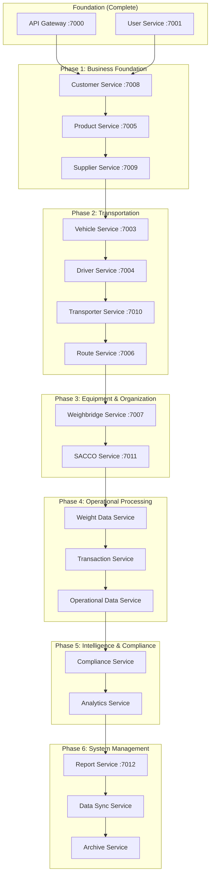

# QaliTrack Services Implementation Roadmap - Design Document

## Overview

This design document outlines the strategic approach for implementing the remaining 17 QaliTrack microservices in a logical sequence that maximizes business value, respects technical dependencies, and enables incremental delivery of working functionality.

## Architecture

### Implementation Strategy

The implementation follows a **phased approach** with **dependency-aware sequencing** that enables:

1. **Incremental Value Delivery**: Each phase delivers working business functionality
2. **Risk Mitigation**: Early phases establish foundation for later services
3. **Parallel Development**: Within phases, some services can be developed in parallel
4. **Testing Integration**: Each phase includes comprehensive integration testing

### Dependency Analysis



## Components and Interfaces

### Phase 1: Business Foundation Services

#### Customer Service (:7008) - Priority 1
**Rationale**: Customers drive revenue and establish the business model foundation.

**Key Interfaces**:
- `/api/customers` - Customer CRUD operations
- `/api/customers/{id}/orders` - Order management
- `/api/customers/{id}/contracts` - Contract management
- `/api/customers/{id}/contacts` - Contact management

**Dependencies**: User Service (authentication)
**Enables**: Product Service, Supplier Service

#### Product Service (:7005) - Priority 2  
**Rationale**: Defines what customers order and establishes the product catalog.

**Key Interfaces**:
- `/api/products` - Product catalog management
- `/api/products/categories` - Category management
- `/api/products/{id}/pricing` - Pricing management
- `/api/products/{id}/specifications` - Technical specifications

**Dependencies**: Customer Service (for customer-specific pricing)
**Enables**: Supplier Service, Weight Data Service

#### Supplier Service (:7009) - Priority 3
**Rationale**: Completes the supply chain triangle with customers and products.

**Key Interfaces**:
- `/api/suppliers` - Supplier management
- `/api/suppliers/{id}/contracts` - Supplier contracts
- `/api/suppliers/{id}/performance` - Performance tracking
- `/api/procurement` - Procurement processes

**Dependencies**: Customer Service, Product Service
**Enables**: Vehicle Service, Transaction Service

### Phase 2: Transportation Infrastructure

#### Vehicle Service (:7003) - Priority 4
**Rationale**: Establishes vehicle registry for transportation operations.

**Key Interfaces**:
- `/api/vehicles` - Vehicle registration and management
- `/api/vehicles/{id}/maintenance` - Maintenance tracking
- `/api/vehicles/{id}/inspections` - Inspection management
- `/api/vehicles/{id}/qr-codes` - QR code generation

**Dependencies**: Supplier Service (for vehicle sourcing)
**Enables**: Driver Service, Weight Data Service

#### Driver Service (:7004) - Priority 5
**Rationale**: Manages personnel for vehicle operations.

**Key Interfaces**:
- `/api/drivers` - Driver profile management
- `/api/drivers/{id}/licenses` - License management
- `/api/drivers/{id}/certifications` - Certification tracking
- `/api/drivers/{id}/performance` - Performance metrics

**Dependencies**: Vehicle Service
**Enables**: Transporter Service, Transaction Service

#### Transporter Service (:7010) - Priority 6
**Rationale**: Manages fleet companies and transportation providers.

**Key Interfaces**:
- `/api/transporters` - Transporter management
- `/api/transporters/{id}/fleet` - Fleet management
- `/api/transporters/{id}/capacity` - Capacity planning
- `/api/transporters/{id}/assignments` - Job assignments

**Dependencies**: Vehicle Service, Driver Service
**Enables**: Route Service, SACCO Service

#### Route Service (:7006) - Priority 7
**Rationale**: Optimizes transportation routes and manages gate operations.

**Key Interfaces**:
- `/api/routes` - Route management
- `/api/routes/optimization` - Route optimization
- `/api/routes/{id}/gates` - Gate management
- `/api/routes/{id}/timing` - Timing analysis

**Dependencies**: Transporter Service
**Enables**: Weighbridge Service, Transaction Service

### Phase 3: Equipment & Organization

#### Weighbridge Service (:7007) - Priority 8
**Rationale**: Manages weighing equipment essential for core operations.

**Key Interfaces**:
- `/api/weighbridges` - Equipment management
- `/api/weighbridges/{id}/calibration` - Calibration management
- `/api/weighbridges/{id}/maintenance` - Maintenance tracking
- `/api/weighbridges/{id}/configuration` - Configuration management

**Dependencies**: Route Service (for location context)
**Enables**: Weight Data Service, SACCO Service

#### SACCO Service (:7011) - Priority 9
**Rationale**: Manages cooperative organizations for regulatory compliance.

**Key Interfaces**:
- `/api/saccos` - SACCO management
- `/api/saccos/{id}/membership` - Membership management
- `/api/saccos/{id}/governance` - Governance tracking
- `/api/saccos/{id}/financial` - Financial management

**Dependencies**: Transporter Service, Weighbridge Service
**Enables**: Weight Data Service, Compliance Service

### Phase 4: Operational Processing

#### Weight Data Service - Priority 10
**Rationale**: Core weighing functionality that enables all operational workflows.

**Key Interfaces**:
- `/api/weights` - Weight data management
- `/api/weights/real-time` - Real-time weight capture
- `/api/weights/calibration` - Calibration data
- `/api/weights/history` - Historical weight data

**Dependencies**: Weighbridge Service, Vehicle Service, SACCO Service
**Enables**: Transaction Service, Compliance Service

#### Transaction Service - Priority 11
**Rationale**: Orchestrates complete business transactions across all services.

**Key Interfaces**:
- `/api/transactions` - Transaction management
- `/api/transactions/workflows` - Workflow orchestration
- `/api/transactions/{id}/state` - State management
- `/api/transactions/audit` - Audit trail

**Dependencies**: Weight Data Service, all Master Data services
**Enables**: Operational Data Service, Analytics Service

#### Operational Data Service - Priority 12
**Rationale**: Manages operational processes and monitoring.

**Key Interfaces**:
- `/api/operations` - Operational management
- `/api/operations/processes` - Process management
- `/api/operations/monitoring` - Performance monitoring
- `/api/operations/configuration` - Configuration management

**Dependencies**: Transaction Service
**Enables**: Compliance Service, Analytics Service

### Phase 5: Intelligence & Compliance

#### Compliance Service - Priority 13
**Rationale**: Ensures regulatory compliance across all operations.

**Key Interfaces**:
- `/api/compliance` - Compliance monitoring
- `/api/compliance/regulations` - Regulatory management
- `/api/compliance/violations` - Violation tracking
- `/api/compliance/reports` - Compliance reporting

**Dependencies**: Weight Data Service, Transaction Service, Operational Data Service
**Enables**: Analytics Service, Report Service

#### Analytics Service - Priority 14
**Rationale**: Provides business intelligence and performance insights.

**Key Interfaces**:
- `/api/analytics` - Analytics management
- `/api/analytics/metrics` - Metrics collection
- `/api/analytics/reports` - Report generation
- `/api/analytics/dashboards` - Dashboard management

**Dependencies**: All operational services
**Enables**: Report Service, Archive Service

### Phase 6: System Management

#### Report Service (:7012) - Priority 15
**Rationale**: Provides comprehensive reporting across all system data.

**Key Interfaces**:
- `/api/reports` - Report management
- `/api/reports/templates` - Template management
- `/api/reports/schedule` - Scheduled reporting
- `/api/reports/export` - Export management

**Dependencies**: Analytics Service, Compliance Service
**Enables**: Data Sync Service, Archive Service

#### Data Sync Service - Priority 16
**Rationale**: Enables multi-site operations and data synchronization.

**Key Interfaces**:
- `/api/sync` - Synchronization management
- `/api/sync/replication` - Data replication
- `/api/sync/conflicts` - Conflict resolution
- `/api/sync/status` - Sync status monitoring

**Dependencies**: All services (for data synchronization)
**Enables**: Archive Service

#### Archive Service - Priority 17
**Rationale**: Manages long-term data storage and retention policies.

**Key Interfaces**:
- `/api/archive` - Archive management
- `/api/archive/retention` - Retention policies
- `/api/archive/retrieval` - Data retrieval
- `/api/archive/compliance` - Archive compliance

**Dependencies**: All services (for data archival)
**Enables**: Complete system functionality

## Data Models

### Service Implementation Tracking

```typescript
interface ServiceImplementation {
  id: string;
  name: string;
  port: number;
  phase: number;
  priority: number;
  status: 'not_started' | 'in_progress' | 'testing' | 'completed';
  dependencies: string[];
  enables: string[];
  businessValue: string;
  technicalComplexity: 'low' | 'medium' | 'high';
  estimatedEffort: string;
  integrationPoints: string[];
}
```

### Phase Completion Criteria

```typescript
interface PhaseCompletion {
  phase: number;
  name: string;
  services: string[];
  completionCriteria: string[];
  businessValue: string;
  integrationTests: string[];
  performanceTargets: Record<string, number>;
}
```

## Error Handling

### Implementation Risk Mitigation

1. **Dependency Validation**: Each service validates its dependencies are available before starting
2. **Graceful Degradation**: Services handle missing dependencies gracefully
3. **Circuit Breakers**: Implement circuit breakers for service-to-service communication
4. **Rollback Strategy**: Each phase can be rolled back if critical issues are discovered

### Integration Testing Strategy

1. **Phase-Level Testing**: Comprehensive testing after each phase completion
2. **Service-Level Testing**: Individual service testing before integration
3. **End-to-End Testing**: Complete workflow testing across service boundaries
4. **Performance Testing**: Load and stress testing at each phase

## Testing Strategy

### Testing Approach by Phase

#### Phase 1 Testing
- Customer order creation and management
- Product catalog operations
- Supplier relationship management
- Customer-supplier-product integration

#### Phase 2 Testing  
- Vehicle registration and tracking
- Driver management and licensing
- Fleet operations and assignments
- Route planning and optimization

#### Phase 3 Testing
- Weighbridge equipment management
- SACCO membership and governance
- Equipment-organization integration

#### Phase 4 Testing
- Weight data capture and processing
- Transaction orchestration
- Operational workflow management
- Real-time data processing

#### Phase 5 Testing
- Compliance monitoring and reporting
- Analytics and business intelligence
- Performance metrics and KPIs

#### Phase 6 Testing
- Report generation and distribution
- Multi-site data synchronization
- Data archival and retention
- Complete system integration

### Performance Targets

| Phase | Response Time | Throughput | Availability |
|-------|---------------|------------|--------------|
| Phase 1 | < 200ms | 1000 req/min | 99.5% |
| Phase 2 | < 300ms | 800 req/min | 99.5% |
| Phase 3 | < 250ms | 600 req/min | 99.5% |
| Phase 4 | < 100ms | 2000 req/min | 99.9% |
| Phase 5 | < 500ms | 500 req/min | 99.5% |
| Phase 6 | < 1000ms | 200 req/min | 99.0% |

## Implementation Timeline

### Estimated Timeline (Assuming 2-3 developers)

| Phase | Duration | Services | Key Deliverables |
|-------|----------|----------|------------------|
| Phase 1 | 6-8 weeks | Customer, Product, Supplier | Order management system |
| Phase 2 | 8-10 weeks | Vehicle, Driver, Transporter, Route | Fleet management system |
| Phase 3 | 4-6 weeks | Weighbridge, SACCO | Equipment and organization management |
| Phase 4 | 8-12 weeks | Weight Data, Transaction, Operational | Core weighing operations |
| Phase 5 | 6-8 weeks | Compliance, Analytics | Intelligence and monitoring |
| Phase 6 | 6-8 weeks | Report, Data Sync, Archive | System management |

**Total Estimated Timeline**: 38-52 weeks (9-12 months)

### Parallel Development Opportunities

Within each phase, some services can be developed in parallel:

- **Phase 1**: Customer and Product can start in parallel, Supplier depends on both
- **Phase 2**: Vehicle and Driver can start in parallel, then Transporter and Route
- **Phase 3**: Weighbridge and SACCO can be developed in parallel
- **Phase 4**: Weight Data first, then Transaction and Operational in parallel
- **Phase 5**: Compliance and Analytics can be developed in parallel
- **Phase 6**: Report first, then Data Sync and Archive in parallel

This parallel approach could reduce the timeline to **30-40 weeks (7-9 months)** with adequate resources.