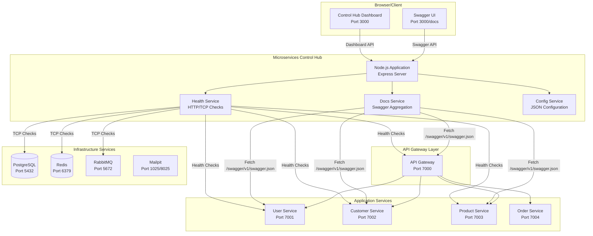
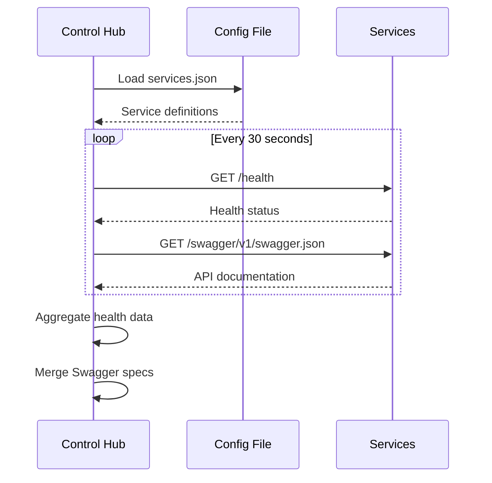
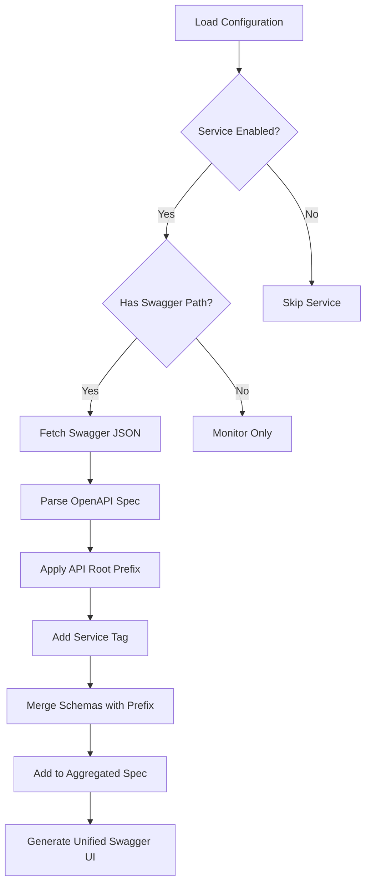

# 🎛️ Microservices Control Hub

A unified **monitoring and API documentation hub** for microservices architectures. Combines real-time health monitoring with dynamic Swagger/OpenAPI documentation aggregation in a single, beautiful dashboard.

## ✨ Features

### 🔄 **Real-Time Monitoring**
- Live health status tracking for all services
- Response time monitoring and statistics
- Service grouping (infrastructure, application, gateway, etc)
- Auto-refresh with configurable intervals
- Service availability tracking with historical data

### 📋 **API Documentation Aggregation** 
- Dynamic Swagger/OpenAPI documentation discovery from Docker and external HTTP/HTTPS services
- Unified API documentation interface with multi-server support
- Service-specific documentation access with automatic tagging
- **Path transformation support** for gateway routing adjustments *(strip/add/replace URL segments)*
- Schema conflict resolution with automatic prefixing *(prevents naming collisions: `User` → `userserviceUser`)*
- Multiple server environments for API testing (development, staging, production)

### 📚 **Service Guides Aggregation**
- Renders and aggregates external documentation sites (e.g., from DocFX, MkDocs) for each service.
- Provides a central, beautiful landing page to browse all available service guides.
- Uses a reverse proxy to seamlessly serve the documentation under the `/service-guides` path.
- Discovers available guides via a new `guidesPath` property in the service configuration.

### 🎯 **Unified Dashboard**
- Single pane of glass for all microservices
- Interactive service cards with detailed information
- Service filtering by group and status
- Responsive design for desktop and mobile
- Real-time status indicators

### ⚙️ **Configuration-Driven**
- JSON-based service configuration supporting both Docker services and external URLs
- Environment-specific settings with multi-server support
- Customizable application branding with `applicationName` and `PROJECT_NAME`
- Hot-reload configuration without restart
- Flexible service discovery patterns for mixed architectures

## 🏗️ Architecture Overview



## 🚀 Quick Start

### Using Docker Compose (Recommended)

1. **Clone the repository**:
   ```bash
   git clone https://github.com/churnisa/microservices-control-hub.git
   cd microservices-control-hub
   ```

2. **Copy example configuration**:
   ```bash
   cp examples/config/services.json config/services.json
   # Edit config/services.json to match your services
   ```

3. **Start the control hub**:
   ```bash
   docker-compose -f examples/docker-compose.yml up -d
   ```

4. **Access the dashboard**:
   - **Main Dashboard**: http://localhost:3000
   - **API Documentation**: http://localhost:3000/docs
   - **Health API**: http://localhost:3000/api/health

### Local Development

1. **Install dependencies**:
   ```bash
   npm install
   ```

2. **Configure services**:
   ```bash
   cp config/services.json.example config/services.json
   # Edit config/services.json for your environment
   ```

3. **Start the server**:
   ```bash
   npm run dev
   ```

## 📊 Dashboard Features

### Main Dashboard

The main dashboard provides:
- **Overall system health** with color-coded status indicators
- **Service statistics** including response times and availability
- **Service groups** organized by type (infrastructure, application, gateway)
- **Individual service cards** with detailed health information
- **Real-time updates** every 30 seconds
- **Interactive filtering** by group and status

### API Documentation Interface  

The documentation interface offers:
- **Unified Swagger UI** aggregating all service APIs
- **Service-specific documentation** with proper tagging
- **External server configuration** for API testing
- **Schema conflict resolution** with service prefixes *(avoids naming collisions when multiple services define schemas with the same name)*
- **Interactive API testing** directly from the browser

## ⚙️ Configuration

### Service Configuration Schema

```json
{
  "environment": "development",
  "applicationName": "QaliTrack",
  "servers": [
    {
      "url": "http://localhost:7000",
      "description": "Local Development"
    },
    {
      "url": "https://api-staging.qalitrack.com",
      "description": "Staging Environment"
    },
    {
      "url": "https://api.qalitrack.com",
      "description": "Production Environment"
    }
  ],
  "external": {
    "host": "localhost",
    "protocol": "http", 
    "gatewayPort": "7000"
  },
  "services": [
    {
      "name": "user-service",
      "host": "user-service",
      "port": 80,
      "group": "application",
      "enabled": true,
      "healthPath": "/health",
      "swaggerPath": "/swagger/v1/swagger.json",
      "apiRoot": "/api/users",
      "description": "User management service"
    },
    {
      "name": "external-auth-service",
      "url": "https://auth.external-provider.com",
      "group": "external",
      "enabled": true,
      "healthPath": "/health",
      "swaggerPath": "/api-docs/swagger.json",
      "apiRoot": "/api/auth",
      "description": "External HTTPS service (no port specified)"
    },
    {
      "name": "legacy-system",
      "url": "http://legacy.internal.com:8080",
      "group": "external",
      "enabled": true,
      "healthPath": "/status",
      "description": "External HTTP service with custom port"
    }
  ]
}
```

### Configuration Properties

#### Global Properties
| Property | Description | Required | Example |
|----------|-------------|----------|---------|
| `applicationName` | Application name for branding | ❌ | `"QaliTrack"` |
| `servers` | Multiple server environments | ❌ | `[{"url": "...", "description": "..."}]` |
| `external` | Legacy external config | ❌ | `{"host": "api.com", "protocol": "https"}` |

#### Service Properties
| Property | Description | Required | Example |
|----------|-------------|----------|---------|
| `name` | Service identifier | ✅ | `"user-service"` |
| `host` + `port` | Local Docker service | ❌* | `"user-service"`, `80` |
| `url` | External HTTP/HTTPS URL | ❌* | `"https://api.external.com"` |
| `group` | Service category | ✅ | `"application"`, `"external"` |
| `enabled` | Include in monitoring | ✅ | `true` |
| `healthPath` | Health check endpoint | ❌ | `"/health"` |
| `swaggerPath` | Swagger docs endpoint | ❌ | `"/swagger/v1/swagger.json"` |
| `guidesPath` | Path to external docs (e.g., DocFX) | ❌ | `"/docs"` |
| `apiRoot` | API path prefix | ❌ | `"/api/users"` |
| `pathTransformations` | Gateway routing adjustments | ❌ | `[{"pattern": "/api/users", "operation": "strip"}]` |
| `description` | Service description | ❌ | `"User management"` |

*Either `host`+`port` OR `url` must be provided

### Path Transformations

Handle API gateway routing transformations when aggregating Swagger documentation. This addresses common scenarios where gateways modify URL paths.

#### Transformation Operations

| Operation | Description | Example |
|-----------|-------------|---------|
| `strip` | Remove prefix from paths | `/api/users/profile` → `/profile` |
| `add` | Add prefix to matching paths | `/oauth/token` → `/api/users/oauth/token` |
| `replace` | Replace prefix with new value | `/v1/products` → `/api/products` |
| `strip-all-except` | Strip from all paths except specified | `/api/users/profile` → `/profile`, but `/oauth/token` unchanged |
| `add-all-except` | Add to all paths except specified | Add prefix to all except OAuth endpoints |

#### Configuration Example

```json
{
  "name": "user-service", 
  "pathTransformations": [
    {
      "pattern": "/api/users",
      "operation": "strip-all-except",
      "except": ["/oauth", "/o/"],
      "description": "Gateway strips /api/users prefix from all endpoints except OAuth paths"
    },
    {
      "pattern": "/v1/auth",
      "operation": "replace", 
      "replacement": "/api/users/auth",
      "description": "Replace legacy versioned path with new structure"
    }
  ]
}
```

#### Advanced Configuration with Except Patterns

```json
{
  "name": "user-service",
  "pathTransformations": [
    {
      "pattern": "/api/users",
      "operation": "strip",
      "except": ["/oauth", "/o/"],
      "description": "Strip /api/users prefix except from OAuth endpoints"
    },
    {
      "pattern": "/oauth",
      "operation": "add",
      "replacement": "/api/users",
      "description": "Add /api/users prefix to OAuth endpoints"
    }
  ]
}
```

#### Common Use Cases

**Scenario 1: Gateway strips service prefixes (except OAuth)**
- Service exposes: `/api/users/profile`, `/api/users/settings`, `/oauth/token`, `/o/userinfo`
- Gateway routes: `/profile`, `/settings`, `/oauth/token`, `/o/userinfo`
- Configuration: `{"pattern": "/api/users", "operation": "strip-all-except", "except": ["/oauth", "/o/"]}`

**Scenario 2: Gateway adds prefixes to specific endpoints**  
- Service exposes: `/oauth/token`, `/oauth/refresh`
- Gateway routes: `/api/users/oauth/token`, `/api/users/oauth/refresh`
- Configuration: `{"pattern": "/oauth", "operation": "add", "replacement": "/api/users"}`

**Scenario 3: Complex mixed transformations**
- Service has `/api/users/profile`, `/api/users/settings`, `/oauth/token`, `/o/userinfo`
- Gateway strips `/api/users` from regular endpoints but leaves OAuth paths untouched
- Use: `{"pattern": "/api/users", "operation": "strip", "except": ["/oauth", "/o/"]}`

**Scenario 4: Legacy versioning with exceptions**
- Service has `/v1/users/profile`, `/v1/users/settings`, `/oauth/token`
- Gateway wants `/api/users/profile`, `/api/users/settings`, `/oauth/token`
- Configuration: `{"pattern": "/v1/users", "operation": "replace", "replacement": "/api/users", "except": ["/oauth"]}`

### Environment Variables

| Variable | Description | Default |
|----------|-------------|---------|
| `PORT` | Server port | `3000` |
| `NODE_ENV` | Node environment | `development` |
| `CONFIG_PATH` | Configuration file path | `./config/services.json` |
| `PROJECT_NAME` | Global project name override | `'Microservices'` |

## 🔍 How It Works

### 1. Service Discovery Process



### 2. Health Monitoring Flow

The control hub performs different types of health checks:

#### HTTP Health Checks (Application Services)
```javascript
// For Docker services with healthPath defined
GET http://service-name:port/health
// For external services with URL
GET https://external-api.com/health
// Expected: 200 OK response
```

#### TCP Health Checks (Infrastructure Services)  
```javascript
// For services without healthPath (databases, caches)
const socket = new net.Socket();
socket.connect(port, host);
// Expected: Successful connection
```

### 3. Documentation Aggregation Process



## 🌍 Deployment Scenarios

### Development Environment
```yaml
environment:
  - NODE_ENV=development
  - CONFIG_PATH=/app/config/development.json
external:
  host: localhost
  protocol: http
```

### Staging Environment
```yaml
environment:
  - NODE_ENV=staging  # Enables production-like security settings
  - CONFIG_PATH=/app/config/staging.json  # Uses staging-specific service configuration
external:
  host: api-staging.company.com  # Public staging API domain for external access
  protocol: https  # Ensures secure connections for API testing
```

### Production Environment
```yaml
environment:
  - NODE_ENV=production
  - CONFIG_PATH=/app/config/production.json
external:
  host: api.company.com
  protocol: https
```

## 🔧 API Reference

### Health Endpoints

| Endpoint | Method | Description |
|----------|---------|-------------|
| `/api/health` | GET | All services health status |
| `/api/health/{service}` | GET | Specific service health |
| `/api/health/stats/summary` | GET | Health statistics summary |

### Documentation Endpoints

| Endpoint | Method | Description |
|----------|---------|-------------|
| `/api/docs/swagger.json` | GET | Aggregated Swagger specification |
| `/api/docs/services/{service}/swagger.json` | GET | Service-specific Swagger |
| `/api/docs/services` | GET | List of documented services |
| `/api/docs/summary` | GET | Documentation statistics |

### Service Discovery Endpoints

| Endpoint | Method | Description |
|----------|---------|-------------|
| `/api/services` | GET | All services with status |
| `/api/services/config` | GET | Service configuration |
| `/api/services/groups` | GET | Services grouped by type |
| `/api/services/refresh` | POST | Reload configuration |

## 🐛 Troubleshooting

### Service Not Appearing

1. **Check configuration**:
   ```bash
   curl http://localhost:3000/api/services/config
   ```

2. **Verify service health**:
   ```bash
   curl http://your-service/health
   ```

3. **Test Swagger endpoint**:
   ```bash
   curl http://your-service/swagger/v1/swagger.json
   ```

### Documentation Not Loading

1. **Check service availability**:
   ```bash
   curl http://localhost:3000/api/docs/services
   ```

2. **Verify external configuration**:
   ```bash
   # Check that EXTERNAL_HOST matches your domain
   curl http://localhost:3000/api/docs/swagger.json | grep -A5 servers
   ```

### Health Checks Failing

1. **Check network connectivity**:
   ```bash
   docker network inspect microservices
   ```

2. **Verify service endpoints**:
   ```bash
   docker exec -it control-hub-container curl http://service-name/health
   ```

## 🧪 Testing

The project includes a comprehensive test suite with sample services to verify functionality:

### Quick Test
```bash
# Run test environment with sample services
docker-compose -f tests/docker-compose.test.yml up -d

# Access test dashboard
open http://localhost:3000

# View aggregated docs from 3 sample services
open http://localhost:3000/docs

# Cleanup
docker-compose -f tests/docker-compose.test.yml down
```

### Test Coverage
- **Health monitoring**: HTTP endpoints + TCP socket connections for Docker and external services  
- **Swagger aggregation**: Multiple services with different API roots including external URLs
- **Service grouping**: Application, infrastructure, and external services
- **Configuration**: API root prefixes, multi-server support, and mixed service discovery
- **External services**: HTTP service running outside Docker container for URL-based configuration testing

See [tests/README.md](tests/README.md) for detailed testing instructions.

## 🏥 Health Endpoint Requirements

### Supported Health Check Formats

The control hub supports flexible health endpoint formats to accommodate different service architectures:

#### 1. Simple HTTP Status (Minimal)
```http
GET /health
HTTP 200 OK
```
- ✅ **Any 200-299 status = healthy**
- ❌ **Non-200 status = unhealthy**

#### 2. JSON with Status Field (Recommended)
```json
{
  "status": "healthy"
}
```

**Supported status values:**
- `"healthy"` → Service is fully operational ✅
- `"degraded"` → Service has issues but running ⚠️
- `"unhealthy"` → Service has problems ❌
- Any other value → Treated as `"degraded"`

#### 3. ASP.NET Core Health Checks (Built-in Support)
```json
{
  "status": "Healthy",
  "totalDuration": "00:00:00.0123456",
  "entries": {
    "database": {
      "status": "Healthy", 
      "duration": "00:00:00.0100000"
    }
  }
}
```

**Status mapping:**
- `"Healthy"` → `"healthy"` ✅
- `"Degraded"` → `"degraded"` ⚠️
- `"Unhealthy"` → `"degraded"` ⚠️

#### 4. Custom Health Information
```json
{
  "status": "healthy",
  "version": "1.2.3",
  "uptime": "2d 14h 32m",
  "dependencies": {
    "database": "connected",
    "redis": "connected"
  }
}
```

### Health Check Response Format

The control hub aggregates health data and returns:
```json
{
  "status": "healthy",
  "timestamp": "2025-08-25T03:00:00.000Z", 
  "responseTime": 156,
  "endpoint": "http://customer-service:80/health",
  "service": {
    "name": "customer-service",
    "group": "application",
    "description": "Customer relationship management"
  }
}
```

### Status Detection Logic

1. **HTTP Response Check**: Must return 200-299 status code
2. **JSON Parsing**: Attempts to parse response body as JSON
3. **Status Field**: Looks for `status` field in response
4. **Fallback**: If no `status` field but HTTP 200, considers `"healthy"`

### Error Handling

Connection failures result in:
```json
{
  "status": "down", 
  "error": "ECONNREFUSED",
  "timestamp": "2025-08-25T03:00:00.000Z",
  "responseTime": 5000
}
```

**Error status mapping:**
- Connection refused → `"down"` 💀
- Timeout → `"down"` 💀  
- HTTP 4xx/5xx → `"unhealthy"` ❌

### Implementation Examples

#### Express.js
```javascript
app.get('/health', (req, res) => {
  res.json({ status: 'healthy' });
});
```

#### ASP.NET Core (Built-in)
```csharp
// Program.cs
builder.Services.AddHealthChecks();
app.MapHealthChecks("/health");
```

#### Spring Boot
```java
// Built-in at /actuator/health
// Or custom:
@RestController
public class HealthController {
    @GetMapping("/health")
    public Map<String, String> health() {
        return Map.of("status", "healthy");
    }
}
```

## 📈 Monitoring Best Practices

1. **Service Health Endpoints**: Ensure all services expose `/health` endpoints with proper status responses
2. **Swagger Documentation**: Use consistent OpenAPI 3.0 specifications
3. **Service Grouping**: Organize services by type (application, infrastructure, gateway)
4. **Configuration Management**: Use environment-specific configuration files
5. **Network Setup**: Ensure services can communicate within Docker networks
6. **Health Check Consistency**: Use standard status values (`healthy`, `degraded`, `unhealthy`)
7. **Response Time Optimization**: Keep health checks lightweight (< 500ms)

## 🤝 Contributing

1. Fork the repository
2. Create a feature branch: `git checkout -b feature/amazing-feature`
3. Commit your changes: `git commit -m 'Add amazing feature'`
4. Push to the branch: `git push origin feature/amazing-feature`
5. Open a Pull Request

## 🔗 Related Projects

- [Swagger UI](https://swagger.io/tools/swagger-ui/) - API documentation interface
- [Express.js](https://expressjs.com/) - Web framework for Node.js
- [Docker](https://www.docker.com/) - Containerization platform

---

**Microservices Control Hub** - Your single pane of glass for microservices monitoring and documentation.
