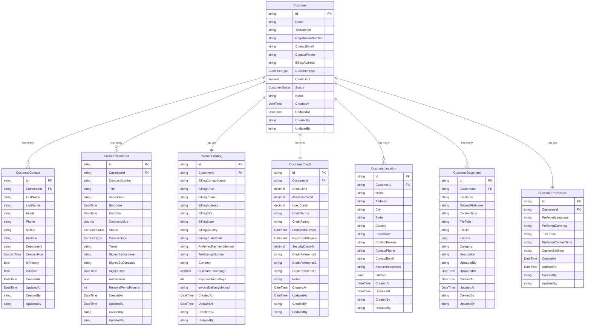

# Customer Service Database Schema

## Overview

The Customer Service database is designed to support comprehensive customer relationship management within the QaliTrack ecosystem. The schema follows Entity Framework Core conventions with SQLite as the development database, designed for production deployment with SQL Server or PostgreSQL.

## Entity Relationship Diagram



## Table Definitions

### Customer Table

The central customer entity containing core business information.

```sql
CREATE TABLE Customer (
    Id NVARCHAR(36) PRIMARY KEY,
    Name NVARCHAR(500) NOT NULL,
    TaxNumber NVARCHAR(50) NULL,
    RegistrationNumber NVARCHAR(50) NULL,
    ContactEmail NVARCHAR(255) NOT NULL,
    ContactPhone NVARCHAR(20) NULL,
    BillingAddress NVARCHAR(1000) NOT NULL,
    CustomerType INT NOT NULL,
    CreditLimit DECIMAL(18,2) NOT NULL,
    Status INT NOT NULL DEFAULT 0,
    Notes NTEXT NULL,
    CreatedAt DATETIME2 NOT NULL DEFAULT GETUTCDATE(),
    UpdatedAt DATETIME2 NOT NULL DEFAULT GETUTCDATE(),
    CreatedBy NVARCHAR(100) NOT NULL DEFAULT 'system',
    UpdatedBy NVARCHAR(100) NOT NULL DEFAULT 'system'
);

-- Indexes
CREATE UNIQUE INDEX IX_Customer_TaxNumber ON Customer(TaxNumber) WHERE TaxNumber IS NOT NULL;
CREATE UNIQUE INDEX IX_Customer_RegistrationNumber ON Customer(RegistrationNumber) WHERE RegistrationNumber IS NOT NULL;
CREATE UNIQUE INDEX IX_Customer_ContactEmail ON Customer(ContactEmail);
CREATE INDEX IX_Customer_Name ON Customer(Name);
CREATE INDEX IX_Customer_Status ON Customer(Status);
CREATE INDEX IX_Customer_CustomerType ON Customer(CustomerType);
```

**Business Rules:**
- Name is required and limited to 500 characters
- Contact email must be unique across all customers
- Tax number and registration number must be unique when provided
- Credit limit must be non-negative
- Default status is Active (0)

---

### CustomerContact Table

Individual contacts associated with customers, supporting multiple contact types.

```sql
CREATE TABLE CustomerContact (
    Id NVARCHAR(36) PRIMARY KEY,
    CustomerId NVARCHAR(36) NOT NULL,
    FirstName NVARCHAR(100) NOT NULL,
    LastName NVARCHAR(100) NOT NULL,
    Email NVARCHAR(255) NULL,
    Phone NVARCHAR(20) NULL,
    Mobile NVARCHAR(20) NULL,
    Position NVARCHAR(100) NULL,
    Department NVARCHAR(100) NULL,
    ContactType INT NOT NULL,
    IsPrimary BIT NOT NULL DEFAULT 0,
    IsActive BIT NOT NULL DEFAULT 1,
    CreatedAt DATETIME2 NOT NULL DEFAULT GETUTCDATE(),
    UpdatedAt DATETIME2 NOT NULL DEFAULT GETUTCDATE(),
    CreatedBy NVARCHAR(100) NOT NULL DEFAULT 'system',
    UpdatedBy NVARCHAR(100) NOT NULL DEFAULT 'system',
    
    CONSTRAINT FK_CustomerContact_Customer 
        FOREIGN KEY (CustomerId) REFERENCES Customer(Id) ON DELETE CASCADE
);

-- Indexes
CREATE INDEX IX_CustomerContact_CustomerId ON CustomerContact(CustomerId);
CREATE INDEX IX_CustomerContact_Email ON CustomerContact(Email);
CREATE INDEX IX_CustomerContact_ContactType ON CustomerContact(ContactType);
CREATE INDEX IX_CustomerContact_IsPrimary ON CustomerContact(IsPrimary);
```

**Business Rules:**
- First name and last name are required
- Only one primary contact per customer per contact type
- Email validation handled at application level
- Cascade delete when customer is removed

---

### CustomerContract Table

Contract management with comprehensive terms and lifecycle tracking.

```sql
CREATE TABLE CustomerContract (
    Id NVARCHAR(36) PRIMARY KEY,
    CustomerId NVARCHAR(36) NOT NULL,
    ContractNumber NVARCHAR(100) NOT NULL,
    Title NVARCHAR(500) NOT NULL,
    Description NVARCHAR(2000) NULL,
    StartDate DATETIME2 NOT NULL,
    EndDate DATETIME2 NOT NULL,
    ContractValue DECIMAL(18,2) NOT NULL,
    Status INT NOT NULL DEFAULT 0,
    ContractType INT NOT NULL,
    Terms NTEXT NULL,
    SignedByCustomer NVARCHAR(200) NULL,
    SignedByCompany NVARCHAR(200) NULL,
    SignedDate DATETIME2 NULL,
    AutoRenew BIT NOT NULL DEFAULT 0,
    RenewalPeriodMonths INT NULL,
    CreatedAt DATETIME2 NOT NULL DEFAULT GETUTCDATE(),
    UpdatedAt DATETIME2 NOT NULL DEFAULT GETUTCDATE(),
    CreatedBy NVARCHAR(100) NOT NULL DEFAULT 'system',
    UpdatedBy NVARCHAR(100) NOT NULL DEFAULT 'system',
    
    CONSTRAINT FK_CustomerContract_Customer 
        FOREIGN KEY (CustomerId) REFERENCES Customer(Id) ON DELETE CASCADE
);

-- Indexes
CREATE UNIQUE INDEX IX_CustomerContract_ContractNumber ON CustomerContract(ContractNumber);
CREATE INDEX IX_CustomerContract_CustomerId ON CustomerContract(CustomerId);
CREATE INDEX IX_CustomerContract_Status ON CustomerContract(Status);
CREATE INDEX IX_CustomerContract_ContractType ON CustomerContract(ContractType);
CREATE INDEX IX_CustomerContract_StartDate ON CustomerContract(StartDate);
CREATE INDEX IX_CustomerContract_EndDate ON CustomerContract(EndDate);
```

**Business Rules:**
- Contract number must be unique across all contracts
- Start date must be before or equal to end date
- Contract value must be non-negative
- Default status is Draft (0)
- Auto-renew requires renewal period to be specified

---

### CustomerBilling Table

Billing and payment information with one-to-one relationship to Customer.

```sql
CREATE TABLE CustomerBilling (
    Id NVARCHAR(36) PRIMARY KEY,
    CustomerId NVARCHAR(36) NOT NULL,
    BillingContactName NVARCHAR(200) NOT NULL,
    BillingEmail NVARCHAR(255) NOT NULL,
    BillingPhone NVARCHAR(20) NULL,
    BillingAddress NVARCHAR(1000) NOT NULL,
    BillingCity NVARCHAR(100) NULL,
    BillingState NVARCHAR(100) NULL,
    BillingCountry NVARCHAR(100) NULL,
    BillingPostalCode NVARCHAR(20) NULL,
    PreferredPaymentMethod NVARCHAR(100) NULL,
    TaxExemptNumber NVARCHAR(50) NULL,
    Currency NVARCHAR(3) NOT NULL DEFAULT 'USD',
    DiscountPercentage DECIMAL(5,2) NOT NULL DEFAULT 0.00,
    PaymentTermsDays INT NOT NULL DEFAULT 30,
    InvoiceDeliveryMethod NVARCHAR(50) NOT NULL DEFAULT 'Email',
    CreatedAt DATETIME2 NOT NULL DEFAULT GETUTCDATE(),
    UpdatedAt DATETIME2 NOT NULL DEFAULT GETUTCDATE(),
    CreatedBy NVARCHAR(100) NOT NULL DEFAULT 'system',
    UpdatedBy NVARCHAR(100) NOT NULL DEFAULT 'system',
    
    CONSTRAINT FK_CustomerBilling_Customer 
        FOREIGN KEY (CustomerId) REFERENCES Customer(Id) ON DELETE CASCADE
);

-- Indexes
CREATE UNIQUE INDEX IX_CustomerBilling_CustomerId ON CustomerBilling(CustomerId);
CREATE INDEX IX_CustomerBilling_BillingEmail ON CustomerBilling(BillingEmail);
```

**Business Rules:**
- One billing record per customer
- Billing contact name, email, and address are required
- Currency defaults to USD
- Discount percentage between 0 and 100
- Payment terms default to 30 days

---

### CustomerCredit Table

Credit management with real-time usage tracking and payment history.

```sql
CREATE TABLE CustomerCredit (
    Id NVARCHAR(36) PRIMARY KEY,
    CustomerId NVARCHAR(36) NOT NULL,
    CreditLimit DECIMAL(18,2) NOT NULL,
    AvailableCredit DECIMAL(18,2) NOT NULL,
    UsedCredit DECIMAL(18,2) NOT NULL DEFAULT 0.00,
    CreditTerms NVARCHAR(1000) NULL,
    CreditRating NVARCHAR(50) NULL,
    LastCreditReview DATETIME2 NULL,
    NextCreditReview DATETIME2 NULL,
    SecurityDeposit DECIMAL(18,2) NOT NULL DEFAULT 0.00,
    CreditReference1 NVARCHAR(500) NULL,
    CreditReference2 NVARCHAR(500) NULL,
    CreditReference3 NVARCHAR(500) NULL,
    Notes NVARCHAR(2000) NULL,
    CreatedAt DATETIME2 NOT NULL DEFAULT GETUTCDATE(),
    UpdatedAt DATETIME2 NOT NULL DEFAULT GETUTCDATE(),
    CreatedBy NVARCHAR(100) NOT NULL DEFAULT 'system',
    UpdatedBy NVARCHAR(100) NOT NULL DEFAULT 'system',
    
    CONSTRAINT FK_CustomerCredit_Customer 
        FOREIGN KEY (CustomerId) REFERENCES Customer(Id) ON DELETE CASCADE
);

-- Indexes
CREATE UNIQUE INDEX IX_CustomerCredit_CustomerId ON CustomerCredit(CustomerId);
CREATE INDEX IX_CustomerCredit_CreditRating ON CustomerCredit(CreditRating);
CREATE INDEX IX_CustomerCredit_NextCreditReview ON CustomerCredit(NextCreditReview);
```

**Business Rules:**
- One credit record per customer
- Available credit = Credit limit - Used credit
- All monetary amounts must be non-negative
- Credit review dates track evaluation schedule

---

### CustomerLocation Table

Physical locations associated with customers for service delivery.

```sql
CREATE TABLE CustomerLocation (
    Id NVARCHAR(36) PRIMARY KEY,
    CustomerId NVARCHAR(36) NOT NULL,
    Name NVARCHAR(200) NOT NULL,
    Address NVARCHAR(1000) NOT NULL,
    City NVARCHAR(100) NULL,
    State NVARCHAR(100) NULL,
    Country NVARCHAR(100) NULL,
    PostalCode NVARCHAR(20) NULL,
    ContactPerson NVARCHAR(200) NULL,
    ContactPhone NVARCHAR(20) NULL,
    ContactEmail NVARCHAR(255) NULL,
    AccessInstructions NVARCHAR(1000) NULL,
    IsActive BIT NOT NULL DEFAULT 1,
    CreatedAt DATETIME2 NOT NULL DEFAULT GETUTCDATE(),
    UpdatedAt DATETIME2 NOT NULL DEFAULT GETUTCDATE(),
    CreatedBy NVARCHAR(100) NOT NULL DEFAULT 'system',
    UpdatedBy NVARCHAR(100) NOT NULL DEFAULT 'system',
    
    CONSTRAINT FK_CustomerLocation_Customer 
        FOREIGN KEY (CustomerId) REFERENCES Customer(Id) ON DELETE CASCADE
);

-- Indexes
CREATE INDEX IX_CustomerLocation_CustomerId ON CustomerLocation(CustomerId);
CREATE INDEX IX_CustomerLocation_IsActive ON CustomerLocation(IsActive);
CREATE INDEX IX_CustomerLocation_City ON CustomerLocation(City);
CREATE INDEX IX_CustomerLocation_State ON CustomerLocation(State);
CREATE INDEX IX_CustomerLocation_Country ON CustomerLocation(Country);
```

**Business Rules:**
- Location name and address are required
- Multiple locations per customer supported
- Active/inactive status for location management
- Access instructions for service teams

---

### CustomerDocument Table

Document management for contracts, licenses, and other customer files.

```sql
CREATE TABLE CustomerDocument (
    Id NVARCHAR(36) PRIMARY KEY,
    CustomerId NVARCHAR(36) NOT NULL,
    FileName NVARCHAR(500) NOT NULL,
    OriginalFileName NVARCHAR(500) NULL,
    ContentType NVARCHAR(100) NOT NULL,
    FilePath NVARCHAR(1000) NULL,
    FileUrl NVARCHAR(1000) NULL,
    FileSize BIGINT NOT NULL,
    Category NVARCHAR(100) NULL,
    Description NVARCHAR(1000) NULL,
    UploadedBy NVARCHAR(100) NOT NULL,
    UploadedAt DATETIME2 NOT NULL DEFAULT GETUTCDATE(),
    CreatedAt DATETIME2 NOT NULL DEFAULT GETUTCDATE(),
    UpdatedAt DATETIME2 NOT NULL DEFAULT GETUTCDATE(),
    CreatedBy NVARCHAR(100) NOT NULL DEFAULT 'system',
    UpdatedBy NVARCHAR(100) NOT NULL DEFAULT 'system',
    
    CONSTRAINT FK_CustomerDocument_Customer 
        FOREIGN KEY (CustomerId) REFERENCES Customer(Id) ON DELETE CASCADE
);

-- Indexes
CREATE INDEX IX_CustomerDocument_CustomerId ON CustomerDocument(CustomerId);
CREATE INDEX IX_CustomerDocument_Category ON CustomerDocument(Category);
CREATE INDEX IX_CustomerDocument_UploadedAt ON CustomerDocument(UploadedAt);
```

**Business Rules:**
- File name and content type are required
- File size tracked for storage management
- Category-based organization (contracts, licenses, etc.)
- Upload tracking for audit purposes

---

### CustomerPreference Table

Customer-specific preferences and settings with JSON storage for custom configurations.

```sql
CREATE TABLE CustomerPreference (
    Id NVARCHAR(36) PRIMARY KEY,
    CustomerId NVARCHAR(36) NOT NULL,
    PreferredLanguage NVARCHAR(10) NULL DEFAULT 'en',
    PreferredCurrency NVARCHAR(3) NULL DEFAULT 'USD',
    TimeZone NVARCHAR(50) NULL DEFAULT 'UTC',
    PreferredContactTime NVARCHAR(100) NULL,
    CustomSettings NTEXT NULL, -- JSON stored as text
    CreatedAt DATETIME2 NOT NULL DEFAULT GETUTCDATE(),
    UpdatedAt DATETIME2 NOT NULL DEFAULT GETUTCDATE(),
    CreatedBy NVARCHAR(100) NOT NULL DEFAULT 'system',
    UpdatedBy NVARCHAR(100) NOT NULL DEFAULT 'system',
    
    CONSTRAINT FK_CustomerPreference_Customer 
        FOREIGN KEY (CustomerId) REFERENCES Customer(Id) ON DELETE CASCADE
);

-- Indexes
CREATE UNIQUE INDEX IX_CustomerPreference_CustomerId ON CustomerPreference(CustomerId);
```

**Business Rules:**
- One preference record per customer
- Defaults: English language, USD currency, UTC timezone
- Custom settings stored as JSON for flexibility
- Contact time preferences for scheduling

## Enumerations

### CustomerType
```csharp
public enum CustomerType
{
    Individual = 0,  // Individual person
    Corporate = 1,   // Corporation or business entity
    Government = 2,  // Government agency or department
    NonProfit = 3    // Non-profit organization
}
```

### CustomerStatus
```csharp
public enum CustomerStatus
{
    Active = 0,     // Fully operational customer
    Inactive = 1,   // Temporarily disabled
    Suspended = 2,  // Compliance or payment issues
    Pending = 3     // Awaiting activation approval
}
```

### ContactType
```csharp
public enum ContactType
{
    Business = 0,   // General business contact
    Technical = 1,  // Technical point of contact
    Billing = 2,    // Financial and billing contact
    Emergency = 3   // Emergency contact person
}
```

### ContractStatus
```csharp
public enum ContractStatus
{
    Draft = 0,      // Contract in preparation
    Active = 1,     // Currently valid contract
    Expired = 2,    // Contract past end date
    Terminated = 3  // Contract cancelled before end date
}
```

### ContractType
```csharp
public enum ContractType
{
    Service = 0,      // Ongoing service agreements
    Maintenance = 1,  // Equipment maintenance contracts
    Lease = 2         // Equipment or facility lease agreements
}
```

## Data Integrity Constraints

### Primary Keys
- All tables use GUID strings as primary keys for distributed system compatibility
- Primary keys are generated at application level using `Guid.NewGuid()`

### Foreign Key Relationships
- **Customer → CustomerContact**: One-to-many with cascade delete
- **Customer → CustomerContract**: One-to-many with cascade delete
- **Customer → CustomerBilling**: One-to-one with cascade delete
- **Customer → CustomerCredit**: One-to-one with cascade delete
- **Customer → CustomerLocation**: One-to-many with cascade delete
- **Customer → CustomerDocument**: One-to-many with cascade delete
- **Customer → CustomerPreference**: One-to-one with cascade delete

### Unique Constraints
- **Customer.TaxNumber**: Unique when not null
- **Customer.RegistrationNumber**: Unique when not null
- **Customer.ContactEmail**: Unique across all customers
- **CustomerContract.ContractNumber**: Unique across all contracts
- **CustomerBilling.CustomerId**: One billing record per customer
- **CustomerCredit.CustomerId**: One credit record per customer
- **CustomerPreference.CustomerId**: One preference record per customer

### Check Constraints
- Credit limits and monetary amounts must be non-negative
- Discount percentages must be between 0 and 100
- Contract start date must be before or equal to end date
- Used credit cannot exceed credit limit

## Performance Optimization

### Indexing Strategy

**Customer Table:**
- Clustered index on Id (primary key)
- Unique non-clustered indexes on TaxNumber, RegistrationNumber, ContactEmail
- Non-clustered indexes on Name, Status, CustomerType for search performance

**CustomerContact Table:**
- Non-clustered indexes on CustomerId, Email, ContactType, IsPrimary
- Composite index on (CustomerId, ContactType, IsPrimary) for primary contact queries

**CustomerContract Table:**
- Unique non-clustered index on ContractNumber
- Non-clustered indexes on CustomerId, Status, ContractType
- Date-based indexes on StartDate and EndDate for expiration queries

**Other Tables:**
- Foreign key indexes for join performance
- Status and category indexes for filtering
- Date indexes for time-based queries

### Query Optimization Patterns

**Customer Search:**
```sql
-- Optimized customer search with pagination
SELECT * FROM Customer 
WHERE Name LIKE @search + '%' 
   OR ContactEmail LIKE @search + '%'
   OR TaxNumber = @search
ORDER BY Name
OFFSET @offset ROWS FETCH NEXT @pageSize ROWS ONLY;
```

**Customer Details with Related Data:**
```sql
-- Efficient loading of customer with all related data
SELECT c.*, cc.*, ct.*, cb.*, cr.*, cl.*, cd.*, cp.*
FROM Customer c
LEFT JOIN CustomerContact cc ON c.Id = cc.CustomerId
LEFT JOIN CustomerContract ct ON c.Id = ct.CustomerId
LEFT JOIN CustomerBilling cb ON c.Id = cb.CustomerId
LEFT JOIN CustomerCredit cr ON c.Id = cr.CustomerId
LEFT JOIN CustomerLocation cl ON c.Id = cl.CustomerId
LEFT JOIN CustomerDocument cd ON c.Id = cd.CustomerId
LEFT JOIN CustomerPreference cp ON c.Id = cp.CustomerId
WHERE c.Id = @customerId;
```

## Migration Considerations

### Development to Production
- SQLite used for development and testing
- Production deployment supports SQL Server or PostgreSQL
- Entity Framework migrations handle schema differences
- Connection string configuration for environment-specific databases

### Backup and Recovery
- Full database backups recommended daily
- Transaction log backups for point-in-time recovery
- Customer data retention policies for GDPR compliance
- Archive strategy for inactive customers and expired contracts

### Data Seeding
- Default customer types and statuses
- Sample data for development environments
- Production data migration from legacy systems
- Validation scripts for data integrity

## Security Considerations

### Data Protection
- Customer PII encrypted at rest and in transit
- Credit information requires elevated access permissions
- Audit trail for all customer data modifications
- Soft delete for regulatory compliance

### Access Control
- Row-level security based on organization context
- Field-level encryption for sensitive data
- Database user permissions follow principle of least privilege
- Connection string encryption in configuration

### Compliance
- GDPR compliance for EU customer data
- PCI DSS compliance for payment information
- Data retention and purging policies
- Audit log retention for regulatory requirements

## Monitoring and Maintenance

### Performance Monitoring
- Query execution time tracking
- Index usage statistics
- Database growth monitoring
- Connection pool utilization

### Maintenance Tasks
- Index rebuilding and statistics updates
- Database consistency checks
- Backup verification
- Archive and purge operations

### Health Checks
- Database connectivity verification
- Table count and size monitoring
- Foreign key constraint validation
- Data integrity verification queries