# C4 Level 1: System Context Diagram

## 🌍 **QaliTrack System Context**

This diagram shows the QaliTrack weighbridge management system from a bird's eye view, highlighting the people who use it, and the other software systems it interacts with.

### **System Purpose**
QaliTrack is a comprehensive weighbridge management system that digitizes and automates the entire weighing process, from vehicle registration and driver management to real-time weight capture, compliance monitoring, and business analytics.

## 📊 **System Context Diagram**

### **Option 1: C4Context (Auto-positioned with grouping hints)**

```mermaid
C4Context
    title QaliTrack Weighbridge Management System - System Context

    %% Primary Users (Left side)
    Person(driver, "Truck Driver", "Transports goods, requires weighing services")
    Person(operator, "Weighbridge Operator", "Operates weighing equipment, validates transactions")
    Person(inspector, "Vehicle Inspector", "Conducts safety inspections, compliance checks")
    Person(manager, "Site Manager", "Monitors operations, reviews reports")
    
    %% Administrative Users (Right side)
    Person(admin, "System Administrator", "Manages users, configures system")
    Person(auditor, "Compliance Auditor", "Reviews compliance reports, validates adherence")
    Person(customer, "Customer Representative", "Tracks orders, monitors deliveries")
    Person(sacco_admin, "SACCO Administrator", "Manages cooperative members, vehicles, finances")
    
    %% Central System
    System(qalitrack, "QaliTrack Platform", "Comprehensive weighbridge management system for real-time weighing, transactions, compliance, and analytics")
    
    Enterprise_Boundary(external_systems, "External Systems") {
        System_Ext(erp_sap, "ERP System (SAP ECC)", "Legacy factory management, inventory, production")
        System_Ext(erp_s4hana, "ERP System (S/4HANA)", "Next-gen SAP suite, real-time analytics, digital core")
        System_Ext(erp_oracle, "ERP System (Oracle)", "Financial management, procurement")
        System_Ext(hardware_weighbridge, "Weighbridge Hardware", "Load cells, weight measurement, signal processing")
        System_Ext(hardware_gates, "Gate Control Systems", "Access control, RFID vehicle detection, barriers")
        System_Ext(anpr_camera, "ANPR Camera System", "Automatic Number Plate Recognition for vehicle identification")
        System_Ext(kiosk_system, "Self-Service Kiosk", "Unmanned weighing points, driver authorization via face detection")
        System_Ext(regulatory_kebs, "KEBS (Regulatory)", "Kenya Bureau of Standards - compliance")
        System_Ext(regulatory_ntsa, "NTSA (Regulatory)", "National Transport & Safety Authority")
        System_Ext(payment_mpesa, "M-Pesa Payment", "Mobile payment processing")
        System_Ext(sms_gateway, "SMS Gateway", "Notifications and alerts")
        System_Ext(email_service, "Email Service", "System notifications, reports")
        System_Ext(backup_cloud, "Cloud Backup", "Automated data backup and recovery")
    }
    
    %% Primary User Interactions (Left to Center)
    Rel(driver, qalitrack, "Uses mobile app", "HTTPS/Mobile - Vehicle registration, status checks")
    Rel(operator, qalitrack, "Uses web portal", "HTTPS/Web - Weight capture, transaction validation")
    Rel(inspector, qalitrack, "Uses inspection app", "HTTPS/Mobile - Safety checks, compliance validation")
    Rel(manager, qalitrack, "Uses dashboard", "HTTPS/Web - Performance monitoring, reports")
    
    %% Administrative User Interactions (Right to Center)
    Rel(admin, qalitrack, "Uses admin panel", "HTTPS/Web - User management, system configuration")
    Rel(auditor, qalitrack, "Reviews reports", "HTTPS/Web - Compliance verification, audit trails")
    Rel(customer, qalitrack, "Tracks orders", "HTTPS/Web - Delivery status, weight confirmations")
    Rel(sacco_admin, qalitrack, "Manages cooperative", "HTTPS/Web - Member vehicles, driver assignments")
    
    %% External System Integrations
    Rel(qalitrack, erp_sap, "Synchronizes data", "HTTPS/REST - Legacy production orders, inventory")
    Rel(qalitrack, erp_s4hana, "Real-time integration", "HTTPS/REST - Live production, analytics")
    Rel(qalitrack, erp_oracle, "Exchanges transactions", "HTTPS/REST - Financial data, procurement")
    Rel_Back(hardware_weighbridge, qalitrack, "Sends weight data", "Serial/TCP - Real-time measurements")
    Rel_Back(hardware_gates, qalitrack, "Reports vehicle presence", "TCP/HTTP - RFID vehicle detection, access control")
    Rel_Back(anpr_camera, qalitrack, "Sends plate data", "HTTP/TCP - License plate recognition")
    Rel_Back(kiosk_system, qalitrack, "Processes transactions", "HTTPS/REST - Unmanned weighing, face detection auth")
    Rel(qalitrack, regulatory_kebs, "Submits compliance reports", "HTTPS - Monthly compliance data")
    Rel(qalitrack, regulatory_ntsa, "Validates vehicle licenses", "HTTPS - Vehicle registration checks")
    Rel(qalitrack, payment_mpesa, "Processes payments", "HTTPS API - Fee collection, invoices")
    Rel(qalitrack, sms_gateway, "Sends notifications", "HTTPS API - Alerts, status updates")
    Rel(qalitrack, email_service, "Sends reports", "SMTP - Automated reports, notifications")
    Rel(qalitrack, backup_cloud, "Backs up data", "HTTPS - Encrypted backup, disaster recovery")

    UpdateElementStyle(qalitrack, $bgColor="#2E8B57", $fontColor="#FFFFFF", $borderColor="#1F5F3F")
    UpdateElementStyle(driver, $bgColor="#4A90E2", $fontColor="#FFFFFF")
    UpdateElementStyle(operator, $bgColor="#4A90E2", $fontColor="#FFFFFF")
    UpdateElementStyle(inspector, $bgColor="#9C27B0", $fontColor="#FFFFFF")
    UpdateElementStyle(manager, $bgColor="#4A90E2", $fontColor="#FFFFFF")
    UpdateElementStyle(admin, $bgColor="#4A90E2", $fontColor="#FFFFFF")
    UpdateElementStyle(auditor, $bgColor="#4A90E2", $fontColor="#FFFFFF")
    UpdateElementStyle(customer, $bgColor="#4A90E2", $fontColor="#FFFFFF")
    UpdateElementStyle(sacco_admin, $bgColor="#FF9800", $fontColor="#FFFFFF")
```

### **Option 2: Flowchart with Explicit Positioning Control**

```mermaid
flowchart TB
    %% Top row - Regulatory and External Systems
    subgraph "🏛️ Regulatory & External Systems"
        direction LR
        KEBS["🏛️ KEBS<br/>Kenya Bureau of Standards<br/>Compliance reporting"]
        NTSA["🚗 NTSA<br/>Transport & Safety Authority<br/>Vehicle compliance"]
        ERP_SAP["🏭 ERP SAP (ECC)<br/>Legacy factory management<br/>Production planning"]
        ERP_S4HANA["🏭 ERP S/4HANA<br/>Next-gen SAP suite<br/>Real-time analytics"]
        ERP_ORACLE["💼 ERP Oracle<br/>Financial management<br/>Procurement"]
    end
    
    %% Left side - Operational Users
    subgraph "👷 Operational Users"
        direction TB
        driver["🚛 Truck Driver<br/>Transports goods<br/>Requires weighing services"]
        operator["⚖️ Weighbridge Operator<br/>Operates equipment<br/>Validates transactions"]
        inspector["🔍 Vehicle Inspector<br/>Conducts safety inspections<br/>Compliance checks"]
        manager["👨‍💼 Site Manager<br/>Monitors operations<br/>Reviews reports"]
    end
    
    %% Center - QaliTrack Platform
    qalitrack["🏗️ QaliTrack Platform<br/>Comprehensive weighbridge management<br/>Real-time weighing, transactions, compliance"]
    
    %% Right side - Administrative Users
    subgraph "👨‍💻 Administrative Users"
        direction TB
        admin["🔧 System Administrator<br/>Manages users<br/>Configures system"]
        auditor["📋 Compliance Auditor<br/>Reviews compliance reports<br/>Validates adherence"]
        customer["🏢 Customer Representative<br/>Tracks orders<br/>Monitors deliveries"]
        sacco_admin["🏦 SACCO Administrator<br/>Manages cooperative members<br/>Vehicle assignments"]
    end
    
    %% Bottom left - Hardware Systems
    subgraph "🔧 Hardware Systems"
        direction LR
        weighbridge["⚖️ Weighbridge Hardware<br/>Load cells, signal processing<br/>Weight measurement"]
        gates["🚪 Gate Control Systems<br/>Access control, RFID vehicle detection<br/>Barrier systems"]
        anpr["📷 ANPR Camera<br/>License plate recognition<br/>Vehicle identification"]
        kiosk["🖥️ Self-Service Kiosk<br/>Unmanned weighing<br/>Face detection authorization"]
    end
    
    %% Bottom right - Communication Systems
    subgraph "📡 Communication Systems"
        direction LR
        mpesa["💳 M-Pesa Payment<br/>Mobile payments<br/>Fee collection"]
        sms["📱 SMS Gateway<br/>Notifications<br/>Alerts"]
        email["📧 Email Service<br/>Reports<br/>Notifications"]
        backup["☁️ Cloud Backup<br/>Data backup<br/>Disaster recovery"]
    end
    
    %% User Interactions - Operational (Left to Center)
    driver -->|"Uses mobile app<br/>HTTPS/Mobile"| qalitrack
    operator -->|"Uses web portal<br/>HTTPS/Web"| qalitrack
    inspector -->|"Uses inspection app<br/>HTTPS/Mobile"| qalitrack
    manager -->|"Uses dashboard<br/>HTTPS/Web"| qalitrack
    
    %% User Interactions - Administrative (Right to Center)
    admin -->|"Uses admin panel<br/>HTTPS/Web"| qalitrack
    auditor -->|"Reviews reports<br/>HTTPS/Web"| qalitrack
    customer -->|"Tracks orders<br/>HTTPS/Web"| qalitrack
    sacco_admin -->|"Manages cooperative<br/>HTTPS/Web"| qalitrack
    
    %% External System Integrations - Top
    qalitrack -->|"Submits compliance<br/>HTTPS"| KEBS
    qalitrack -->|"Validates licenses<br/>HTTPS"| NTSA
    qalitrack -->|"Synchronizes data<br/>HTTPS/REST"| ERP_SAP
    qalitrack -->|"Real-time integration<br/>HTTPS/REST"| ERP_S4HANA
    qalitrack -->|"Exchanges transactions<br/>HTTPS/REST"| ERP_ORACLE
    
    %% Hardware Integrations - Bottom Left
    weighbridge -->|"Sends weight data<br/>Serial/TCP"| qalitrack
    gates -->|"Reports vehicle presence<br/>TCP/HTTP - RFID detection"| qalitrack
    anpr -->|"Sends plate data<br/>HTTP/TCP"| qalitrack
    kiosk -->|"Processes transactions<br/>HTTPS/REST - Face detection auth"| qalitrack
    
    %% Communication Integrations - Bottom Right
    qalitrack -->|"Processes payments<br/>HTTPS API"| mpesa
    qalitrack -->|"Sends notifications<br/>HTTPS API"| sms
    qalitrack -->|"Sends reports<br/>SMTP"| email
    qalitrack -->|"Backs up data<br/>HTTPS"| backup
    
    %% Styling
    classDef platformStyle fill:#2E8B57,stroke:#1F5F3F,stroke-width:3px,color:#FFFFFF
    classDef userStyle fill:#4A90E2,stroke:#2E5A87,stroke-width:2px,color:#FFFFFF
    classDef inspectorStyle fill:#9C27B0,stroke:#6A1B9A,stroke-width:2px,color:#FFFFFF
    classDef externalStyle fill:#E67E22,stroke:#A0522D,stroke-width:2px,color:#FFFFFF
    classDef hardwareStyle fill:#8E44AD,stroke:#6A1B9A,stroke-width:2px,color:#FFFFFF
    classDef commStyle fill:#16A085,stroke:#0D7A6B,stroke-width:2px,color:#FFFFFF
    
    class qalitrack platformStyle
    class driver,operator,manager,admin,auditor,customer,sacco_admin userStyle
    class inspector inspectorStyle
    class KEBS,NTSA,ERP_SAP,ERP_S4HANA,ERP_ORACLE externalStyle
    class weighbridge,gates,anpr,kiosk hardwareStyle
    class mpesa,sms,email,backup commStyle
```

### **PNG Exports**

> **Note**: To generate the PNG files, use the Mermaid CLI or online tools as described in [assets/README.md](assets/README.md)

## 👥 **System Users & Their Goals**

### **Primary Users**

#### **🚛 Truck Driver**
- **Goals**: Quick weighing process, minimal wait times, clear instructions
- **Interactions**: Mobile app for registration, status checks, delivery confirmations
- **Key Needs**: Real-time updates, digital receipts, route guidance

#### **⚖️ Weighbridge Operator** 
- **Goals**: Accurate weight capture, efficient transaction processing, compliance validation
- **Interactions**: Web portal for equipment control, transaction management, reporting
- **Key Needs**: Equipment status monitoring, validation tools, audit trails

#### **🔍 Vehicle Inspector**
- **Goals**: Safety compliance, vehicle roadworthiness, regulatory adherence
- **Interactions**: Mobile inspection app for safety checks, compliance validation, certificate generation
- **Key Needs**: Inspection checklists, compliance databases, digital certification

#### **👨‍💼 Site Manager**
- **Goals**: Operational efficiency, performance optimization, resource management
- **Interactions**: Dashboard for KPI monitoring, report generation, resource allocation
- **Key Needs**: Real-time analytics, performance metrics, operational insights

### **Administrative Users**

#### **🔧 System Administrator**
- **Goals**: System reliability, security maintenance, user management
- **Interactions**: Admin panel for configuration, monitoring, security management
- **Key Needs**: System health monitoring, security controls, backup management

#### **📋 Compliance Auditor**
- **Goals**: Regulatory compliance, audit trail verification, risk management
- **Interactions**: Read-only access to compliance reports and audit logs
- **Key Needs**: Complete audit trails, regulatory reports, violation tracking

#### **🏢 Customer Representative**
- **Goals**: Order tracking, delivery confirmation, invoice validation
- **Interactions**: Customer portal for order status, delivery tracking, documentation
- **Key Needs**: Real-time delivery status, weight confirmations, digital documentation

#### **🏦 SACCO Administrator**
- **Goals**: Cooperative member management, vehicle fleet coordination, financial oversight
- **Interactions**: SACCO management portal for member registration, vehicle assignments, financial tracking
- **Key Needs**: Member databases, vehicle assignments, cooperative financial reports

## 🔗 **External System Integration**

### **Enterprise Systems**

#### **🏭 ERP Systems (SAP ECC, S/4HANA, Oracle)**
- **Purpose**: Synchronize production data, inventory, financial transactions
- **Integration**: REST API, scheduled batch jobs, real-time updates
- **Data Flow**: Production orders → QaliTrack, Weight data → ERP

**System Types:**
- **SAP ECC**: Legacy factory management, batch processing
- **S/4HANA**: Real-time analytics, digital core operations
- **Oracle**: Financial management, procurement workflows

#### **💳 Payment Systems (M-Pesa)**
- **Purpose**: Process service fees, delivery payments, invoice settlements
- **Integration**: HTTPS API, real-time payment processing
- **Data Flow**: Payment requests → M-Pesa, Payment confirmations → QaliTrack

### **Hardware Systems**

#### **⚖️ Weighbridge Equipment**
- **Purpose**: Capture real-time weight measurements with high precision
- **Integration**: Serial communication, TCP/IP protocols
- **Data Flow**: Load cell readings → Weight processing → Transaction recording

#### **🚪 Gate Control Systems**
- **Purpose**: Vehicle identification, access control, traffic management
- **Integration**: RFID vehicle detection, barrier controls, camera systems
- **Data Flow**: Vehicle RFID detection → Gate system → QaliTrack registration

#### **📷 ANPR Camera System**
- **Purpose**: Automatic Number Plate Recognition for vehicle identification
- **Integration**: Computer vision, license plate databases, real-time processing
- **Data Flow**: Vehicle plates → ANPR system → QaliTrack vehicle validation

#### **🖥️ Self-Service Kiosk**
- **Purpose**: Unmanned weighing points for automated transactions with driver authorization
- **Integration**: Touch interface, face detection authorization, payment processing, receipt printing
- **Data Flow**: Driver input → Face detection → Kiosk system → QaliTrack transaction processing

### **Regulatory Systems**

#### **📊 KEBS (Kenya Bureau of Standards)**
- **Purpose**: Compliance reporting, standards verification
- **Integration**: Automated report submission, compliance validation
- **Data Flow**: Transaction summaries → KEBS, Compliance status → QaliTrack

#### **🚗 NTSA (National Transport & Safety Authority)**
- **Purpose**: Vehicle registration validation, license verification
- **Integration**: Real-time license checks, registration validation
- **Data Flow**: License queries → NTSA, Validation results → QaliTrack

### **Communication Systems**

#### **📱 SMS Gateway**
- **Purpose**: Real-time notifications, alerts, status updates
- **Integration**: HTTPS API, automated messaging
- **Data Flow**: System events → SMS notifications → Users

#### **📧 Email Service**
- **Purpose**: Report delivery, system notifications, audit communications
- **Integration**: SMTP, automated reporting
- **Data Flow**: System reports → Email service → Recipients

### **Infrastructure Services**

#### **☁️ Cloud Backup**
- **Purpose**: Data protection, disaster recovery, business continuity
- **Integration**: Encrypted backup, automated scheduling
- **Data Flow**: System data → Encrypted backup → Cloud storage

## 🎯 **Key Business Benefits**

### **Operational Efficiency**
- **Automated Processes**: Reduced manual data entry and human error
- **Real-time Monitoring**: Immediate visibility into operations
- **Streamlined Workflows**: Optimized weighing and transaction processes

### **Compliance & Accuracy**
- **Regulatory Adherence**: Automated compliance reporting
- **Audit Trails**: Complete transaction history and documentation
- **Data Integrity**: Validated measurements and secure data handling

### **Business Intelligence**
- **Performance Analytics**: Real-time KPI monitoring and reporting
- **Predictive Insights**: Data-driven decision making
- **Resource Optimization**: Efficient resource allocation and planning

### **Customer Experience**
- **Transparency**: Real-time delivery tracking and status updates
- **Digital Documentation**: Paperless transaction processing
- **Service Quality**: Consistent and reliable service delivery

## 🔐 **Security & Compliance Context**

### **Data Protection**
- **Encryption**: All data transmission encrypted using TLS 1.3
- **Access Control**: Role-based access with multi-factor authentication
- **Audit Logging**: Comprehensive audit trails for all system activities

### **Regulatory Compliance**
- **KEBS Standards**: Automated compliance with weighing regulations
- **NTSA Requirements**: Vehicle license and registration validation
- **Data Privacy**: GDPR-compliant data handling and storage

### **Business Continuity**
- **High Availability**: 99.9% uptime with redundant systems
- **Disaster Recovery**: Automated backup and recovery procedures
- **Monitoring**: 24/7 system monitoring and alerting

---

**Next Level**: [Container Architecture →](02-container-architecture.md) - Deep dive into the major system components and technology choices.