# C4 Level 2: Container Architecture

## 📦 **QaliTrack Container Architecture**

This diagram shows the high-level technology choices and how responsibilities are distributed across containers (applications, databases, microservices) within the QaliTrack system.

### **Architecture Overview**
QaliTrack follows a microservices architecture pattern with clear separation between **masterdata** (master data management) and **masterdata** (operational data processing) services, supported by a robust infrastructure layer.

## 🏗️ **Container Architecture Diagram**

```mermaid
C4Container
    title QaliTrack Platform - Container Architecture

    Person(user, "System Users", "Drivers, Operators, Managers, Administrators, Vehicle Inspectors, SACCO Administrators")

    Container_Boundary(client_layer, "Client Applications") {
        Container(web_portal, "Web Portal", "React/TypeScript", "Main dashboard for operators and managers with real-time monitoring")
        Container(mobile_app, "Mobile App", "React Native", "Driver-focused app for vehicle registration and status updates")
        Container(kiosk_app, "Self-Service Kiosk", "React/TypeScript", "Unmanned weighing with face detection authorization")
        Container(admin_panel, "Admin Panel", "React/TypeScript", "System administration, user management, and configuration")
    }

    Container_Boundary(gateway_layer, "API Gateway Layer") {
        Container(api_gateway, "API Gateway", "Ocelot/.NET 8", "Request routing, authentication, rate limiting, and load balancing")
        Container(service_discovery, "Service Discovery", ".NET 8", "Service registration, health monitoring, and dynamic routing")
    }

    Container_Boundary(datamaster_layer, "masterdata Services - Master Data Management") {
        Container(user_service, "User Service", ".NET 8/SQLite", "Authentication, authorization, JWT tokens, RBAC - Port 7001")
        Container(customer_service, "Customer Service", ".NET 8/SQLite", "Customer management, orders, relationships - Port 7008")
        Container(product_service, "Product Service", ".NET 8/SQLite", "Product catalog, pricing, specifications - Port 7005")
        Container(supplier_service, "Supplier Service", ".NET 8/SQLite", "Vendor management, procurement, contracts - Port 7009")
        Container(transporter_service, "Transporter Service", ".NET 8/SQLite", "Fleet companies, capacity planning - Port 7010")
        Container(route_service, "Route Service", ".NET 8/SQLite", "Transport routes, optimization, gates - Port 7006")
        Container(vehicle_service, "Vehicle Service", ".NET 8/SQLite", "Vehicle registration, maintenance, compliance - Port 7003")
        Container(driver_service, "Driver Service", ".NET 8/SQLite", "Driver profiles, licenses, performance - Port 7004")
        Container(weighbridge_service, "Weighbridge Service", ".NET 8/SQLite", "Equipment management, calibration - Port 7007")
        Container(sacco_service, "SACCO Service", ".NET 8/SQLite", "Cooperative organizations, memberships - Port 7011")
        Container(organization_service, "Organization Service (DEPRECATED)", ".NET 8/SQLite", "Multi-tenant context, permissions - Port 7002")
    }

    Container_Boundary(datamanager_layer, "masterdata Services - Operational Data Processing") {
        Container(weight_data_service, "Weight Data Service", ".NET 8/SQLite", "Real-time weight capture, hardware integration")
        Container(transaction_service, "Transaction Service", ".NET 8/SQLite", "Transaction lifecycle, multi-entity linking")
        Container(compliance_service, "Compliance Service", ".NET 8/SQLite", "Regulatory monitoring, violation detection")
        Container(analytics_service, "Analytics Service", ".NET 8/SQLite", "Performance metrics, business intelligence")
        Container(operational_data_service, "Operational Data Service", ".NET 8/SQLite", "Product & route management, weighbridge orchestration")
        Container(data_sync_service, "Data Sync Service", "Go/SQLite", "Multi-site synchronization, master data replication")
        Container(archive_service, "Archive Service", ".NET 8/SQLite", "Long-term storage, historical data retrieval")
    }

    Container_Boundary(infrastructure_layer, "Infrastructure Layer") {
        ContainerDb(primary_db, "Primary Database", "PostgreSQL 15+ with Extensions", "Transactional data, time-series (TimescaleDB), full-text search, JSON documents")
        ContainerDb(cache_layer, "Cache Layer", "Redis Cluster", "Session management, master data caching, performance optimization")
        ContainerQueue(message_streaming, "Message Streaming", "Apache Kafka", "Event sourcing, real-time data streaming")
        ContainerQueue(command_queue, "Command Queue", "RabbitMQ", "Command processing, background jobs, notifications")
    }

    System_Ext(external_systems, "External Systems", "ERP (SAP ECC, S/4HANA), Hardware (Gate Control Systems with RFID vehicle detection, Self-Service Kiosk with face detection authorization, ANPR Camera System with automatic number plate recognition), Regulatory, Payment systems")

    %% Client Layer Relationships
    Rel(user, web_portal, "Uses", "HTTPS")
    Rel(user, mobile_app, "Uses", "HTTPS")
    Rel(user, kiosk_app, "Uses", "HTTPS")
    Rel(user, admin_panel, "Uses", "HTTPS")

    %% Gateway Layer Relationships
    Rel(web_portal, api_gateway, "API calls", "HTTPS/REST")
    Rel(mobile_app, api_gateway, "API calls", "HTTPS/REST")
    Rel(kiosk_app, api_gateway, "API calls", "HTTPS/REST")
    Rel(admin_panel, api_gateway, "API calls", "HTTPS/REST")

    Rel(api_gateway, service_discovery, "Service lookup", "HTTP")

    %% masterdata Service Relationships
    Rel(api_gateway, user_service, "Authentication", "HTTP/REST")
    Rel(api_gateway, customer_service, "Customer operations", "HTTP/REST")
    Rel(api_gateway, product_service, "Product operations", "HTTP/REST")
    Rel(api_gateway, supplier_service, "Supplier operations", "HTTP/REST")
    Rel(api_gateway, transporter_service, "Transport operations", "HTTP/REST")
    Rel(api_gateway, route_service, "Route operations", "HTTP/REST")
    Rel(api_gateway, vehicle_service, "Vehicle operations", "HTTP/REST")
    Rel(api_gateway, driver_service, "Driver operations", "HTTP/REST")
    Rel(api_gateway, weighbridge_service, "Equipment operations", "HTTP/REST")
    Rel(api_gateway, sacco_service, "SACCO operations", "HTTP/REST")
    Rel(api_gateway, organization_service, "Organization operations", "HTTP/REST")

    %% masterdata Service Relationships
    Rel(api_gateway, weight_data_service, "Weight operations", "HTTP/REST")
    Rel(api_gateway, transaction_service, "Transaction operations", "HTTP/REST")
    Rel(api_gateway, compliance_service, "Compliance operations", "HTTP/REST")
    Rel(api_gateway, analytics_service, "Analytics operations", "HTTP/REST")
    Rel(api_gateway, operational_data_service, "Operational operations", "HTTP/REST")
    Rel(api_gateway, data_sync_service, "Sync operations", "HTTP/REST")
    Rel(api_gateway, archive_service, "Archive operations", "HTTP/REST")

    %% Inter-Service Communication
    Rel(transaction_service, customer_service, "Customer validation", "HTTP/REST")
    Rel(transaction_service, product_service, "Product validation", "HTTP/REST")
    Rel(transaction_service, vehicle_service, "Vehicle validation", "HTTP/REST")
    Rel(transaction_service, driver_service, "Driver validation", "HTTP/REST")
    Rel(compliance_service, driver_service, "License monitoring", "HTTP/REST")
    Rel(analytics_service, transaction_service, "Transaction analysis", "HTTP/REST")

    %% Database Relationships
    Rel(user_service, primary_db, "User data", "SQL")
    Rel(customer_service, primary_db, "Customer data", "SQL")
    Rel(transaction_service, primary_db, "Transaction data", "SQL")
    Rel(weight_data_service, primary_db, "Weight measurements", "SQL/TimescaleDB")
    Rel(analytics_service, primary_db, "Analytics data", "SQL/TimescaleDB")
    Rel(compliance_service, primary_db, "Audit trails", "SQL/Full-text search")

    %% Cache Relationships
    Rel(user_service, cache_layer, "Session cache", "Redis Protocol")
    Rel(customer_service, cache_layer, "Master data cache", "Redis Protocol")
    Rel(api_gateway, cache_layer, "Auth cache", "Redis Protocol")

    %% Message Queue Relationships
    Rel(weight_data_service, message_streaming, "Weight events", "Kafka Protocol")
    Rel(transaction_service, message_streaming, "Transaction events", "Kafka Protocol")
    Rel(compliance_service, command_queue, "Violation alerts", "AMQP")
    Rel(data_sync_service, message_streaming, "Sync events", "Kafka Protocol")

    %% External System Integration
    Rel(weight_data_service, external_systems, "Hardware integration", "TCP/Serial")
    Rel(compliance_service, external_systems, "Regulatory reporting", "HTTPS")
    Rel(data_sync_service, external_systems, "ERP synchronization", "HTTPS/REST")

    UpdateElementStyle(user_service, $bgColor="#E8F5E8", $borderColor="#4CAF50")
    UpdateElementStyle(customer_service, $bgColor="#E8F5E8", $borderColor="#4CAF50")
    UpdateElementStyle(datamaster_layer, $bgColor="#F3E5F5", $borderColor="#9C27B0")
    UpdateElementStyle(datamanager_layer, $bgColor="#FFF3E0", $borderColor="#FF9800")
```

## 🏗️ **Architecture Layers**

### **📱 Client Applications Layer**

#### **Web Portal** (React/TypeScript)
- **Purpose**: Primary interface for operational users
- **Features**: Real-time dashboards, transaction monitoring, reporting
- **Users**: Weighbridge operators, site managers, vehicle inspectors, compliance auditors
- **Key Capabilities**: 
  - Live transaction tracking
  - Equipment status monitoring  
  - Performance analytics
  - Operational reporting

#### **Mobile App** (React Native)
- **Purpose**: Driver-focused mobile experience
- **Features**: Vehicle registration, delivery tracking, status updates
- **Users**: Truck drivers, field personnel, vehicle inspectors
- **Key Capabilities**:
  - Quick vehicle registration
  - Real-time delivery status
  - Digital receipts
  - Route guidance

#### **Self-Service Kiosk** (React/TypeScript)
- **Purpose**: Unmanned weighing operations
- **Features**: Phase detection authorization, driver authentication, transaction processing
- **Users**: Truck drivers, vehicle inspectors
- **Key Capabilities**:
  - Automated driver authentication via face detection
  - Self-service transaction initiation
  - Digital documentation generation
  - Multi-language support

#### **Admin Panel** (React/TypeScript)
- **Purpose**: System administration and configuration
- **Features**: User management, system configuration, security settings
- **Users**: System administrators, IT personnel, SACCO administrators, customer representatives
- **Key Capabilities**:
  - User role management
  - System configuration
  - Security administration
  - Organization management
  - Audit trail review

### **🚪 API Gateway Layer**

#### **API Gateway** (Ocelot/.NET 8)
- **Purpose**: Single entry point for all client requests
- **Responsibilities**:
  - Request routing to appropriate services
  - Authentication and authorization
  - Rate limiting and throttling
  - Load balancing
  - API versioning
- **Port**: 7000
- **Key Features**:
  - JWT token validation
  - Role-based access control
  - Request/response transformation
  - Circuit breaker patterns

#### **Service Discovery** (.NET 8)
- **Purpose**: Dynamic service registration and health monitoring
- **Responsibilities**:
  - Service registration and deregistration
  - Health check monitoring
  - Service instance tracking
  - Dynamic routing table updates
- **Key Features**:
  - Automatic service discovery
  - Health status monitoring
  - Load balancing decisions
  - Failover management

### **🗄️ masterdata Services - Master Data Management**

#### **Core Identity & Access**
- **User Service** (:7001) - Authentication, authorization, JWT tokens, RBAC ✅
- **Organization Service** (:7002) - Multi-tenant context, permissions

#### **Business Master Data**
- **Customer Service** (:7008) - Customer management, orders, relationships ✅
- **Product Service** (:7005) - Product catalog, pricing, specifications
- **Supplier Service** (:7009) - Vendor management, procurement, contracts

#### **Transportation Master Data**
- **Transporter Service** (:7010) - Fleet companies, capacity planning
- **Route Service** (:7006) - Transport routes, optimization, gates
- **Vehicle Service** (:7003) - Vehicle registration, maintenance, compliance
- **Driver Service** (:7004) - Driver profiles, licenses, performance

#### **Equipment & Organization**
- **Weighbridge Service** (:7007) - Equipment management, calibration
- **SACCO Service** (:7011) - Cooperative organizations, memberships ✅

### **⚙️ masterdata Services - Operational Data Processing**

#### **Core Operational Services**
- **Weight Data Service** - Real-time weight capture, hardware integration
- **Transaction Service** - Transaction lifecycle, multi-entity linking
- **Compliance Service** - Regulatory monitoring, violation detection
- **Analytics Service** - Performance metrics, business intelligence

#### **Supporting Services**
- **Operational Data Service** - Product & route management, weighbridge orchestration
- **Data Sync Service** (Go) - Multi-site synchronization, master data replication
- **Archive Service** - Long-term storage, historical data retrieval

### **🗃️ Infrastructure Layer**

#### **Database Layer**
- **PostgreSQL 15+ with Extensions**: 
  - **Core Database**: ACID-compliant transactional data with multi-tenant partitioning
  - **TimescaleDB Extension**: High-performance time-series data for weight measurements and analytics
  - **Full-Text Search**: Built-in search capabilities for audit trails and complex queries
  - **JSONB Support**: Flexible document storage for metadata and configurations
- **Redis Cluster**: High-performance caching and session management

#### **Message Processing**
- **Apache Kafka**: Event streaming for real-time data processing
- **RabbitMQ**: Command queue for background jobs and notifications

## 🔄 **Data Flow Patterns**

### **Request Processing Flow**
1. **Client Request** → API Gateway (Authentication/Authorization)
2. **API Gateway** → Service Discovery (Route Resolution)
3. **API Gateway** → Target Service (Business Logic)
4. **Service** → Database/Cache (Data Operations)
5. **Service** → Message Queue (Event Publishing)
6. **Response** ← API Gateway ← Target Service

### **Inter-Service Communication**
- **Synchronous**: HTTP/REST for real-time operations
- **Asynchronous**: Kafka events for eventual consistency
- **Cache**: Redis for frequently accessed master data
- **Search**: PostgreSQL full-text search for complex queries and audit trails

### **Data Persistence Strategy**
- **Transactional Data**: PostgreSQL with ACID compliance
- **Cache Data**: Redis for performance optimization
- **Time-Series Data**: PostgreSQL with TimescaleDB extension for analytics and metrics
- **Search Data**: PostgreSQL full-text search for audit trails and complex queries
- **Document Data**: PostgreSQL JSONB for flexible schemas and metadata

## 🔐 **Security Architecture**

### **Authentication & Authorization**
- **Single Sign-On**: JWT-based authentication through API Gateway
- **Role-Based Access**: Hierarchical role system with fine-grained permissions
- **Multi-Factor Authentication**: Enhanced security for administrative access

### **Data Protection**
- **Encryption in Transit**: TLS 1.3 for all external communications
- **Encryption at Rest**: Database-level encryption for sensitive data
- **API Security**: Rate limiting, input validation, output sanitization

### **Audit & Compliance**
- **Comprehensive Logging**: All transactions logged to PostgreSQL audit tables
- **Audit Trails**: Immutable record of all system changes
- **Compliance Monitoring**: Automated regulatory compliance checking

## 📊 **Technology Choices Rationale**

### **Microservices Architecture**
- **Benefits**: Independent scaling, technology diversity, team autonomy
- **Trade-offs**: Increased complexity, network overhead, distributed data

### **.NET 8 for Services**
- **Benefits**: High performance, strong typing, extensive ecosystem
- **Trade-offs**: Platform dependency, memory usage

### **Go for Data Sync Service**  
- **Benefits**: Superior concurrency, low memory footprint, fast compilation
- **Use Case**: High-throughput data synchronization across multiple sites

### **PostgreSQL as Unified Database**
- **Benefits**: ACID compliance, advanced features, proven reliability, cost-effective
- **Core Features**: Partitioning, advanced indexing, concurrent connections
- **Extensions**: 
  - **TimescaleDB**: Time-series optimization for weight data and metrics
  - **Full-Text Search**: Built-in search capabilities replacing Elasticsearch
  - **JSONB**: Document storage for flexible schemas and metadata
  - **PostGIS**: Geospatial data for routes and locations (if needed)

### **Redis for Caching**
- **Benefits**: In-memory performance, data structures, clustering
- **Use Cases**: Session management, master data caching, real-time analytics

### **Kafka for Event Streaming**
- **Benefits**: High throughput, fault tolerance, stream processing
- **Use Cases**: Real-time events, audit logging, inter-service communication

## 🚀 **Deployment & Scaling**

### **Containerization**
- **Docker**: All services containerized for consistent deployment
- **Orchestration**: Kubernetes for production container management
- **Service Mesh**: Istio for advanced traffic management and security

### **Horizontal Scaling**
- **Stateless Services**: All application services designed for horizontal scaling
- **Database Scaling**: Read replicas, connection pooling, query optimization
- **Cache Scaling**: Redis clustering for distributed caching

### **High Availability**
- **Load Balancing**: Multiple instances behind load balancers
- **Circuit Breakers**: Fault tolerance and graceful degradation
- **Health Monitoring**: Continuous health checks and automatic recovery

---

**Previous Level**: [← System Context](01-system-context.md) | **Next Level**: [Component Flows →](03-component-flows.md)