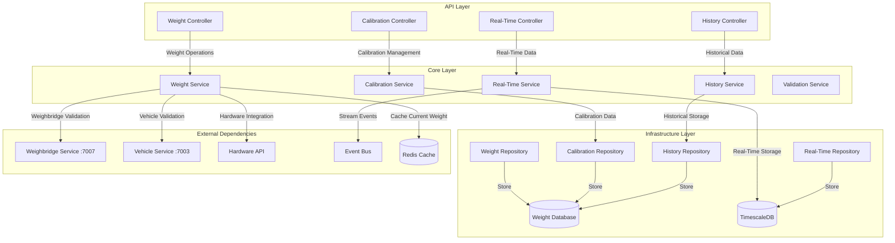
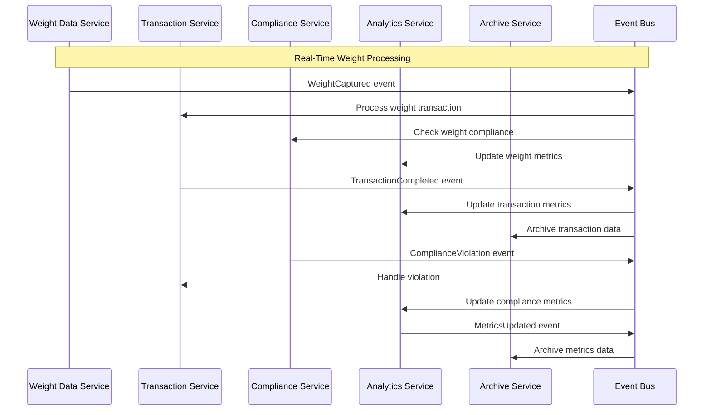
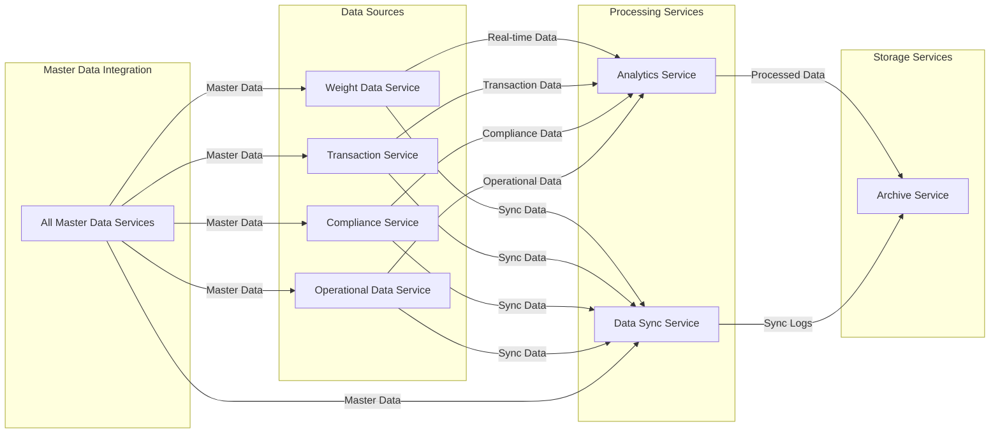

# C4 Level 3: Data Manager Service Component Flows

## 📊 **Data Manager Service Components**

**Navigation**: [← Main Component Flows](03-component-flows.md) | [← Previous: Master Data Components](03-component-flows-masterdata.md) | **Next**: [Service Architectures →](04-service-architectures.md)

This document details the component-level interactions for all 7 QaliTrack Data Manager services, showing how operational data flows through the system and integrates with master data services.

---

## **Weight Data Service Component Flow**

### **Weight Data Service Components**

**Weight Service Core**
- Processes real-time weight measurements from hardware
- Validates weight data against calibration parameters
- Integrates with weighbridge and vehicle services for context

**Calibration Service Core**
- Manages weight calibration data and algorithms
- Handles calibration drift detection and correction
- Maintains calibration history and compliance records

**Real-Time Service Core**
- Streams weight data to real-time consumers
- Publishes weight events to message bus
- Maintains current weight state in cache

**History Service Core**
- Manages historical weight data and trends
- Provides weight analytics and reporting
- Handles data archival and retention policies

---

## **Transaction Service Component Flow**

```mermaid
flowchart TD
    subgraph "API Layer"
        TransactionController[Transaction Controller]
        WorkflowController[Workflow Controller]
        StateController[State Controller]
        AuditController[Audit Controller]
    end
    
    subgraph "Core Layer"
        TransactionService[Transaction Service]
        WorkflowService[Workflow Service]
        StateService[State Service]
        AuditService[Audit Service]
        OrchestrationService[Orchestration Service]
    end
    
    subgraph "Infrastructure Layer"
        TransactionRepo[Transaction Repository]
        WorkflowRepo[Workflow Repository]
        StateRepo[State Repository]
        AuditRepo[Audit Repository]
        TransactionDB[(Transaction Database)]
    end
    
    subgraph "External Dependencies"
        CustomerSvc[Customer Service :7008]
        VehicleSvc[Vehicle Service :7003]
        DriverSvc[Driver Service :7004]
        WeightSvc[Weight Data Service]
        ComplianceSvc[Compliance Service]
        EventBus[Event Bus]
    end

    TransactionController -->|Transaction Operations| TransactionService
    TransactionService -->|Customer Validation| CustomerSvc
    TransactionService -->|Vehicle Validation| VehicleSvc
    TransactionService -->|Driver Validation| DriverSvc
    TransactionService -->|Weight Integration| WeightSvc
    
    WorkflowController -->|Workflow Management| WorkflowService
    WorkflowService -->|Orchestrate Services| OrchestrationService
    WorkflowService -->|Compliance Check| ComplianceSvc
    WorkflowService -->|Workflow Events| EventBus
    
    StateController -->|State Management| StateService
    StateService -->|State Data| StateRepo
    
    AuditController -->|Audit Management| AuditService
    AuditService -->|Audit Trail| AuditRepo
    
    TransactionRepo -->|Store| TransactionDB
    WorkflowRepo -->|Store| TransactionDB
    StateRepo -->|Store| TransactionDB
    AuditRepo -->|Store| TransactionDB
```

### **Transaction Service Components**

**Transaction Service Core**
- Orchestrates complete weighing transactions
- Coordinates multiple services for transaction completion
- Manages transaction lifecycle and state transitions

**Workflow Service Core**
- Manages transaction workflows and business rules
- Handles workflow orchestration and service coordination
- Publishes workflow events for downstream processing

**State Service Core**
- Manages transaction state and status tracking
- Handles state transitions and validation
- Provides transaction status queries and updates

**Audit Service Core**
- Maintains comprehensive audit trails for all transactions
- Tracks user actions and system changes
- Provides audit reporting and compliance support

---

## **Compliance Service Component Flow**

```mermaid
flowchart TD
    subgraph "API Layer"
        ComplianceController[Compliance Controller]
        RegulatoryController[Regulatory Controller]
        ViolationController[Violation Controller]
        ReportingController[Reporting Controller]
    end
    
    subgraph "Core Layer"
        ComplianceService[Compliance Service]
        RegulatoryService[Regulatory Service]
        ViolationService[Violation Service]
        ReportingService[Reporting Service]
        MonitoringService[Monitoring Service]
    end
    
    subgraph "Infrastructure Layer"
        ComplianceRepo[Compliance Repository]
        RegulatoryRepo[Regulatory Repository]
        ViolationRepo[Violation Repository]
        ReportingRepo[Reporting Repository]
        ComplianceDB[(Compliance Database)]
    end
    
    subgraph "External Dependencies"
        VehicleSvc[Vehicle Service :7003]
        DriverSvc[Driver Service :7004]
        WeightSvc[Weight Data Service]
        TransactionSvc[Transaction Service]
        RegulatoryAPI[Regulatory API]
        EventBus[Event Bus]
    end

    ComplianceController -->|Compliance Operations| ComplianceService
    ComplianceService -->|Vehicle Compliance| VehicleSvc
    ComplianceService -->|Driver Compliance| DriverSvc
    ComplianceService -->|Weight Compliance| WeightSvc
    ComplianceService -->|Transaction Compliance| TransactionSvc
    
    RegulatoryController -->|Regulatory Management| RegulatoryService
    RegulatoryService -->|External Regulations| RegulatoryAPI
    RegulatoryService -->|Regulatory Data| RegulatoryRepo
    
    ViolationController -->|Violation Management| ViolationService
    ViolationService -->|Monitor Violations| MonitoringService
    ViolationService -->|Violation Events| EventBus
    ViolationService -->|Violation Data| ViolationRepo
    
    ReportingController -->|Compliance Reporting| ReportingService
    ReportingService -->|Reporting Data| ReportingRepo
    
    ComplianceRepo -->|Store| ComplianceDB
    RegulatoryRepo -->|Store| ComplianceDB
    ViolationRepo -->|Store| ComplianceDB
    ReportingRepo -->|Store| ComplianceDB
```

### **Compliance Service Components**

**Compliance Service Core**
- Monitors compliance across all business operations
- Validates regulatory requirements in real-time
- Integrates with multiple services for comprehensive compliance

**Regulatory Service Core**
- Manages regulatory rules and requirements
- Integrates with external regulatory systems
- Handles regulatory updates and notifications

**Violation Service Core**
- Detects and manages compliance violations
- Handles violation workflows and remediation
- Publishes violation events for immediate action

**Reporting Service Core**
- Generates compliance reports and dashboards
- Provides regulatory reporting and submissions
- Handles compliance analytics and trends

---

## **Analytics Service Component Flow**

```mermaid
flowchart TD
    subgraph "API Layer"
        AnalyticsController[Analytics Controller]
        MetricsController[Metrics Controller]
        ReportingController[Reporting Controller]
        DashboardController[Dashboard Controller]
    end
    
    subgraph "Core Layer"
        AnalyticsService[Analytics Service]
        MetricsService[Metrics Service]
        ReportingService[Reporting Service]
        DashboardService[Dashboard Service]
        AggregationService[Aggregation Service]
    end
    
    subgraph "Infrastructure Layer"
        AnalyticsRepo[Analytics Repository]
        MetricsRepo[Metrics Repository]
        ReportingRepo[Reporting Repository]
        DashboardRepo[Dashboard Repository]
        AnalyticsDB[(Analytics Database)]
        DataWarehouse[(Data Warehouse)]
    end
    
    subgraph "External Dependencies"
        WeightSvc[Weight Data Service]
        TransactionSvc[Transaction Service]
        CustomerSvc[Customer Service :7008]
        VehicleSvc[Vehicle Service :7003]
        EventBus[Event Bus]
        ETLPipeline[ETL Pipeline]
    end

    AnalyticsController -->|Analytics Operations| AnalyticsService
    AnalyticsService -->|Data Aggregation| AggregationService
    AnalyticsService -->|Weight Analytics| WeightSvc
    AnalyticsService -->|Transaction Analytics| TransactionSvc
    AnalyticsService -->|Customer Analytics| CustomerSvc
    
    MetricsController -->|Metrics Management| MetricsService
    MetricsService -->|Event Processing| EventBus
    MetricsService -->|Metrics Data| MetricsRepo
    
    ReportingController -->|Report Management| ReportingService
    ReportingService -->|Data Warehouse| DataWarehouse
    ReportingService -->|ETL Processing| ETLPipeline
    ReportingService -->|Reporting Data| ReportingRepo
    
    DashboardController -->|Dashboard Management| DashboardService
    DashboardService -->|Dashboard Data| DashboardRepo
    
    AnalyticsRepo -->|Store| AnalyticsDB
    MetricsRepo -->|Store| AnalyticsDB
    ReportingRepo -->|Store| DataWarehouse
    DashboardRepo -->|Store| AnalyticsDB
```

### **Analytics Service Components**

**Analytics Service Core**
- Processes business analytics and intelligence
- Aggregates data from multiple operational services
- Provides insights and trend analysis

**Metrics Service Core**
- Collects and processes operational metrics
- Handles real-time metric calculations
- Provides performance monitoring and KPIs

**Reporting Service Core**
- Generates business reports and analytics
- Integrates with data warehouse for complex queries
- Handles scheduled and on-demand reporting

**Dashboard Service Core**
- Manages real-time dashboards and visualizations
- Provides interactive analytics interfaces
- Handles dashboard personalization and sharing

---

## **Operational Data Service Component Flow**

```mermaid
flowchart TD
    subgraph "API Layer"
        OperationalController[Operational Controller]
        ProcessController[Process Controller]
        MonitoringController[Monitoring Controller]
        ConfigController[Config Controller]
    end
    
    subgraph "Core Layer"
        OperationalService[Operational Service]
        ProcessService[Process Service]
        MonitoringService[Monitoring Service]
        ConfigService[Config Service]
        OrchestrationService[Orchestration Service]
    end
    
    subgraph "Infrastructure Layer"
        OperationalRepo[Operational Repository]
        ProcessRepo[Process Repository]
        MonitoringRepo[Monitoring Repository]
        ConfigRepo[Config Repository]
        OperationalDB[(Operational Database)]
    end
    
    subgraph "External Dependencies"
        ProductSvc[Product Service :7005]
        RouteSvc[Route Service :7006]
        WeighbridgeSvc[Weighbridge Service :7007]
        TransactionSvc[Transaction Service]
        EventBus[Event Bus]
        WorkflowEngine[Workflow Engine]
    end

    OperationalController -->|Operational Management| OperationalService
    OperationalService -->|Product Integration| ProductSvc
    OperationalService -->|Route Integration| RouteSvc
    OperationalService -->|Weighbridge Integration| WeighbridgeSvc
    OperationalService -->|Process Orchestration| OrchestrationService
    
    ProcessController -->|Process Management| ProcessService
    ProcessService -->|Workflow Integration| WorkflowEngine
    ProcessService -->|Transaction Integration| TransactionSvc
    ProcessService -->|Process Events| EventBus
    
    MonitoringController -->|Monitoring Management| MonitoringService
    MonitoringService -->|Monitoring Data| MonitoringRepo
    
    ConfigController -->|Configuration Management| ConfigService
    ConfigService -->|Config Data| ConfigRepo
    
    OperationalRepo -->|Store| OperationalDB
    ProcessRepo -->|Store| OperationalDB
    MonitoringRepo -->|Store| OperationalDB
    ConfigRepo -->|Store| OperationalDB
```

### **Operational Data Service Components**

**Operational Service Core**
- Manages operational data and business processes
- Orchestrates product, route, and weighbridge operations
- Provides operational context for transactions

**Process Service Core**
- Manages business process definitions and execution
- Integrates with workflow engines for process automation
- Handles process monitoring and optimization

**Monitoring Service Core**
- Monitors operational performance and health
- Tracks operational metrics and KPIs
- Provides operational alerting and notifications

**Config Service Core**
- Manages operational configurations and parameters
- Handles environment-specific operational settings
- Provides configuration management for operational processes

---

## **Data Sync Service Component Flow**

```mermaid
flowchart TD
    subgraph "API Layer"
        SyncController[Sync Controller]
        ReplicationController[Replication Controller]
        ConflictController[Conflict Controller]
        StatusController[Status Controller]
    end
    
    subgraph "Core Layer"
        SyncService[Sync Service]
        ReplicationService[Replication Service]
        ConflictService[Conflict Service]
        StatusService[Status Service]
        SchedulerService[Scheduler Service]
    end
    
    subgraph "Infrastructure Layer"
        SyncRepo[Sync Repository]
        ReplicationRepo[Replication Repository]
        ConflictRepo[Conflict Repository]
        StatusRepo[Status Repository]
        SyncDB[(Sync Database)]
    end
    
    subgraph "External Dependencies"
        AllMasterDataSvcs[All Master Data Services]
        AllDataManagerSvcs[All Data Manager Services]
        RemoteSites[Remote Site APIs]
        EventBus[Event Bus]
        MessageQueue[Message Queue]
    end

    SyncController -->|Sync Operations| SyncService
    SyncService -->|Master Data Sync| AllMasterDataSvcs
    SyncService -->|Operational Data Sync| AllDataManagerSvcs
    SyncService -->|Remote Site Sync| RemoteSites
    SyncService -->|Schedule Sync| SchedulerService
    
    ReplicationController -->|Replication Management| ReplicationService
    ReplicationService -->|Event Processing| EventBus
    ReplicationService -->|Message Processing| MessageQueue
    ReplicationService -->|Replication Data| ReplicationRepo
    
    ConflictController -->|Conflict Resolution| ConflictService
    ConflictService -->|Conflict Data| ConflictRepo
    
    StatusController -->|Status Management| StatusService
    StatusService -->|Status Data| StatusRepo
    
    SyncRepo -->|Store| SyncDB
    ReplicationRepo -->|Store| SyncDB
    ConflictRepo -->|Store| SyncDB
    StatusRepo -->|Store| SyncDB
```

### **Data Sync Service Components**

**Sync Service Core**
- Orchestrates data synchronization across multiple sites
- Handles bidirectional sync for master and operational data
- Manages sync scheduling and coordination

**Replication Service Core**
- Manages data replication strategies and patterns
- Handles event-driven and batch replication
- Provides replication monitoring and recovery

**Conflict Service Core**
- Detects and resolves data conflicts during sync
- Implements conflict resolution strategies
- Provides conflict reporting and manual resolution

**Status Service Core**
- Monitors sync status and health across all sites
- Provides sync performance metrics and reporting
- Handles sync failure detection and alerting

---

## **Archive Service Component Flow**

```mermaid
flowchart TD
    subgraph "API Layer"
        ArchiveController[Archive Controller]
        RetentionController[Retention Controller]
        RetrievalController[Retrieval Controller]
        ComplianceController[Compliance Controller]
    end
    
    subgraph "Core Layer"
        ArchiveService[Archive Service]
        RetentionService[Retention Service]
        RetrievalService[Retrieval Service]
        ComplianceService[Compliance Service]
        SchedulerService[Scheduler Service]
    end
    
    subgraph "Infrastructure Layer"
        ArchiveRepo[Archive Repository]
        RetentionRepo[Retention Repository]
        RetrievalRepo[Retrieval Repository]
        ComplianceRepo[Compliance Repository]
        ArchiveDB[(Archive Database)]
        ColdStorage[(Cold Storage)]
    end
    
    subgraph "External Dependencies"
        AllServices[All System Services]
        CloudStorage[Cloud Storage]
        BackupSystems[Backup Systems]
        EventBus[Event Bus]
        SchedulerEngine[Scheduler Engine]
    end

    ArchiveController -->|Archive Operations| ArchiveService
    ArchiveService -->|Data Collection| AllServices
    ArchiveService -->|Cloud Storage| CloudStorage
    ArchiveService -->|Schedule Archive| SchedulerService
    
    RetentionController -->|Retention Management| RetentionService
    RetentionService -->|Scheduler Integration| SchedulerEngine
    RetentionService -->|Backup Integration| BackupSystems
    RetentionService -->|Retention Data| RetentionRepo
    
    RetrievalController -->|Data Retrieval| RetrievalService
    RetrievalService -->|Cold Storage Access| ColdStorage
    RetrievalService -->|Retrieval Data| RetrievalRepo
    
    ComplianceController -->|Archive Compliance| ComplianceService
    ComplianceService -->|Compliance Events| EventBus
    ComplianceService -->|Compliance Data| ComplianceRepo
    
    ArchiveRepo -->|Store| ArchiveDB
    RetentionRepo -->|Store| ArchiveDB
    RetrievalRepo -->|Store| ArchiveDB
    ComplianceRepo -->|Store| ArchiveDB
```

### **Archive Service Components**

**Archive Service Core**
- Manages data archival policies and procedures
- Handles automated data archival from all system services
- Integrates with cloud storage for long-term retention

**Retention Service Core**
- Manages data retention policies and compliance
- Handles automated data purging and cleanup
- Provides retention reporting and audit trails

**Retrieval Service Core**
- Manages archived data retrieval and restoration
- Handles search and query capabilities for archived data
- Provides performance optimization for data access

**Compliance Service Core**
- Ensures archival compliance with regulatory requirements
- Manages legal hold and discovery processes
- Provides compliance reporting for archived data

---

## **Cross-Service Integration Patterns**

### **Event-Driven Data Flow**

### **Data Manager Service Dependencies**

---

**Navigation**: [← Main Component Flows](03-component-flows.md) | [← Previous: Master Data Components](03-component-flows-masterdata.md) | **Next**: [Service Architectures →](04-service-architectures.md)