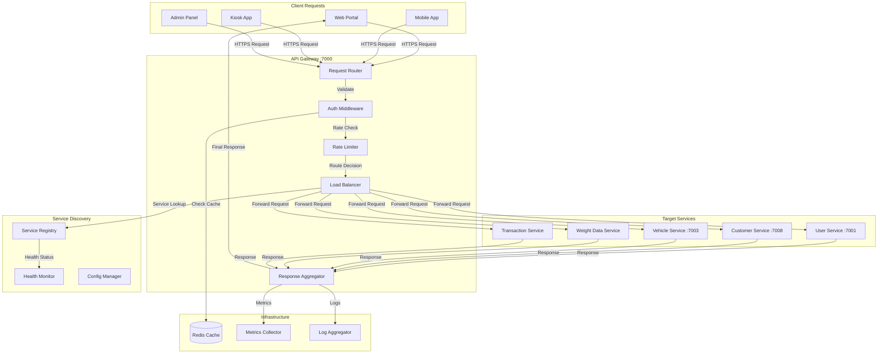
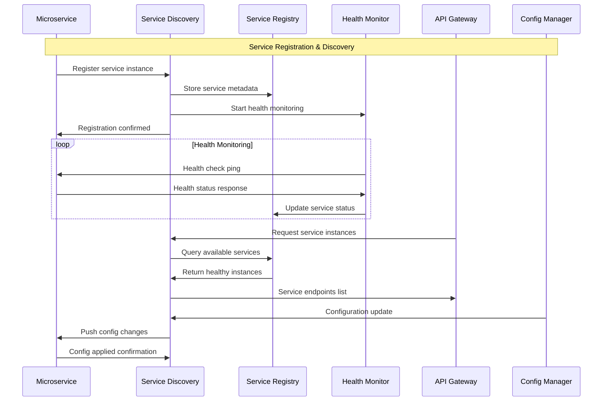
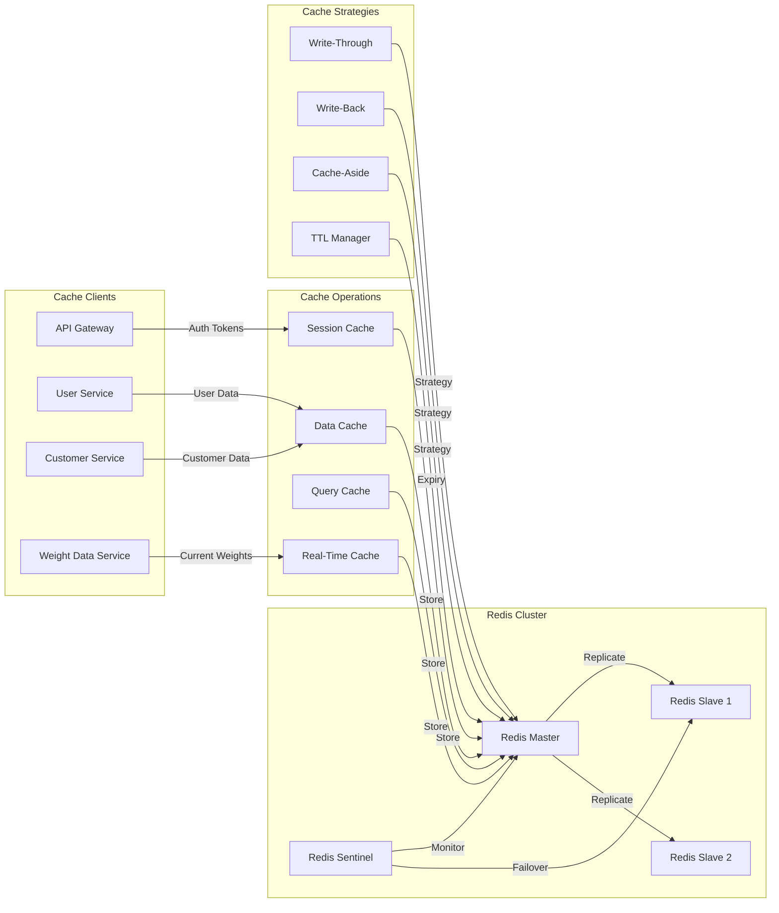
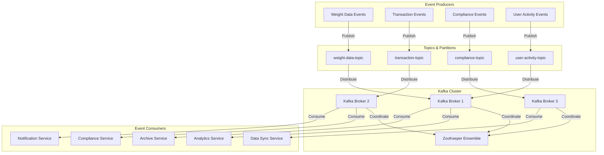
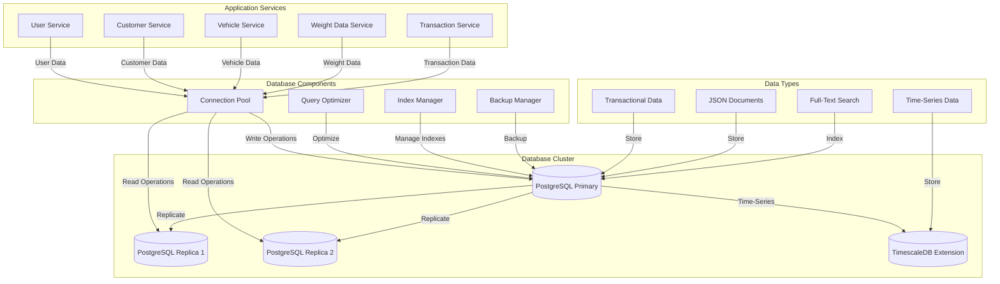

# C4 Level 3: Infrastructure Component Flows

## 🏗️ **Infrastructure Components**

**Navigation**: [← Main Component Flows](03-component-flows.md) | **Next**: [Master Data Components →](03-component-flows-masterdata.md)

This document details the component-level interactions for all QaliTrack infrastructure services including API Gateway, Service Discovery, Cache Layer, Message Streaming, and Database components.

---

## **API Gateway Component Flow**

### **API Gateway Components**

**Request Router**
- Routes incoming requests to appropriate services
- Handles URL path matching and HTTP method routing
- Manages request transformation and header manipulation

**Auth Middleware**
- Validates JWT tokens from client requests
- Integrates with Redis cache for token validation performance
- Performs **coarse-grained authorization** at service level (e.g., "User must be Operator+ to access /api/vehicles/*")
- Enforces **role hierarchy** with inheritance (User < Operator < SiteManager < Admin < SuperAdmin)
- Uses **YAML-based authorization rules** for flexible, environment-specific access control
- Extracts user context and permissions for downstream services
- Forwards user information via headers (X-User-ID, X-User-Roles, X-User-Permissions) to services for fine-grained control
- Supports **client-specific authorization configurations** for multi-tenant deployments

**Rate Limiter**
- Implements rate limiting per client/user/endpoint
- Prevents API abuse and ensures fair resource usage
- Configurable limits based on user roles and service tiers

**Load Balancer**
- Distributes requests across healthy service instances
- Implements round-robin, weighted, and health-based routing
- Integrates with Service Discovery for dynamic instance management

---

## **Service Discovery Component Flow**

### **Service Discovery Components**

**Service Registry**
- Maintains registry of all service instances and their metadata
- Stores service endpoints, health status, and capabilities
- Provides query interface for service lookup operations

**Health Monitor**
- Continuously monitors health of registered services
- Implements configurable health check intervals and timeouts
- Automatically removes unhealthy instances from active pool

**Config Manager**
- Manages centralized configuration for all services
- Pushes configuration updates to registered services
- Handles environment-specific and feature flag configurations

---

## **Cache Layer Component Flow**

### **Cache Layer Components**

**Session Cache**
- Stores user authentication tokens and session data
- Implements TTL-based expiration for security
- Provides fast lookup for API Gateway authentication

**Data Cache**
- Caches frequently accessed master data (customers, products, vehicles)
- Implements cache-aside pattern for optimal performance
- Reduces database load for read-heavy operations

**Query Cache**
- Caches results of complex database queries
- Implements intelligent cache invalidation strategies
- Optimizes performance for analytics and reporting queries

**Real-Time Cache**
- Stores current weight measurements and transaction states
- Provides sub-second access to operational data
- Supports pub/sub for real-time notifications

---

## **Message Streaming Component Flow**

### **Message Streaming Components**

**Event Topics**
- **weight-data-topic**: Real-time weight measurements and calibration events
- **transaction-topic**: Business transaction lifecycle events
- **compliance-topic**: Regulatory compliance and violation events
- **user-activity-topic**: User actions and audit trail events

**Kafka Brokers**
- Distributed message brokers for high availability
- Handle message persistence, replication, and delivery
- Provide scalable event streaming capabilities

**Consumer Groups**
- Analytics Service: Processes events for business intelligence
- Compliance Service: Monitors regulatory compliance in real-time
- Data Sync Service: Synchronizes data across multiple sites
- Archive Service: Archives events for long-term storage

---

## **Database Component Flow**

### **Database Components**

**PostgreSQL Primary**
- Handles all write operations and critical reads
- Maintains ACID compliance for transactional data
- Supports JSON documents and full-text search

**PostgreSQL Replicas**
- Handle read-only operations for load distribution
- Provide high availability and disaster recovery
- Support analytics and reporting queries

**TimescaleDB Extension**
- Optimized for time-series data (weight measurements, sensor data)
- Provides automatic partitioning and compression
- Supports real-time analytics on temporal data

**Connection Pool**
- Manages database connections efficiently
- Implements connection reuse and load balancing
- Handles connection failover and retry logic

---

**Navigation**: [← Main Component Flows](03-component-flows.md) | **Next**: [Master Data Components →](03-component-flows-masterdata.md)