# C4 Level 3: Master Data Service Component Flows

## 👥 **Master Data Service Components**

**Navigation**: [← Main Component Flows](03-component-flows.md) | [← Infrastructure Components](03-component-flows-infrastructure.md) | [Data Manager Components →](03-component-flows-datamanager.md)

This document details the component-level interactions for all 13 QaliTrack Master Data services, showing internal architecture and external dependencies.

---

## **User Service Component Flow (:7001)**

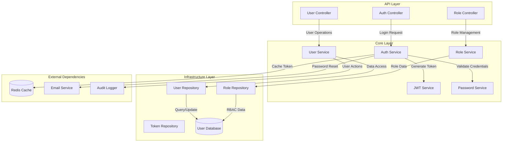

### **User Service Components**

**Auth Controller**
- Handles login, logout, and token refresh endpoints
- Validates user credentials and manages authentication flow
- Integrates with JWT service for token generation

**User Service Core**
- Manages user profiles, preferences, and account settings
- Implements password policies and security requirements
- Handles user lifecycle operations (create, update, deactivate)

**Role Service Core**
- Manages role-based access control (RBAC)
- Defines permissions and role hierarchies
- Supports dynamic role assignment and inheritance

---

## **Customer Service Component Flow (:7008)**

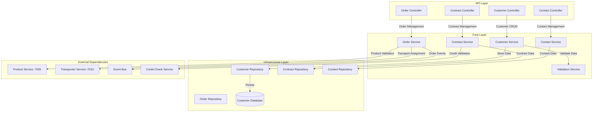

### **Customer Service Components**

**Customer Service Core**
- Manages customer profiles, business information, and relationships
- Handles customer classification (customer/supplier/both)
- Implements customer lifecycle and status management

**Order Service Core**
- Processes customer orders and requirements
- Validates product availability and specifications
- Coordinates with transport services for delivery planning

**Contract Service Core**
- Manages customer contracts and agreements
- Handles pricing, terms, and credit arrangements
- Monitors contract compliance and renewals

---

## **Vehicle Service Component Flow (:7003)**

```mermaid
flowchart TD
    subgraph "API Layer"
        VehicleController[Vehicle Controller]
        RegistrationController[Registration Controller]
        MaintenanceController[Maintenance Controller]
        InspectionController[Inspection Controller]
    end
    
    subgraph "Core Layer"
        VehicleService[Vehicle Service]
        RegistrationService[Registration Service]
        MaintenanceService[Maintenance Service]
        InspectionService[Inspection Service]
        ComplianceService[Compliance Service]
    end
    
    subgraph "Infrastructure Layer"
        VehicleRepo[Vehicle Repository]
        RegistrationRepo[Registration Repository]
        MaintenanceRepo[Maintenance Repository]
        InspectionRepo[Inspection Repository]
        VehicleDB[(Vehicle Database)]
    end
    
    subgraph "External Dependencies"
        SACCOSvc[SACCO Service :7011]
        TransporterSvc[Transporter Service :7010]
        ComplianceAPI[Compliance API]
        QRGenerator[QR Code Generator]
    end

    VehicleController -->|Vehicle CRUD| VehicleService
    VehicleService -->|SACCO Validation| SACCOSvc
    VehicleService -->|Owner Validation| TransporterSvc
    VehicleService -->|Generate QR| QRGenerator
    
    RegistrationController -->|Registration Management| RegistrationService
    RegistrationService -->|Compliance Check| ComplianceAPI
    RegistrationService -->|Registration Data| RegistrationRepo
    
    MaintenanceController -->|Maintenance Tracking| MaintenanceService
    MaintenanceService -->|Maintenance Records| MaintenanceRepo
    
    InspectionController -->|Inspection Management| InspectionService
    InspectionService -->|Compliance Validation| ComplianceService
    InspectionService -->|Inspection Data| InspectionRepo
    
    VehicleRepo -->|Store| VehicleDB
    RegistrationRepo -->|Store| VehicleDB
    MaintenanceRepo -->|Store| VehicleDB
    InspectionRepo -->|Store| VehicleDB
```

### **Vehicle Service Components**

**Vehicle Service Core**
- Manages vehicle registration, specifications, and ownership
- Handles vehicle lifecycle from registration to decommission
- Integrates with SACCO and Transporter services for validation

**Registration Service Core**
- Processes vehicle registration and documentation
- Validates compliance with regulatory requirements
- Generates QR codes for vehicle identification

**Maintenance Service Core**
- Tracks vehicle maintenance schedules and history
- Manages service records and warranty information
- Alerts for upcoming maintenance requirements

**Inspection Service Core**
- Manages vehicle inspections and certifications
- Tracks compliance with safety and regulatory standards
- Handles inspection scheduling and results

---

## **Driver Service Component Flow (:7004)**

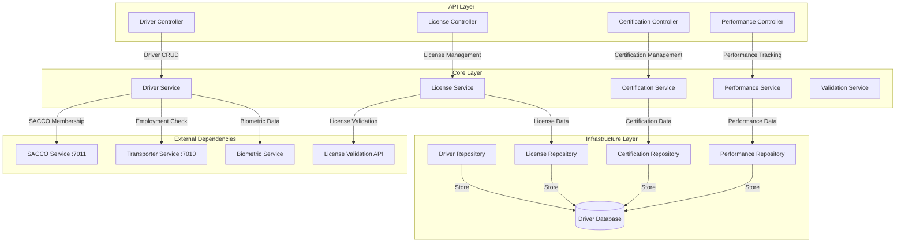

### **Driver Service Components**

**Driver Service Core**
- Manages driver profiles, employment history, and qualifications
- Handles driver lifecycle and status management
- Integrates biometric data for identity verification

**License Service Core**
- Manages driver licenses and endorsements
- Validates license status with external authorities
- Tracks license renewals and violations

**Certification Service Core**
- Manages driver certifications and training records
- Tracks specialized endorsements and qualifications
- Handles certification renewals and compliance

**Performance Service Core**
- Tracks driver performance metrics and ratings
- Monitors safety records and violations
- Provides performance analytics and reporting

---

## **Product Service Component Flow (:7005)**

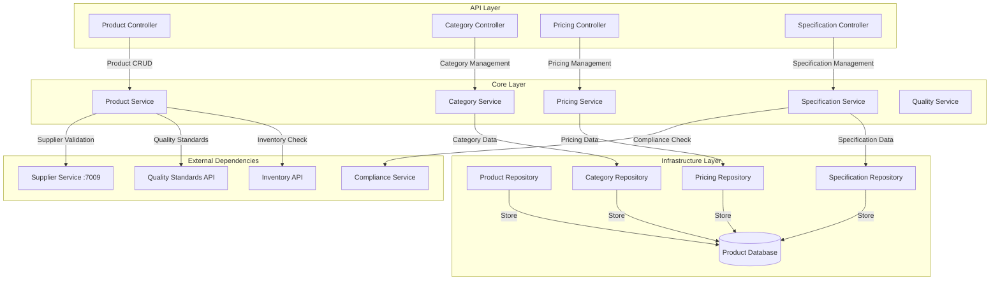

### **Product Service Components**

**Product Service Core**
- Manages product catalog, SKUs, and classifications
- Handles product lifecycle from creation to discontinuation
- Integrates with suppliers for product sourcing

**Category Service Core**
- Manages product categories and hierarchies
- Handles category-specific rules and attributes
- Supports dynamic categorization and tagging

**Pricing Service Core**
- Manages product pricing and discount structures
- Handles tiered pricing and customer-specific rates
- Supports dynamic pricing based on market conditions

**Specification Service Core**
- Manages detailed product specifications and attributes
- Handles quality standards and compliance requirements
- Supports technical documentation and certifications

---

## **Route Service Component Flow (:7006)**

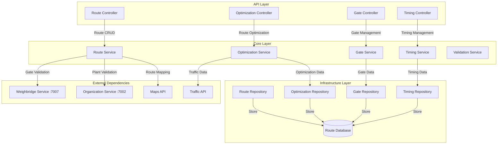

### **Route Service Components**

**Route Service Core**
- Manages transport routes between plants and facilities
- Handles route definitions, waypoints, and constraints
- Integrates with mapping services for route validation

**Optimization Service Core**
- Optimizes routes for efficiency, cost, and time
- Considers traffic patterns, vehicle constraints, and delivery windows
- Provides alternative route suggestions

**Gate Service Core**
- Manages gate assignments and access control
- Handles gate-specific rules and restrictions
- Coordinates with weighbridge services for gate operations

**Timing Service Core**
- Tracks expected vs actual transit times
- Manages delivery schedules and time windows
- Provides timing analytics and performance metrics

---

## **Weighbridge Service Component Flow (:7007)**

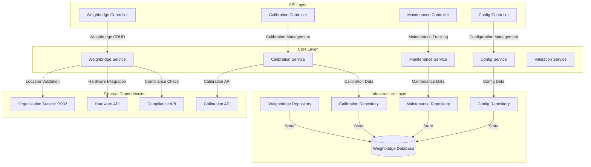

### **Weighbridge Service Components**

**Weighbridge Service Core**
- Manages weighbridge equipment and specifications
- Handles weighbridge registration and certification
- Integrates with hardware systems for operational control

**Calibration Service Core**
- Manages weighbridge calibration schedules and procedures
- Tracks calibration history and compliance
- Integrates with external calibration services

**Maintenance Service Core**
- Tracks weighbridge maintenance and repairs
- Manages preventive maintenance schedules
- Handles equipment lifecycle and replacement planning

**Config Service Core**
- Manages weighbridge configuration and settings
- Handles operational parameters and thresholds
- Supports remote configuration management

---

## **Supplier Service Component Flow (:7009)**

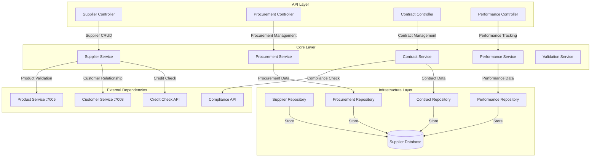

### **Supplier Service Components**

**Supplier Service Core**
- Manages supplier profiles, capabilities, and relationships
- Handles supplier onboarding and qualification processes
- Integrates with customer service for dual-role entities

**Procurement Service Core**
- Manages procurement processes and purchase orders
- Handles supplier selection and negotiation
- Tracks procurement performance and costs

**Contract Service Core**
- Manages supplier contracts and agreements
- Handles terms, conditions, and compliance requirements
- Monitors contract performance and renewals

**Performance Service Core**
- Tracks supplier performance metrics and KPIs
- Monitors delivery performance, quality, and compliance
- Provides supplier scorecards and analytics

---

## **Transporter Service Component Flow (:7010)**

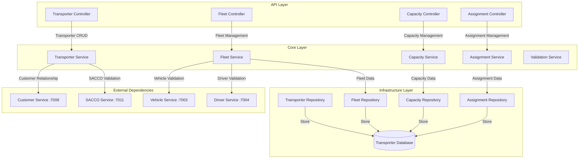

### **Transporter Service Components**

**Transporter Service Core**
- Manages transporter company profiles and business information
- Handles transporter registration and licensing
- Supports dual-role entities (customer-transporter)

**Fleet Service Core**
- Manages transporter fleet composition and capabilities
- Handles vehicle and driver assignments
- Tracks fleet utilization and performance

**Capacity Service Core**
- Manages transporter capacity planning and availability
- Handles capacity reservations and scheduling
- Provides capacity optimization recommendations

**Assignment Service Core**
- Manages transport assignments and job allocation
- Handles route assignments and scheduling
- Tracks assignment performance and completion

---

## **SACCO Service Component Flow (:7011)**

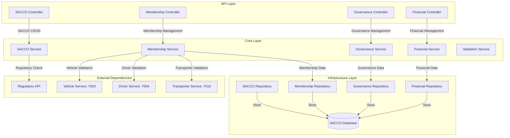

### **SACCO Service Components**

**SACCO Service Core**
- Manages SACCO organization profiles and registration
- Handles SACCO licensing and regulatory compliance
- Manages SACCO operational parameters and rules

**Membership Service Core**
- Manages SACCO membership for vehicles, drivers, and transporters
- Handles membership applications and renewals
- Tracks membership benefits and obligations

**Governance Service Core**
- Manages SACCO governance structure and policies
- Handles leadership and committee management
- Tracks governance compliance and reporting

**Financial Service Core**
- Manages SACCO financial operations and accounts
- Handles member contributions and benefits
- Provides financial reporting and analytics

---

## **Organization Service Component Flow (:7002)**

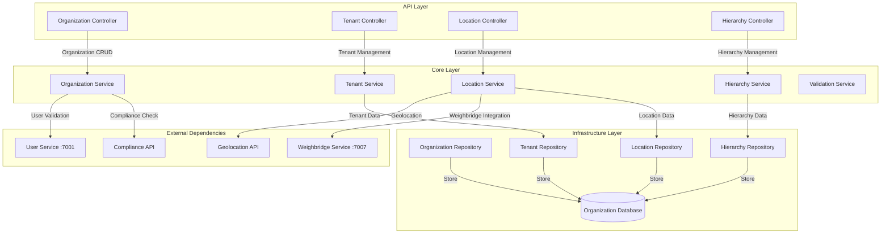

### **Organization Service Components**

**Organization Service Core**
- Manages organization profiles and business information
- Handles organization registration and licensing
- Provides multi-tenant foundation for the system

**Tenant Service Core**
- Manages tenant isolation and data segregation
- Handles tenant-specific configurations and settings
- Provides tenant context for all operations

**Location Service Core**
- Manages organization locations and facilities
- Handles plant, warehouse, and office location data
- Integrates with weighbridge services for operational locations

**Hierarchy Service Core**
- Manages organizational hierarchy and reporting structures
- Handles department and division management
- Supports complex organizational relationships

---

**Navigation**: [← Main Component Flows](03-component-flows.md) | [← Infrastructure Components](03-component-flows-infrastructure.md) | [Data Manager Components →](03-component-flows-datamanager.md)