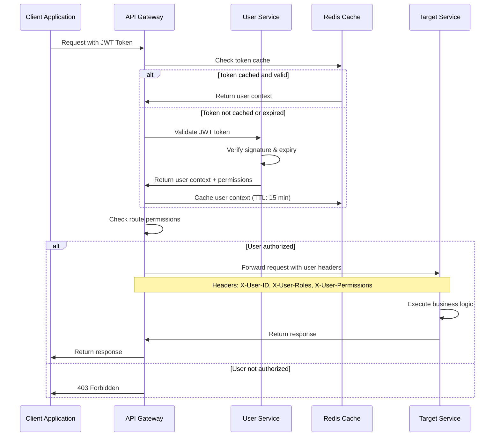
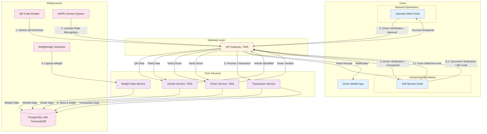
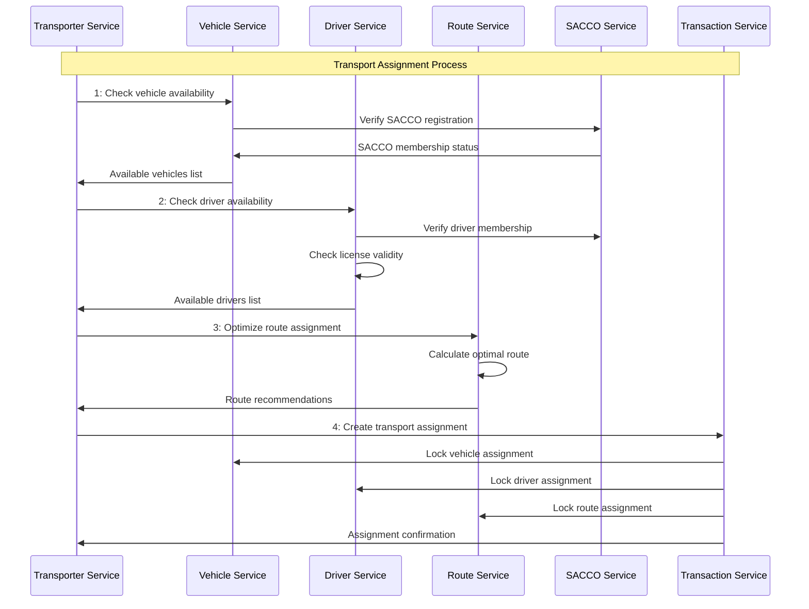
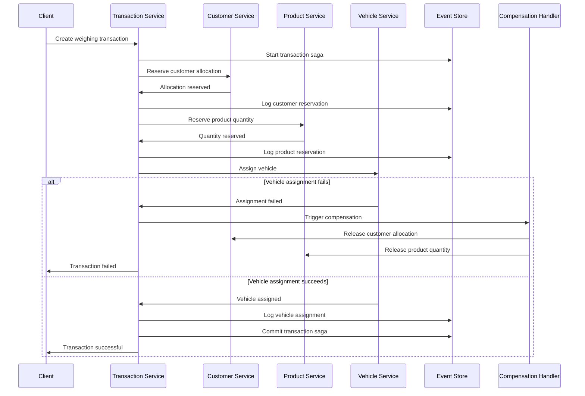
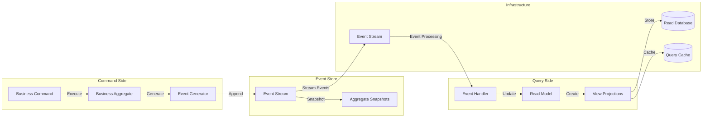

# C4 Level 3: Component Flows

## 🔧 **QaliTrack Component Interactions**

This document provides detailed component-level interactions for all QaliTrack services, showing how data flows through the system during key business processes. Due to the comprehensive nature of the system (13 Master Data + 7 Data Manager + Infrastructure services), this documentation is organized into focused sections with cross-references.

### **Navigation**
- [🏗️ Infrastructure Components](03-component-flows-infrastructure.md) - API Gateway, Service Discovery, Cache, Messaging
- [👥 Master Data Service Components](03-component-flows-masterdata.md) - All 13 Master Data Services
- [📊 Data Manager Service Components](03-component-flows-datamanager.md) - All 7 Data Manager Services
- [🔄 Cross-Service Integration Patterns](#-cross-service-integration-patterns)
- [🔐 Security & Authentication Flows](#-security--authentication-flows)

### **Component Overview**
The system is built around event-driven microservices with clear data flow patterns, authentication boundaries, and business process orchestration. Each service follows Clean Architecture principles with API, Core, and Infrastructure layers.

**Service Categories:**
- **Infrastructure Services**: API Gateway, Service Discovery, Cache Layer, Message Streaming, Database
- **Master Data Services (13)**: User, Customer, Vehicle, Driver, Product, Route, Weighbridge, Supplier, Transporter, SACCO, Organization, Report
- **Data Manager Services (7)**: Weight Data, Transaction, Compliance, Analytics, Operational Data, Data Sync, Archive

For detailed component flows of each category, please refer to the dedicated documentation files linked above.

## 🔐 **Security & Authentication Flows**

### **Authentication & Authorization Flow**

## 📊 **Complete Weighing Transaction Flow**

### **🔄 Complete Transaction Flow**

The operational transaction flow follows the actual weighbridge sequence:

**Vehicle Identification (Steps 1-2):**
- **Step 1:** QR Code Reader detects vehicle QR code for initial identification
- **Step 2:** ANPR Camera System captures license plate for verification
- Vehicle Service validates vehicle registration and status

**Driver & Document Verification (Step 3):**

**Manned Operations (Step 3):**
- Operator verifies driver credentials via web portal
- Manual document inspection and validation
- Human oversight and intervention capabilities

**Unmanned Operations (Step 3 + 3.1 + 3.2):**
- Self-service kiosk handles driver verification
- **Step 3.1:** Face detection authentication
- **Step 3.2:** Document verification using QR code scanning
- Automated credential validation

**Weight Capture & Processing (Steps 4-6):**
- **Step 4:** Weighbridge hardware captures weight after verification
- **Step 5:** Gateway processes validated transaction
- **Step 6:** Data storage and stakeholder notifications

This sequence ensures complete vehicle and driver verification before any weighing operation, maintaining security and compliance standards.

## 🔄 **Cross-Service Integration Patterns**

### **Customer Order Processing Flow**

### **Vehicle & Driver Assignment Flow**

## 📊 **Data Consistency Patterns**

### **Multi-Service Transaction Pattern**

### **Event Sourcing Pattern**

---

**Previous Level**: [← Container Architecture](02-container-architecture.md) | **Next Level**: [Service Architectures →](04-service-architectures.md)