# C4 Level 3: Component Flows

## 🔧 **QaliTrack Component Interactions**

This diagram shows the detailed interactions between services, components, and how data flows through the QaliTrack system during key business processes.

### **Component Overview**
The system is built around event-driven microservices with clear data flow patterns, authentication boundaries, and business process orchestration.

## 🔄 **Authentication & Authorization Flow**

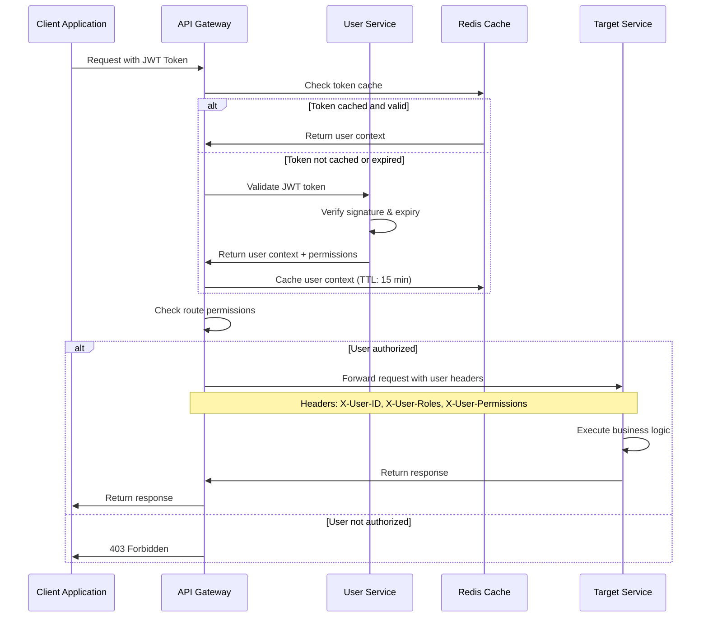

## 📊 **Complete Weighing Transaction Flow**

```mermaid
flowchart TD
    subgraph "Client Layer"
        Driver[Driver Mobile App]
        Operator[Operator Web Portal]
    end
    
    subgraph "Gateway & Auth"
        Gateway[API Gateway :7000]
        UserSvc[User Service :7001]
    end
    
    subgraph "DataMaster Services"
        VehicleSvc[Vehicle Service :7003]
        DriverSvc[Driver Service :7004]
        CustomerSvc[Customer Service :7008]
        ProductSvc[Product Service :7005]
        TransporterSvc[Transporter Service :7010]
        RouteSvc[Route Service :7006]
    end
    
    subgraph "DataManager Services"
        WeightSvc[Weight Data Service]
        TransactionSvc[Transaction Service]
        ComplianceSvc[Compliance Service]
        AnalyticsSvc[Analytics Service]
    end
    
    subgraph "Infrastructure"
        PostgreSQL[(PostgreSQL)]
        InfluxDB[(InfluxDB)]
        Kafka[Apache Kafka]
        Redis[(Redis Cache)]
    end
    
    subgraph "External"
        Hardware[Weighbridge Hardware]
    end

    %% Driver Registration Flow
    Driver -->|1. Vehicle Registration| Gateway
    Gateway -->|Auth Check| UserSvc
    Gateway -->|2. Validate Vehicle| VehicleSvc
    VehicleSvc -->|Check Vehicle DB| PostgreSQL
    Gateway -->|3. Validate Driver| DriverSvc
    DriverSvc -->|Check License Status| PostgreSQL
    Gateway -->|4. Check Transport Assignment| TransporterSvc
    
    %% Weight Capture Flow
    Hardware -->|5. Raw Weight Data| WeightSvc
    WeightSvc -->|Store Time-Series Data| InfluxDB
    WeightSvc -->|6. Weight Event| Kafka
    
    %% Transaction Processing
    Operator -->|7. Create Transaction| Gateway
    Gateway -->|8. Process Transaction| TransactionSvc
    TransactionSvc -->|9. Validate Customer| CustomerSvc
    TransactionSvc -->|10. Validate Product| ProductSvc
    TransactionSvc -->|11. Get Route Info| RouteSvc
    TransactionSvc -->|12. Get Weight Data| WeightSvc
    TransactionSvc -->|13. Store Transaction| PostgreSQL
    TransactionSvc -->|14. Transaction Event| Kafka
    
    %% Compliance & Analytics
    Kafka -->|15. Compliance Check| ComplianceSvc
    ComplianceSvc -->|Validate Regulations| PostgreSQL
    Kafka -->|16. Analytics Processing| AnalyticsSvc
    AnalyticsSvc -->|Update Metrics| InfluxDB
    
    %% Response Flow
    TransactionSvc -->|17. Transaction Complete| Gateway
    Gateway -->|18. Success Response| Operator
    Gateway -->|19. Notification| Driver

    classDef client fill:#e3f2fd
    classDef gateway fill:#fff3e0
    classDef datamaster fill:#f3e5f5
    classDef datamanager fill:#fff3e0
    classDef infrastructure fill:#fce4ec
    classDef external fill:#e8f5e8
    
    class Driver,Operator client
    class Gateway,UserSvc gateway
    class VehicleSvc,DriverSvc,CustomerSvc,ProductSvc,TransporterSvc,RouteSvc datamaster
    class WeightSvc,TransactionSvc,ComplianceSvc,AnalyticsSvc datamanager
    class PostgreSQL,InfluxDB,Kafka,Redis infrastructure
    class Hardware external
```

## 🔗 **DataMaster to DataManager Integration Patterns**

### **Customer Order Processing Flow**

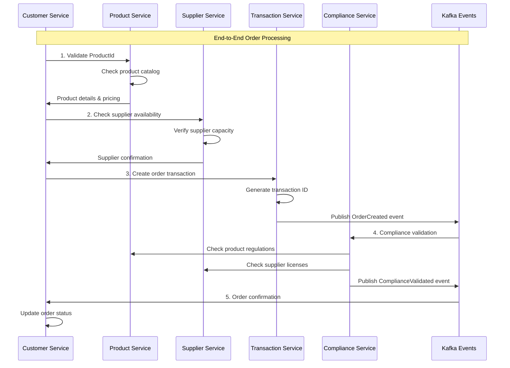

### **Vehicle & Driver Assignment Flow**

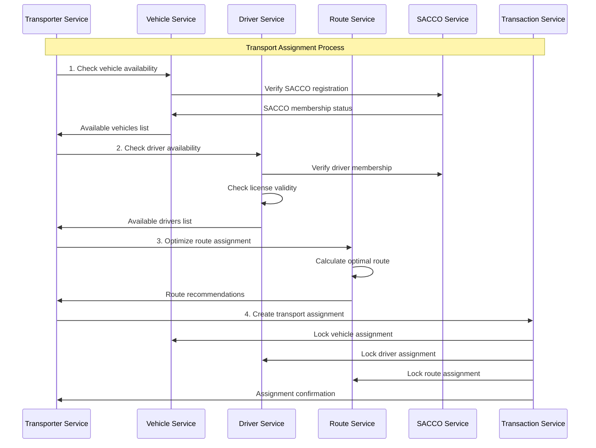

## 📱 **Real-Time Data Processing Components**

### **Weight Data Processing Pipeline**

```mermaid
flowchart LR
    subgraph "Hardware Layer"
        LoadCells[Load Cells]
        Sensors[Weight Sensors]
    end
    
    subgraph "Data Acquisition"
        HardwareInterface[Hardware Interface]
        DataBuffer[Data Buffer]
        Validator[Data Validator]
    end
    
    subgraph "Weight Data Service"
        Processor[Weight Processor]
        Calibrator[Calibration Engine]
        Publisher[Event Publisher]
    end
    
    subgraph "Storage Layer"
        InfluxDB[(InfluxDB)]
        Kafka[Kafka Stream]
        Redis[(Redis Cache)]
    end
    
    subgraph "Consumer Services"
        TransactionSvc[Transaction Service]
        AnalyticsSvc[Analytics Service]
        ComplianceSvc[Compliance Service]
    end

    LoadCells -->|Raw Signals| HardwareInterface
    Sensors -->|Digital Data| HardwareInterface
    HardwareInterface -->|Buffered Data| DataBuffer
    DataBuffer -->|Validated Data| Validator
    
    Validator -->|Clean Data| Processor
    Processor -->|Calibrated Weight| Calibrator
    Calibrator -->|Accurate Weight| Publisher
    
    Publisher -->|Time-Series Data| InfluxDB
    Publisher -->|Weight Events| Kafka
    Publisher -->|Current Weight| Redis
    
    Kafka -->|Real-Time Events| TransactionSvc
    Kafka -->|Analytics Events| AnalyticsSvc
    Kafka -->|Compliance Events| ComplianceSvc
```

### **Event-Driven Architecture Components**

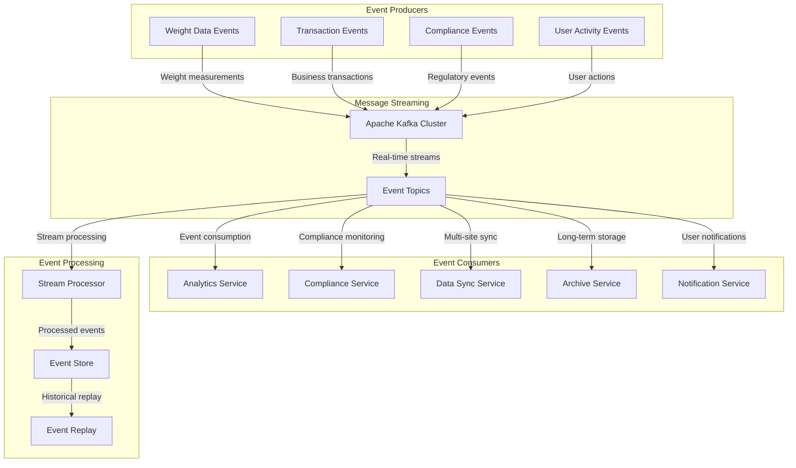

## 🔐 **Security Component Interactions**

### **Role-Based Access Control (RBAC) Flow**

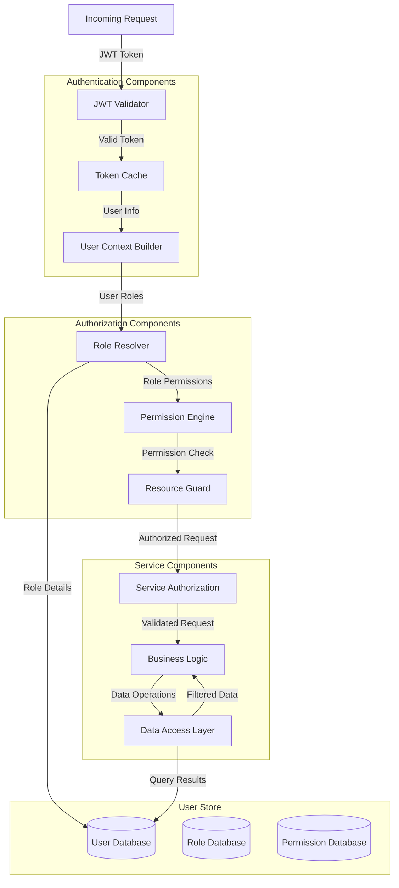

## 📊 **Data Consistency Patterns**

### **Multi-Service Transaction Pattern**

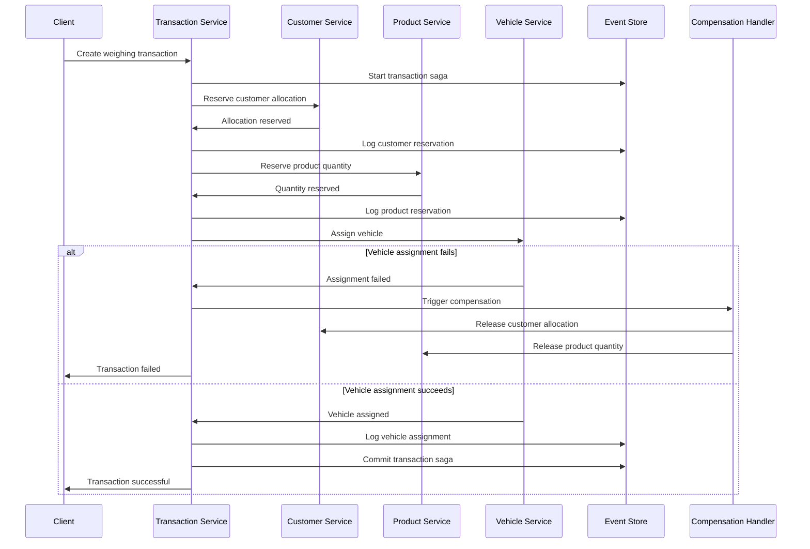

### **Event Sourcing Pattern**

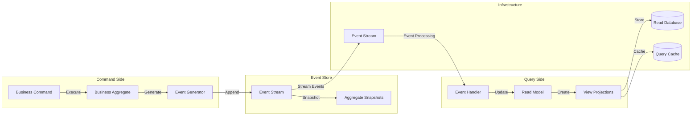

## 🔄 **Service Discovery & Health Monitoring**

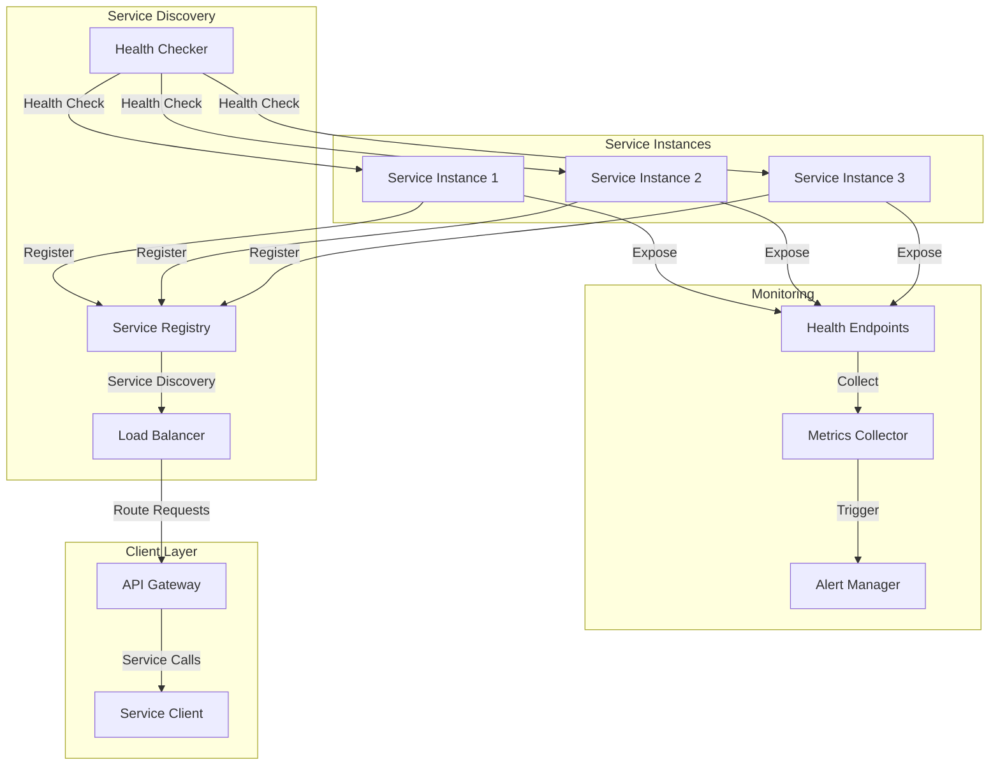

## 🔧 **Error Handling & Resilience Patterns**

### **Circuit Breaker Pattern**

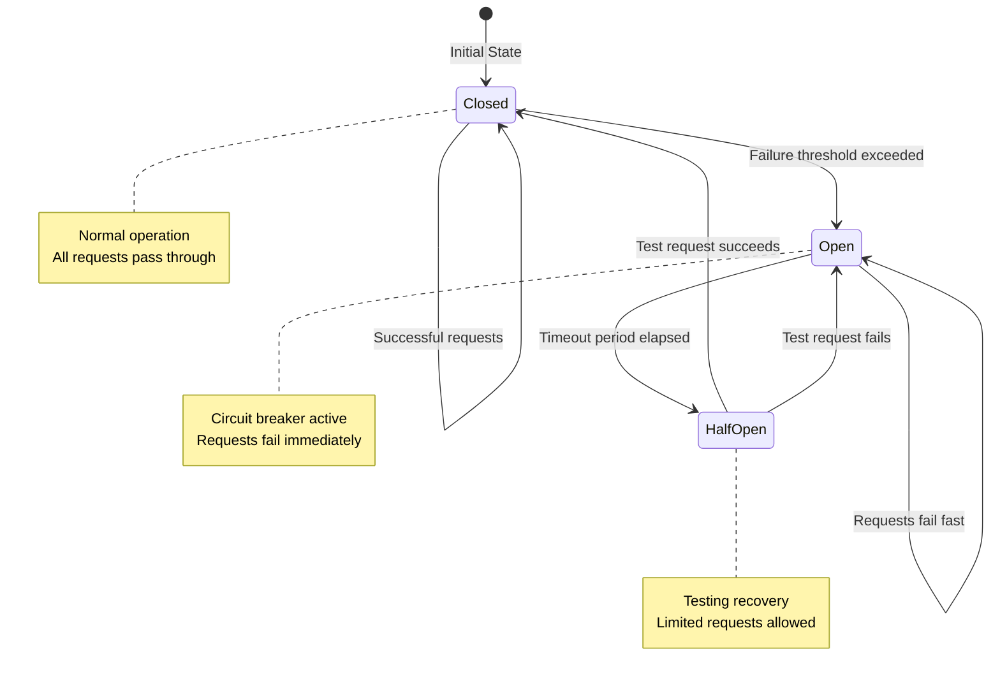

### **Retry & Timeout Strategy**

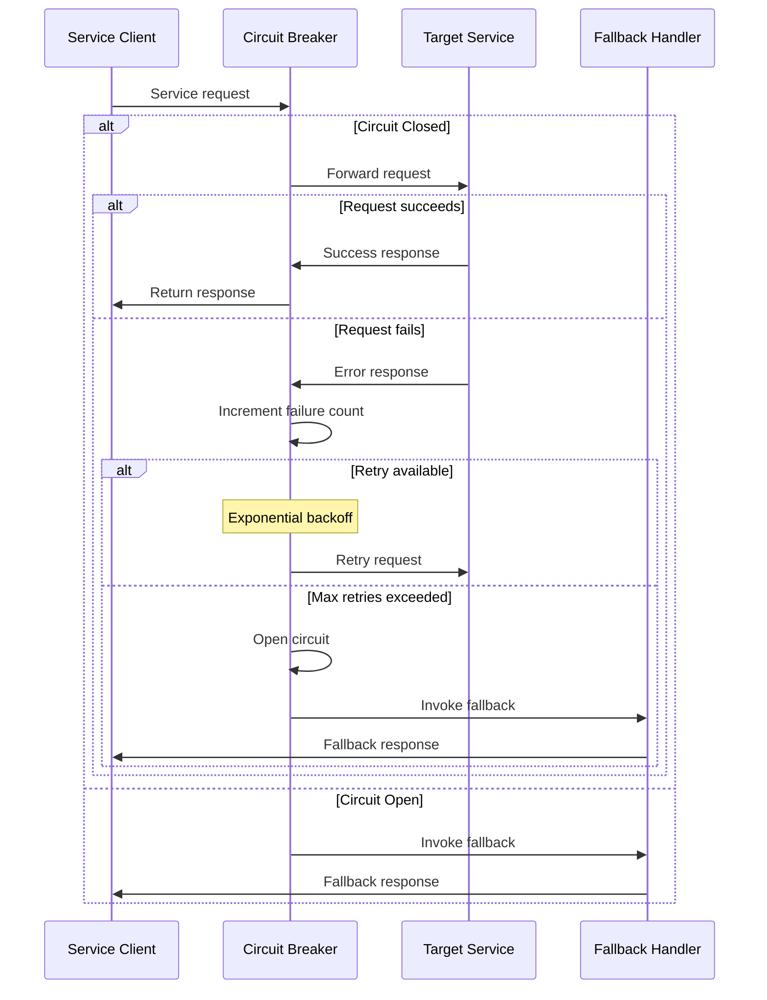

---

**Previous Level**: [← Container Architecture](02-container-architecture.md) | **Next Level**: [Service Architectures →](04-service-architectures.md)