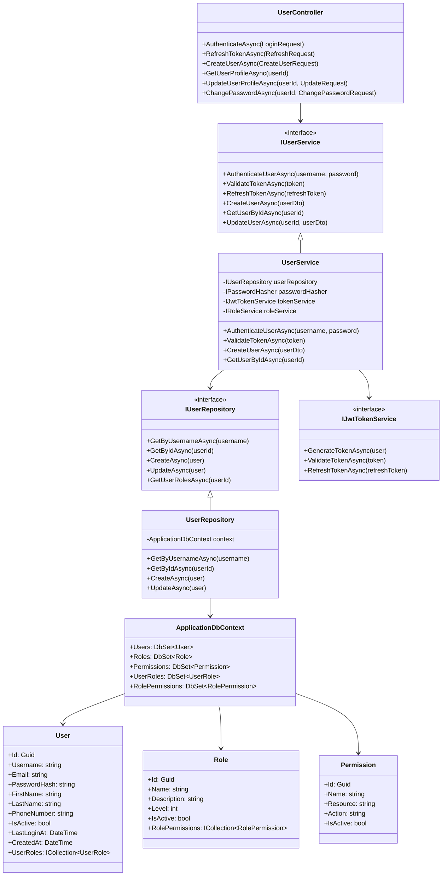
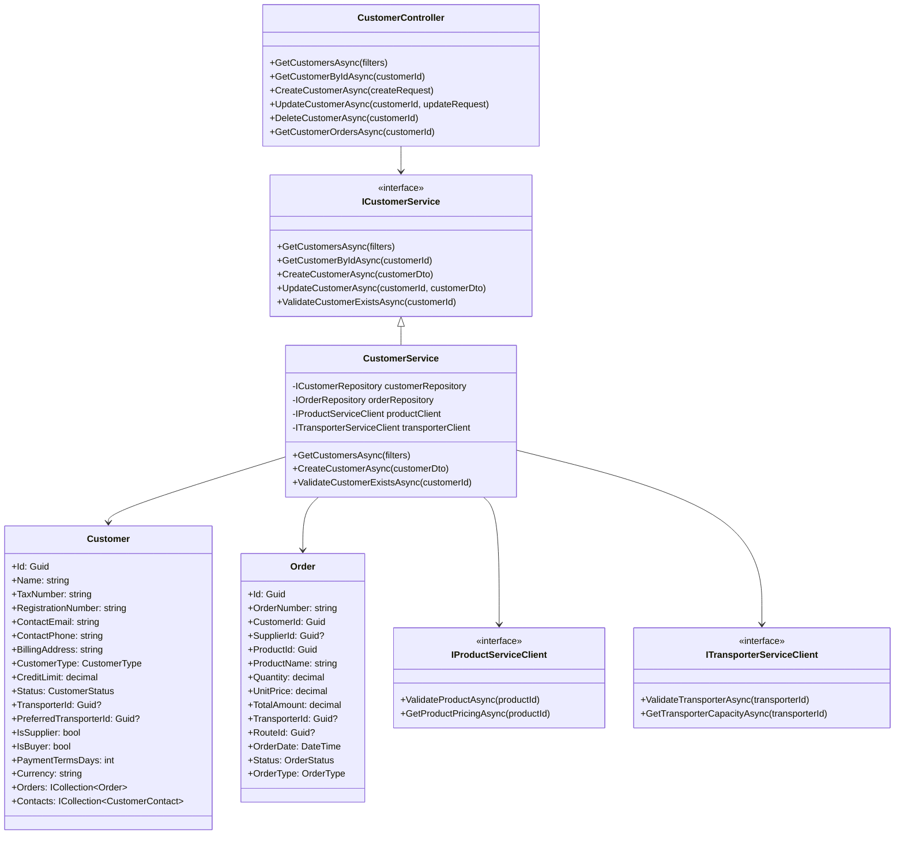
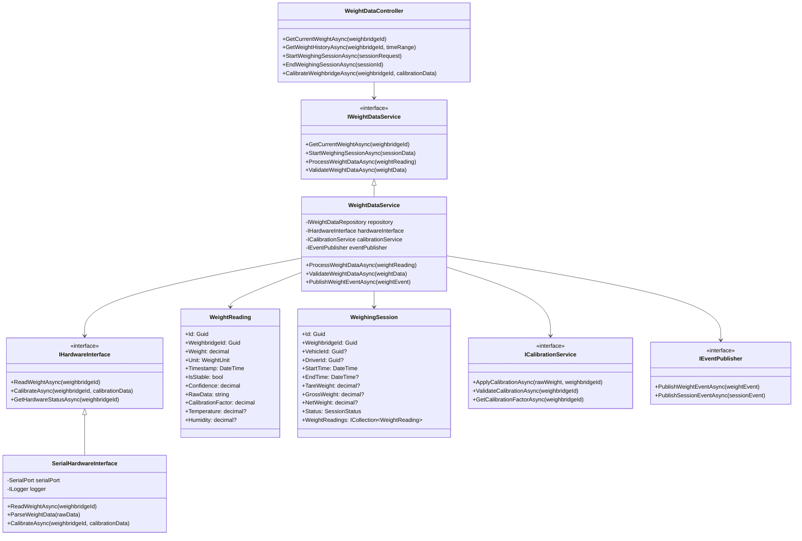
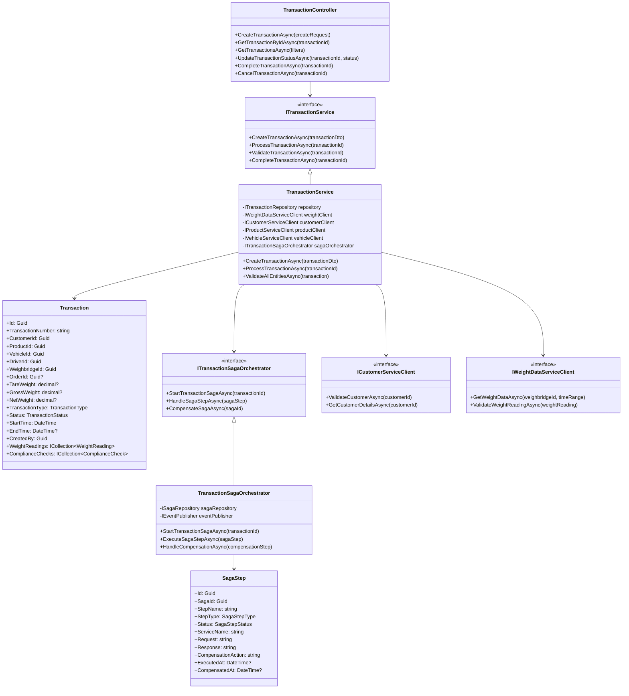
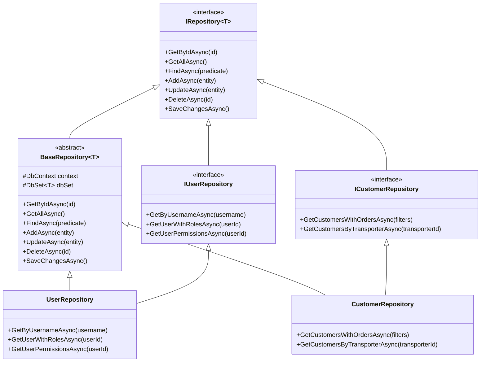
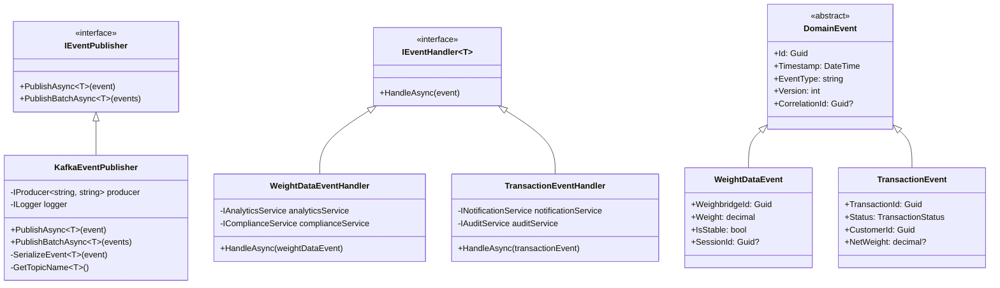
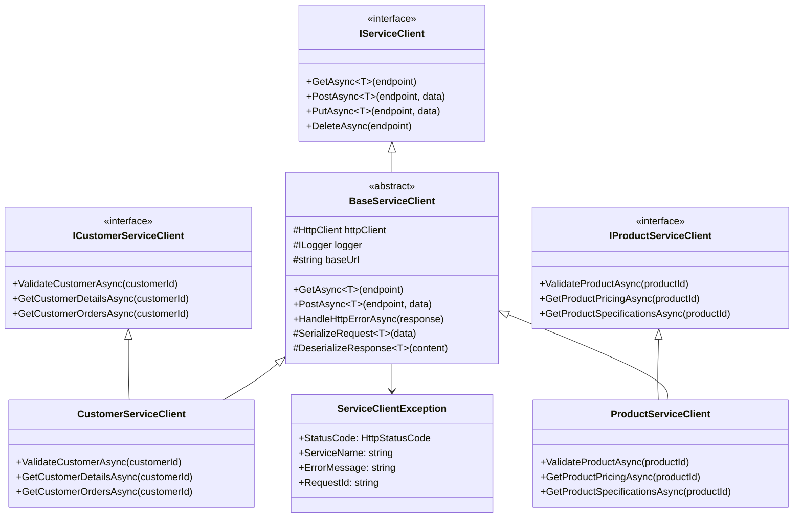
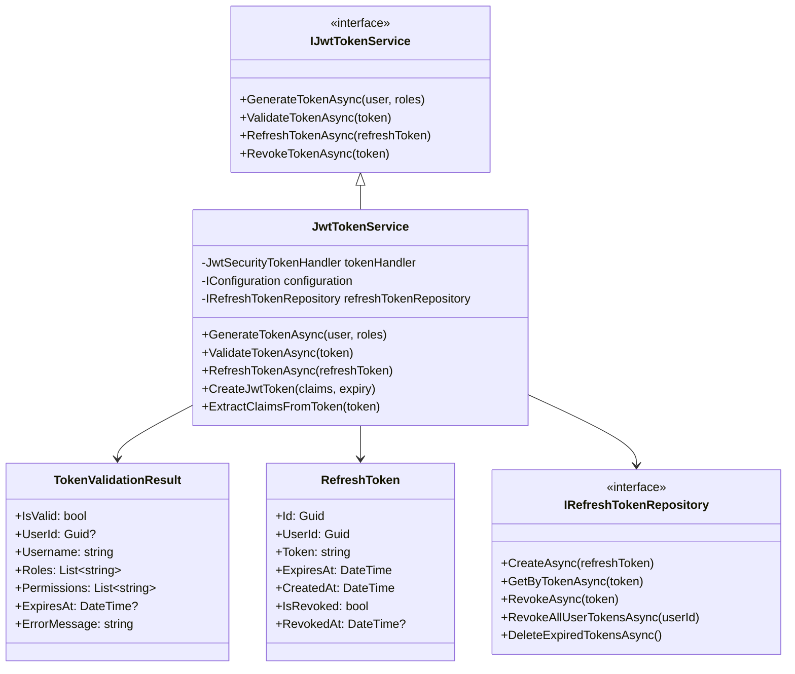
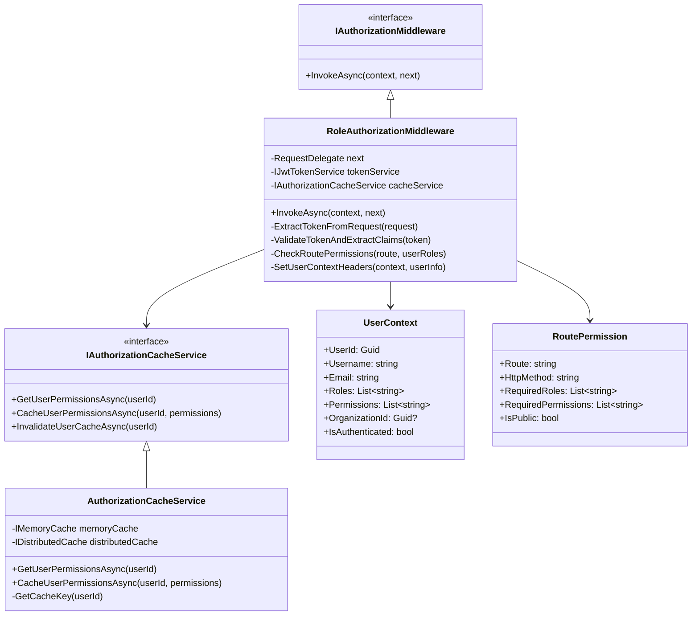
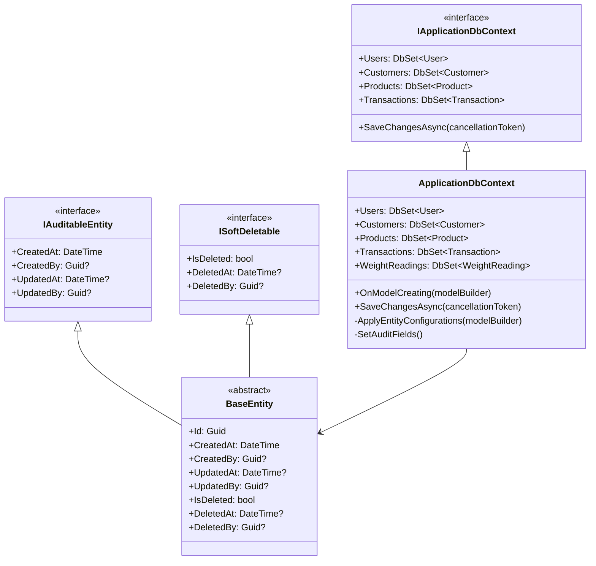

# C4 Level 4: Service Architecture Details

## ⚙️ **Service Internal Architecture**

This document provides detailed views of the internal structure of key services, showing classes, interfaces, data models, and architectural patterns used within individual services.

## 🗄️ **DataMaster Service Architectures**

### **User Service Architecture** (:7001)

### **Customer Service Architecture** (:7008)

## ⚙️ **DataManager Service Architectures**

### **Weight Data Service Architecture**

### **Transaction Service Architecture**

## 🔧 **Shared Infrastructure Components**

### **Repository Pattern Implementation**

### **Event Publishing Architecture**

### **Service Client Pattern**

## 🔒 **Security Architecture Components**

### **JWT Token Service Architecture**

### **Authorization Middleware Architecture**

## 📊 **Data Access Architecture**

### **Database Context Architecture**

---

**Previous Level**: [← Component Flows](03-component-flows.md) | **Next Level**: [Business Processes →](05-business-processes.md)