# Business Process Flows

## 📈 **End-to-End Business Workflows**

This document illustrates the complete business processes that flow through the QaliTrack system, showing how different services collaborate to deliver business value.

## 🚛 **Complete Weighing Transaction Process**

### **Process Overview**
A complete weighing transaction involves multiple stages from initial vehicle registration through final delivery confirmation, spanning both masterdata and DataManager services.

```mermaid
flowchart TD
    subgraph "Phase 1: Pre-Arrival Setup"
        A1[Driver Vehicle Registration]
        A2[Route Assignment]
        A3[Load Planning]
        A4[Documentation Preparation]
    end
    
    subgraph "Phase 2: Arrival & Tare Weighing"
        B1[Gate Entry Scan]
        B2[Vehicle Identification]
        B3[Driver Validation]
        B4[Tare Weight Capture]
        B5[Compliance Check]
    end
    
    subgraph "Phase 3: Loading Process"
        C1[Product Loading]
        C2[Quality Control]
        C3[Loading Documentation]
        C4[Safety Verification]
    end
    
    subgraph "Phase 4: Gross Weighing & Exit"
        D1[Gross Weight Capture]
        D2[Net Weight Calculation]
        D3[Final Compliance Check]
        D4[Documentation Generation]
        D5[Payment Processing]
        D6[Gate Exit Authorization]
    end
    
    subgraph "Phase 5: Post-Departure"
        E1[Delivery Tracking]
        E2[Customer Notification]
        E3[Invoice Generation]
        E4[Performance Analytics]
        E5[Compliance Reporting]
    end

    A1 --> A2 --> A3 --> A4
    A4 --> B1 --> B2 --> B3 --> B4 --> B5
    B5 --> C1 --> C2 --> C3 --> C4
    C4 --> D1 --> D2 --> D3 --> D4 --> D5 --> D6
    D6 --> E1 --> E2 --> E3 --> E4 --> E5
```

## 🔄 **Detailed Service Interaction Workflows**

### **1. Vehicle Registration & Validation Workflow**

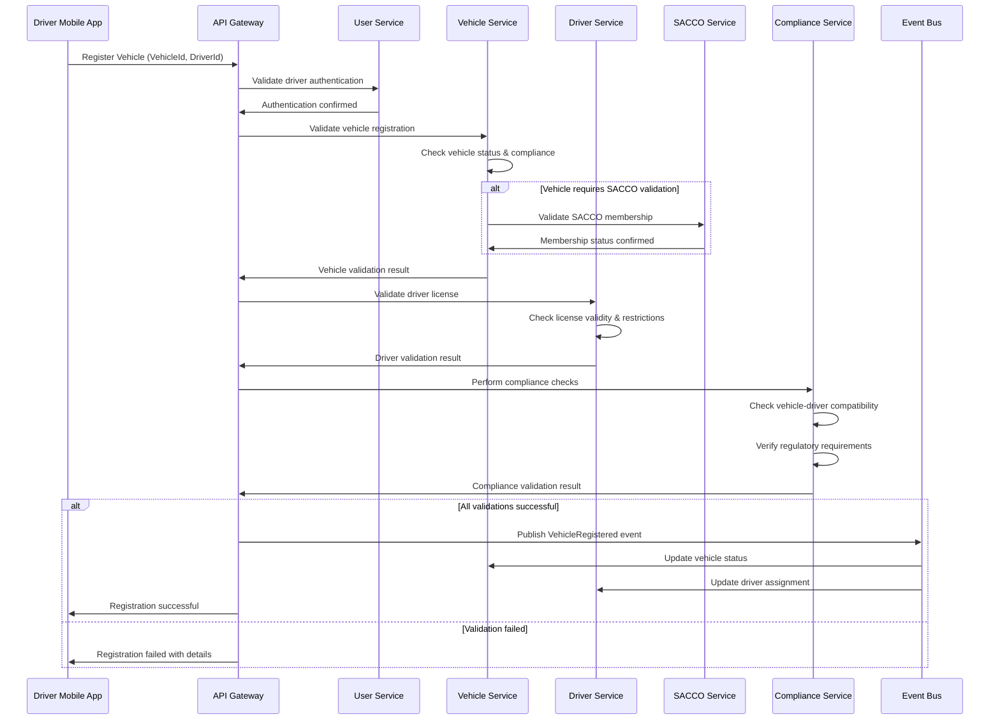

### **2. Customer Order Processing Workflow**

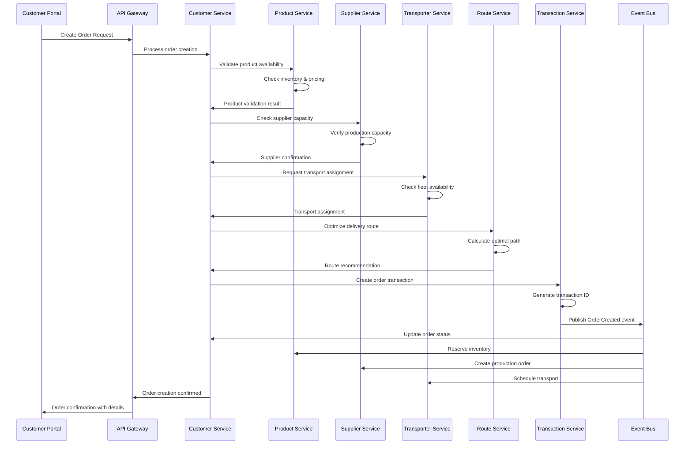

### **3. Real-Time Weight Processing Workflow**

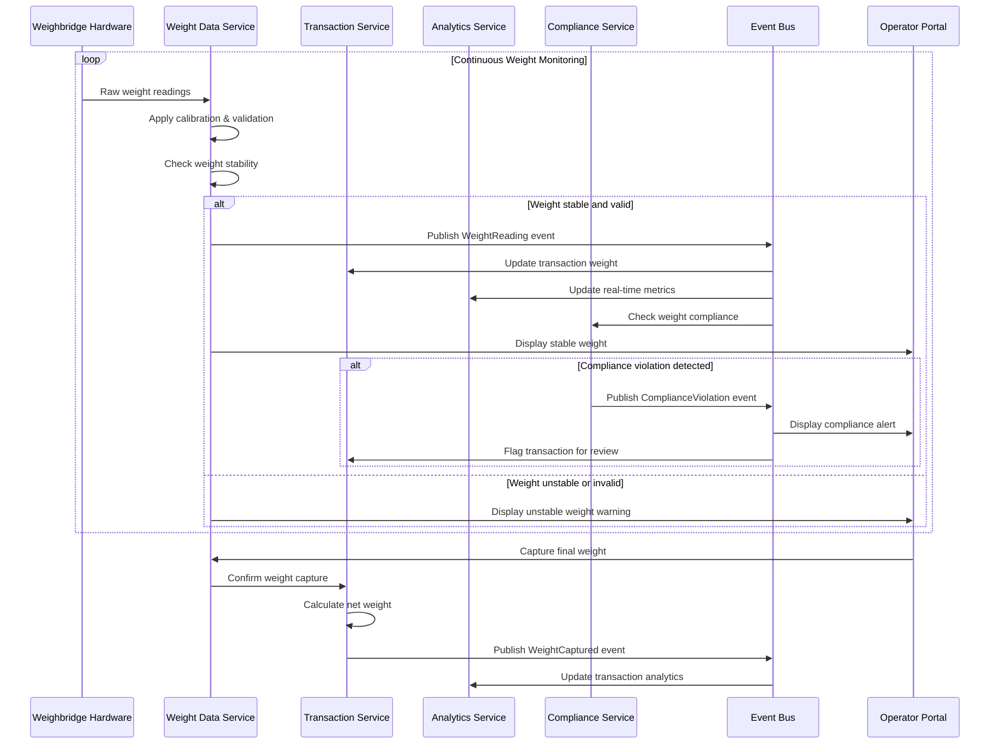

## 🏢 **Multi-Tenant Business Processes**

### **Organization-Specific Workflows**

```mermaid
flowchart TD
    subgraph "Cement Company A (Bamburi)"
        A1[Internal Production Orders]
        A2[Quality Control Processes]
        A3[Distribution Management]
        A4[Customer Delivery Tracking]
    end
    
    subgraph "Cement Company B (ARM)"
        B1[Production Planning]
        B2[Supplier Coordination]
        B3[Fleet Management]
        B4[Regional Distribution]
    end
    
    subgraph "Transport Company C (Trans-Fast)"
        C1[Multi-Client Fleet]
        C2[Driver Assignment]
        C3[Route Optimization]
        C4[Performance Monitoring]
    end
    
    subgraph "SACCO Cooperative D"
        D1[Member Vehicle Management]
        D2[Cooperative Benefits]
        D3[Democratic Governance]
        D4[Financial Services]
    end
    
    subgraph "Shared QaliTrack Services"
        S1[User Authentication]
        S2[Weighbridge Operations]
        S3[Compliance Monitoring]
        S4[Analytics & Reporting]
    end

    A1 --> S1
    A2 --> S2
    A3 --> S3
    A4 --> S4
    
    B1 --> S1
    B2 --> S2
    B3 --> S3
    B4 --> S4
    
    C1 --> S1
    C2 --> S2
    C3 --> S3
    C4 --> S4
    
    D1 --> S1
    D2 --> S2
    D3 --> S3
    D4 --> S4
```

### **Cross-Organization Collaboration Flow**

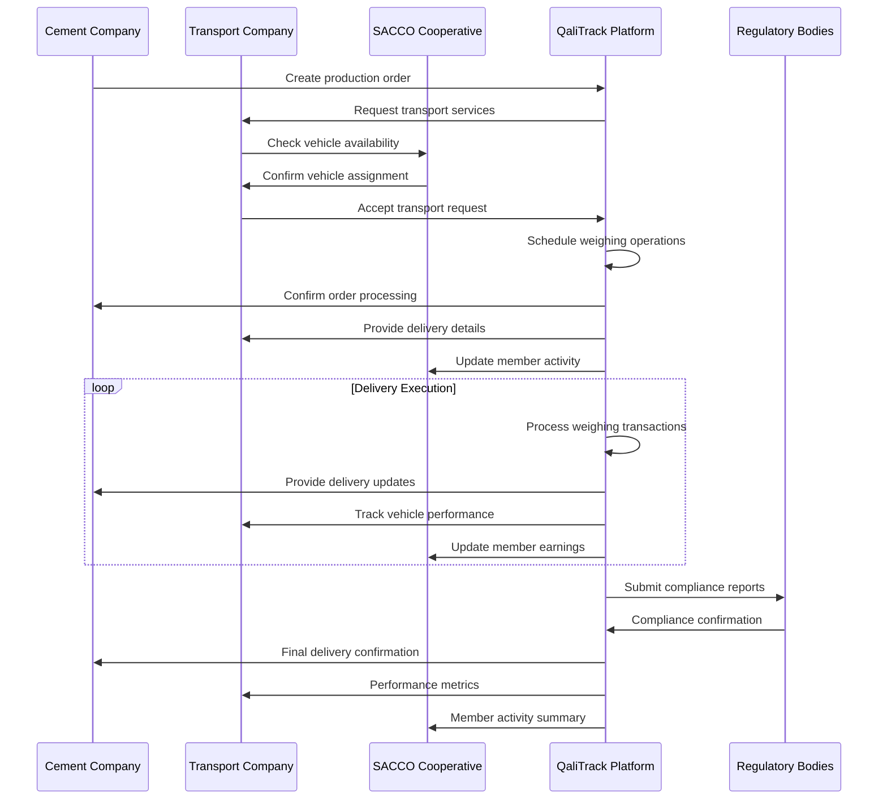

## 📊 **Analytics & Reporting Business Processes**

### **Real-Time Performance Monitoring**

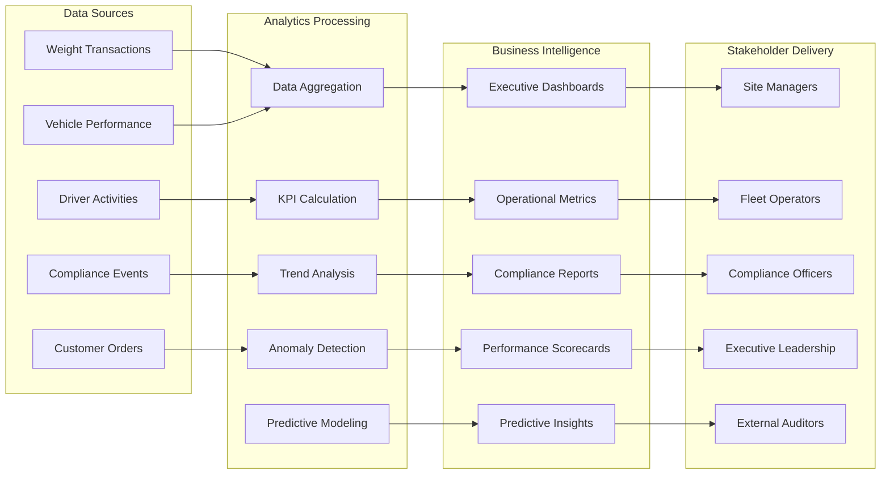

### **Compliance Monitoring & Reporting Process**

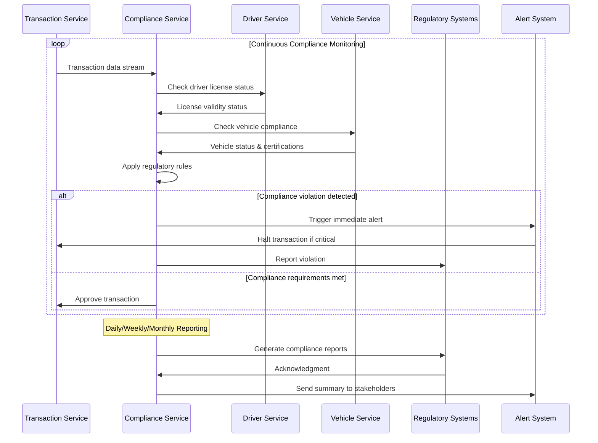

## 🔄 **Business Continuity & Disaster Recovery**

### **Failover & Recovery Process**

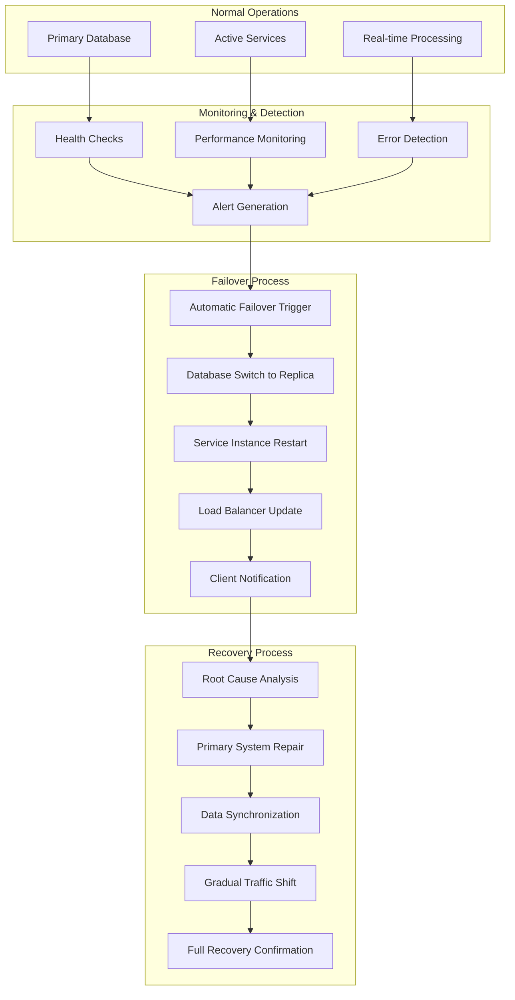

## 📋 **Standard Operating Procedures (SOPs)**

### **Daily Operations Checklist**

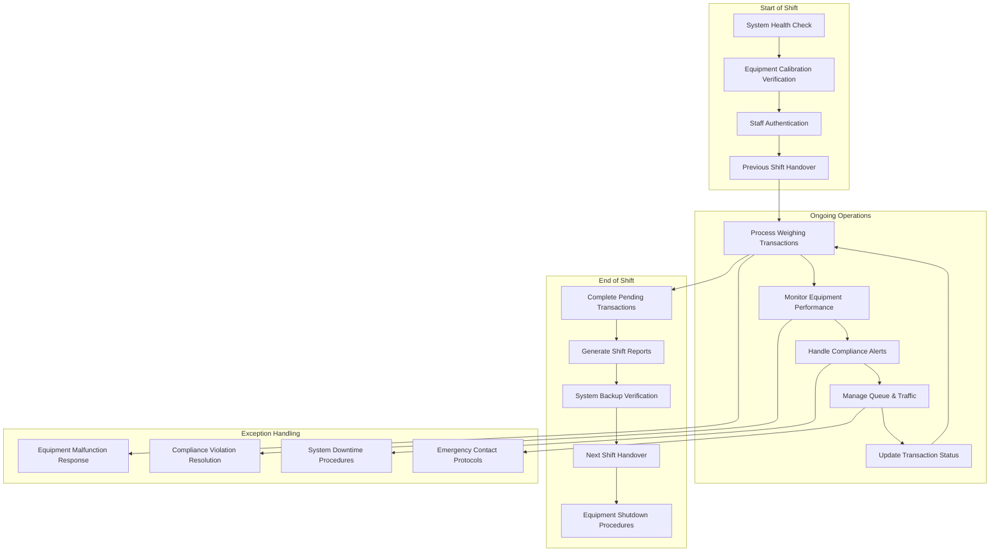

### **Monthly Business Review Process**

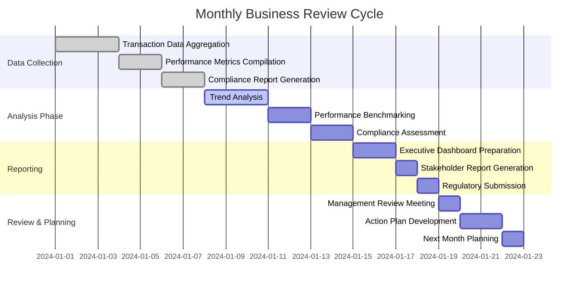

## 🎯 **Key Performance Indicators (KPIs)**

### **Operational KPIs**

| Category | KPI | Target | Measurement Frequency |
|----------|-----|--------|----------------------|
| **Efficiency** | Average Transaction Time | < 15 minutes | Real-time |
| **Accuracy** | Weight Measurement Accuracy | ±0.1% | Daily |
| **Availability** | System Uptime | 99.9% | Continuous |
| **Throughput** | Vehicles Processed per Hour | > 20 vehicles | Hourly |
| **Compliance** | Regulatory Compliance Rate | 100% | Daily |
| **Customer Satisfaction** | Driver Wait Time | < 10 minutes | Real-time |

### **Business KPIs**

| Category | KPI | Target | Measurement Frequency |
|----------|-----|--------|----------------------|
| **Revenue** | Revenue per Transaction | $50+ | Monthly |
| **Cost** | Operational Cost per Vehicle | < $25 | Monthly |
| **Quality** | Error Rate | < 1% | Daily |
| **Growth** | Customer Retention Rate | > 95% | Quarterly |
| **Innovation** | Feature Adoption Rate | > 80% | Quarterly |
| **Sustainability** | Environmental Compliance | 100% | Monthly |

---

**Previous Level**: [← Service Architectures](04-service-architectures.md) | **Next Level**: [Onboarding Guide →](06-onboarding-guide.md)