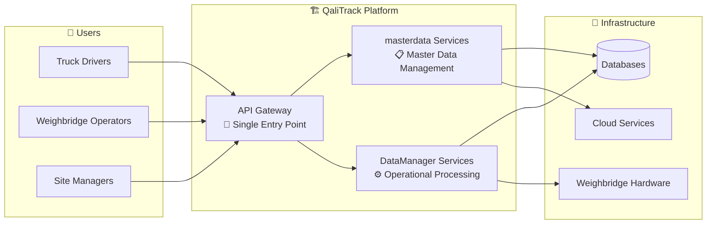
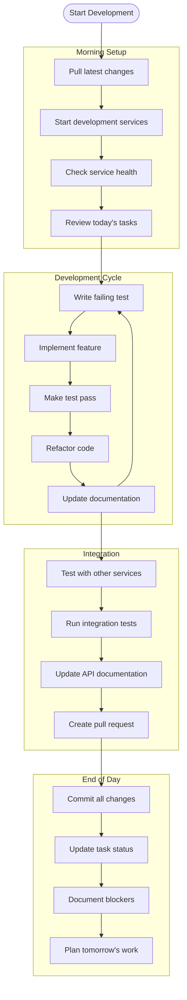
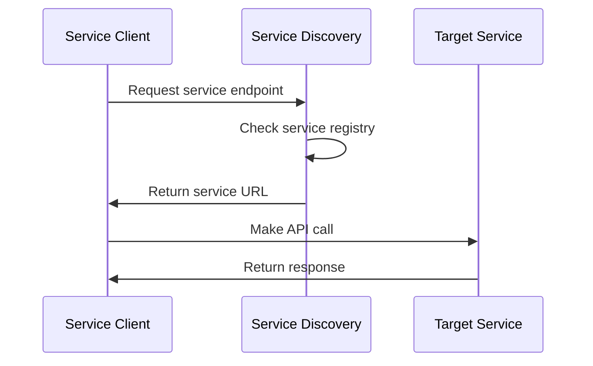

# Developer Onboarding Guide

## 🚀 **Welcome to QaliTrack Development**

This guide will help new developers understand the QaliTrack system quickly and become productive team members. Follow this progressive learning path to master the system architecture and development practices.

## ⚡ **Quick Start: QaliTrack in 5 Minutes**

### **What is QaliTrack?**
QaliTrack is a comprehensive weighbridge management system that digitizes the entire weighing process for cement companies, transport operators, and regulatory compliance across Kenya.

### **System at a Glance**



### **Key System Numbers**
- **18 Microservices**: 11 masterdata + 7 DataManager services
- **3 Client Applications**: Web Portal, Mobile App, Admin Panel
- **4 Infrastructure Components**: PostgreSQL, Redis, Kafka, Elasticsearch
- **1 API Gateway**: Central routing and authentication

## 📚 **Learning Path**

### **Phase 1: Understanding the System (Week 1)**

#### **Day 1-2: System Context**
1. **Read**: [System Context Diagram](01-system-context.md)
2. **Understand**: External users, systems, and business value
3. **Task**: Sketch the system from memory
4. **Validation**: Explain QaliTrack to a non-technical person

#### **Day 3-4: Container Architecture** 
1. **Read**: [Container Architecture](02-container-architecture.md)
2. **Understand**: Major system components and technology choices
3. **Task**: Map services to business capabilities
4. **Validation**: Identify which service handles specific business operations

#### **Day 5: Component Interactions**
1. **Read**: [Component Flows](03-component-flows.md)
2. **Understand**: How services communicate and share data
3. **Task**: Trace a transaction through the system
4. **Validation**: Draw sequence diagram for user authentication

### **Phase 2: Hands-On Development (Week 2)**

#### **Development Environment Setup**

```bash
# 1. Clone the repository
git clone [repository-url]
cd qalitrackservices

# 2. Install dependencies
# - .NET 8 SDK
# - Docker Desktop
# - Visual Studio Code or Visual Studio

# 3. Start basic services
cd packages/qalitrack-gateway
dotnet run

# 4. Start user service (critical dependency)
cd packages/microservices/masterdata/user-service
dotnet run

# 5. Verify setup
curl http://localhost:7000/health
```

#### **Your First Service Exploration**

**Target**: Customer Service (:7008)
- **Why this service**: Well-documented, moderate complexity, clear business purpose
- **Location**: `packages/microservices/masterdata/customer-service/`

**Exploration Tasks**:
1. **Run the service**: `dotnet run` in the service directory
2. **API Exploration**: Use the `.http` files to test endpoints
3. **Code Review**: Examine the controller → service → repository pattern
4. **Database**: Look at the SQLite database structure

### **Phase 3: Service Development (Week 3-4)**

#### **Service Ownership Assignment**

**New developers typically start with:**

| Service | Complexity | Business Impact | Learning Value |
|---------|------------|-----------------|----------------|
| **Product Service** :7005 | Medium | High | Excellent - catalog patterns |
| **Route Service** :7006 | Medium | Medium | Good - optimization algorithms |
| **Weighbridge Service** :7007 | Low | Low | Good - equipment integration |
| **Analytics Service** | High | Medium | Advanced - data processing |

#### **Development Standards Checklist**

```markdown
## Service Development Checklist

### 🏗️ Architecture
- [ ] Follow clean architecture pattern
- [ ] Implement repository pattern
- [ ] Use dependency injection
- [ ] Apply SOLID principles

### 📊 Database
- [ ] Entity Framework Core with SQLite (dev)
- [ ] Proper entity relationships
- [ ] Database migrations
- [ ] Seed data for testing

### 🔌 API Design
- [ ] RESTful endpoints
- [ ] Consistent naming conventions
- [ ] Proper HTTP status codes
- [ ] API documentation (.http files)

### 🧪 Testing
- [ ] Unit tests (>80% coverage)
- [ ] Integration tests
- [ ] API tests using .http files
- [ ] Performance tests for critical paths

### 🔐 Security
- [ ] JWT token validation
- [ ] Role-based authorization
- [ ] Input validation
- [ ] SQL injection prevention

### 📝 Documentation
- [ ] API endpoint documentation
- [ ] Database schema documentation
- [ ] README with setup instructions
- [ ] Code comments for complex logic
```

## 🛠️ **Development Workflow**

### **Daily Development Process**



### **Service Communication Patterns**

#### **Synchronous Communication (Service-to-Service)**

```csharp
// Example: Customer Service calling Product Service
public class CustomerService : ICustomerService
{
    private readonly IProductServiceClient _productClient;
    
    public async Task<OrderDto> CreateOrderAsync(CreateOrderRequest request)
    {
        // 1. Validate product exists
        var product = await _productClient.GetProductAsync(request.ProductId);
        if (product == null)
            throw new BusinessException("Product not found");
            
        // 2. Create order with validated product
        var order = new Order
        {
            ProductId = request.ProductId,
            ProductName = product.Name,
            UnitPrice = product.Price
            // ... other properties
        };
        
        return await _repository.CreateOrderAsync(order);
    }
}
```

#### **Asynchronous Communication (Events)**

```csharp
// Example: Publishing weight data events
public class WeightDataService : IWeightDataService
{
    private readonly IEventPublisher _eventPublisher;
    
    public async Task ProcessWeightReadingAsync(WeightReading reading)
    {
        // 1. Validate and store weight data
        await _repository.SaveWeightReadingAsync(reading);
        
        // 2. Publish event for other services
        var weightEvent = new WeightDataEvent
        {
            WeighbridgeId = reading.WeighbridgeId,
            Weight = reading.Weight,
            Timestamp = reading.Timestamp,
            IsStable = reading.IsStable
        };
        
        await _eventPublisher.PublishAsync(weightEvent);
    }
}
```

## 🔍 **Debugging & Troubleshooting**

### **Common Issues & Solutions**

#### **Service Won't Start**

```bash
# 1. Check port conflicts
netstat -tulpn | grep :7001

# 2. Check database connection
sqlite3 userservice.db ".tables"

# 3. Check configuration
cat appsettings.Development.json

# 4. Clear previous state
rm -rf bin/ obj/
dotnet clean
dotnet build
```

#### **Authentication Issues**

```bash
# 1. Verify User Service is running
curl http://localhost:7001/health

# 2. Test token generation
POST http://localhost:7001/api/auth/login
Content-Type: application/json

{
  "username": "admin",
  "password": "admin123"
}

# 3. Validate token with API Gateway
GET http://localhost:7000/api/customers
Authorization: Bearer [your-jwt-token]
```

#### **Database Issues**

```csharp
// Common Entity Framework issues

// 1. Add migration
dotnet ef migrations add InitialCreate

// 2. Update database
dotnet ef database update

// 3. Reset database
dotnet ef database drop
dotnet ef database update

// 4. Seed test data
dotnet ef database drop
dotnet ef database update
dotnet run --seed-data
```

### **Debugging Tools & Techniques**

#### **Service Health Monitoring**

```bash
# Check all services status
curl http://localhost:7000/api/health/services

# Individual service health
curl http://localhost:7001/health  # User Service
curl http://localhost:7008/health  # Customer Service
curl http://localhost:7005/health  # Product Service
```

#### **Log Analysis**

```bash
# Real-time logs
tail -f logs/customer-service.log

# Search for errors
grep "ERROR" logs/*.log

# Filter by correlation ID
grep "correlation-id-123" logs/*.log
```

## 📖 **Reference Materials**

### **Architecture Patterns Used**

#### **Clean Architecture**
```
┌─────────────────────────────────────┐
│           Controllers               │
│  ┌─────────────────────────────┐   │
│  │        Services             │   │
│  │  ┌─────────────────────┐   │   │
│  │  │     Repositories    │   │   │
│  │  │  ┌─────────────┐   │   │   │
│  │  │  │   Entities  │   │   │   │
│  │  │  └─────────────┘   │   │   │
│  │  └─────────────────────┘   │   │
│  └─────────────────────────────┘   │
└─────────────────────────────────────┘
```

#### **Repository Pattern**
```csharp
public interface IRepository<T> where T : class
{
    Task<T> GetByIdAsync(Guid id);
    Task<IEnumerable<T>> GetAllAsync();
    Task<T> AddAsync(T entity);
    Task UpdateAsync(T entity);
    Task DeleteAsync(Guid id);
    Task<int> SaveChangesAsync();
}
```

### **Service Discovery Pattern**



### **Coding Standards**

#### **Naming Conventions**
- **Classes**: PascalCase (`CustomerService`, `WeightDataRepository`)
- **Methods**: PascalCase (`GetCustomerByIdAsync`, `CreateOrderAsync`)
- **Variables**: camelCase (`customerId`, `orderDetails`)
- **Constants**: UPPER_CASE (`MAX_RETRY_COUNT`, `DEFAULT_TIMEOUT`)

#### **Error Handling**
```csharp
public async Task<CustomerDto> GetCustomerAsync(Guid customerId)
{
    try
    {
        var customer = await _repository.GetByIdAsync(customerId);
        if (customer == null)
            throw new EntityNotFoundException($"Customer {customerId} not found");
            
        return _mapper.Map<CustomerDto>(customer);
    }
    catch (EntityNotFoundException)
    {
        throw; // Re-throw business exceptions
    }
    catch (Exception ex)
    {
        _logger.LogError(ex, "Error retrieving customer {CustomerId}", customerId);
        throw new ServiceException("Error retrieving customer", ex);
    }
}
```

## 🎯 **30-Day Success Metrics**

### **Week 1: Understanding**
- [ ] Can explain QaliTrack business value
- [ ] Understands system architecture
- [ ] Environment setup complete
- [ ] First service explored

### **Week 2: Development Basics**
- [ ] First API endpoint implemented
- [ ] Unit tests written and passing
- [ ] Database operations working
- [ ] Service communication established

### **Week 3: Integration**
- [ ] Service integrates with API Gateway
- [ ] Authentication/authorization working
- [ ] Events published and consumed
- [ ] Error handling implemented

### **Week 4: Proficiency**
- [ ] Can implement complex business logic
- [ ] Performance considerations applied
- [ ] Full testing suite implemented
- [ ] Documentation updated

## 👥 **Team Resources**

### **Who to Ask for Help**

| Area | Contact | Availability |
|------|---------|-------------|
| **Architecture Questions** | Lead Architect | Daily standup |
| **Development Issues** | Senior Developers | Slack #dev-help |
| **DevOps/Infrastructure** | DevOps Engineer | Slack #devops |
| **Business Logic** | Product Owner | Weekly planning |
| **Testing Strategy** | QA Lead | Daily standup |

### **Communication Channels**

- **Daily Standup**: 9:00 AM (Architecture decisions, blockers)
- **Slack #qalitrack-dev**: Real-time development discussions
- **Weekly Architecture Review**: Fridays 2:00 PM
- **Code Review Process**: GitHub pull requests
- **Documentation Updates**: Confluence wiki

## 🔄 **Continuous Learning**

### **Advanced Topics (Month 2+)**
1. **Event Sourcing Patterns**
2. **CQRS Implementation**
3. **Performance Optimization**
4. **Security Hardening**
5. **Microservices Monitoring**
6. **Cloud Deployment Strategies**

### **Recommended Reading**
- **Clean Architecture** by Robert C. Martin
- **Microservices Patterns** by Chris Richardson
- **Domain-Driven Design** by Eric Evans
- **.NET Microservices Architecture** (Microsoft docs)

---

**Congratulations!** You're now equipped to become a productive QaliTrack developer. Remember: ask questions early and often, and don't hesitate to reach out to the team for guidance.

**Previous Level**: [← Business Processes](05-business-processes.md) | **Architecture Guide**: [← Back to README](README.md)