# QaliTrack Services - Entity Relationship Analysis

## Overview

This document provides a comprehensive analysis of entity relationships across all QaliTrack microservices, identifying current relationships, missing relationships, and the target consolidated architecture.

## Current Service Analysis

### Master Data Services (12 services)

| Service | Key Entities | Current Cross-Service References |
|---------|-------------|-----------------------------------|
| **customer-service** | Customer, Contact, Contract, Order | TransporterId (external ref) |
| **driver-service** | Driver, DriverLicense, DriverProfile | None (isolated) |
| **product-service** | Product, Category, Pricing, Specification | None (isolated) |
| **route-service** | Route, RouteWaypoint, RouteRestriction | None (isolated) |
| **weighbridge-service** | Weighbridge, WeighbridgeCalibration, WeighbridgeLocation | None (isolated) |
| **supplier-service** | Supplier, SupplierProduct, SupplierContact | None (isolated) |
| **transporter-service** | Transporter, TransporterFleet, TransporterDriver | CustomerServiceReference (external ref) |
| **vehicle-service** | Vehicle, VehicleType, VehicleRegistration | VehicleTypeId (internal only) |
| **sacco-service** | Sacco, SaccoMember, SaccoCommittee | None (isolated) |
| **user-service** | User, Role, Permission | OrganizationId (external ref) |
| **organization-service** | Organization, OrganizationUser, OrganizationLocation | None (isolated) |
| **report-service** | Report, ReportTemplate, ReportSchedule | None (isolated) |

### Data Manager Services (7 services)

| Service | Key Entities | Cross-Service References |
|---------|-------------|---------------------------|
| **transaction-service** | WeighingTransaction, TransactionWorkflow | VehicleId, DriverId, SupplierId, CustomerId, ProductId, RouteId, WeighbridgeId, OrganizationId |
| **weight-data-service** | WeightMeasurement, CalibrationRecord | WeighbridgeId, TransactionId |
| **compliance-service** | ComplianceCheck, RegulatoryStandard | VehicleId, DriverId, TransactionId |
| **analytics-service** | Analytics, Metrics, Dashboard | References all operational data |
| **operational-data-service** | OperationalAlert, MaintenanceSchedule | WeighbridgeId, VehicleId |
| **data-sync-service** | SyncSession, SyncConflict | All entity references for synchronization |
| **archive-service** | ArchivedTransaction, RetentionPolicy | All entity references for archival |

## Current State ER Diagram

### Master Data Entities

```mermaid
erDiagram
    %% Organization Foundation
    Organization {
        string Id PK
        string Name
        string Type
        string Status
    }
    
    User {
        string Id PK
        string Username
        string Email
        string OrganizationId FK
    }
    
    %% Core Master Data
    Customer {
        string Id PK
        string Name
        string ContactEmail
        string TransporterId FK "External Reference"
        bool IsSupplier
        bool IsBuyer
    }
    
    Supplier {
        string Id PK
        string Name
        string ContactEmail
        string Type
        string Status
    }
    
    Transporter {
        string Id PK
        string Name
        string RegistrationNumber
        bool IsCustomer
        string CustomerServiceReference "External Reference"
    }
    
    Driver {
        string Id PK
        string FirstName
        string LastName
        string EmployeeId
        string Status
    }
    
    Vehicle {
        string Id PK
        string RegistrationNumber
        string Make
        string Model
        string VehicleTypeId FK
        string Status
    }
    
    VehicleType {
        string Id PK
        string Name
        string Category
    }
    
    Product {
        string Id PK
        string Name
        string Code
        string CategoryId FK
        string Status
    }
    
    ProductCategory {
        string Id PK
        string Name
        string Code
    }
    
    Route {
        string Id PK
        string Name
        string Origin
        string Destination
        string Status
    }
    
    Weighbridge {
        string Id PK
        string Name
        string Code
        string Location
        string Status
    }
    
    Sacco {
        string Id PK
        string Name
        string RegistrationNumber
        string Status
    }
    
    %% Current Relationships (Limited)
    Organization ||--o{ User : manages
    Vehicle }o--|| VehicleType : "belongs to"
    Product }o--|| ProductCategory : "categorized by"
```

## Missing Relationships Analysis

### Critical Missing Relationships

#### 1. Driver-SACCO Membership
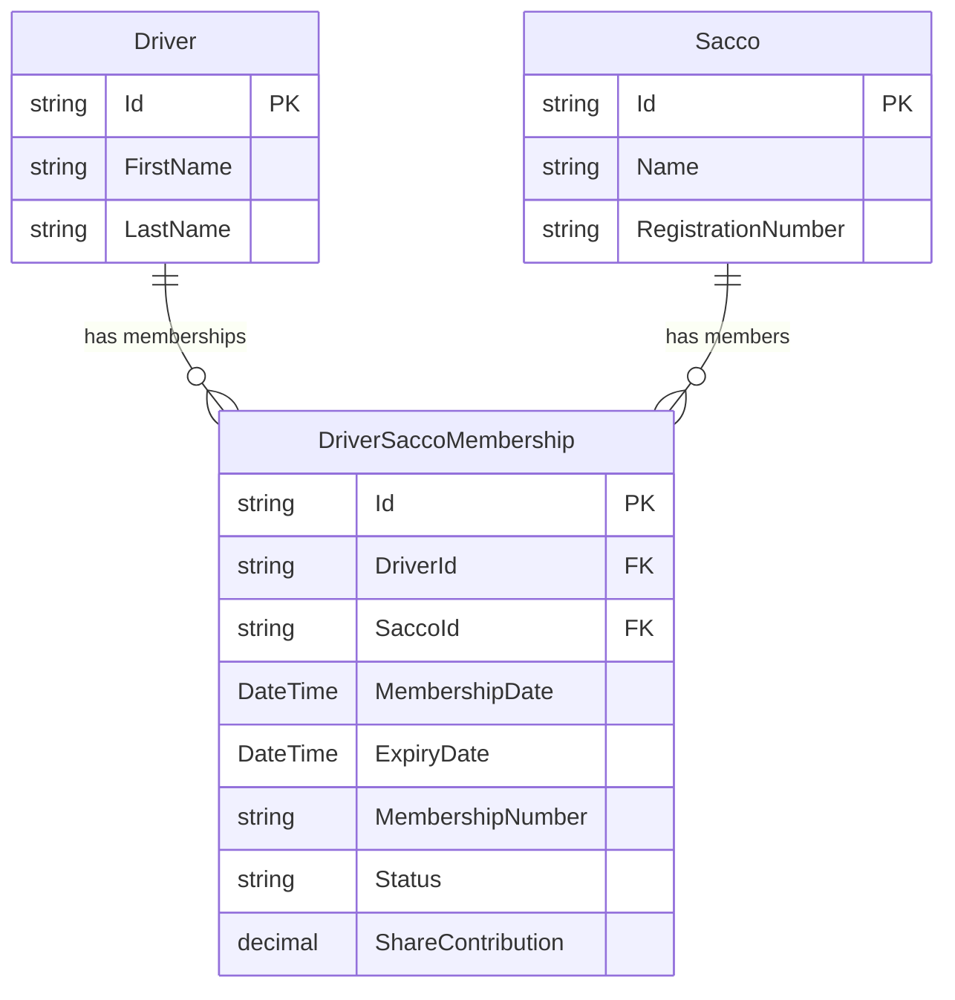

#### 2. Vehicle-Transporter Ownership
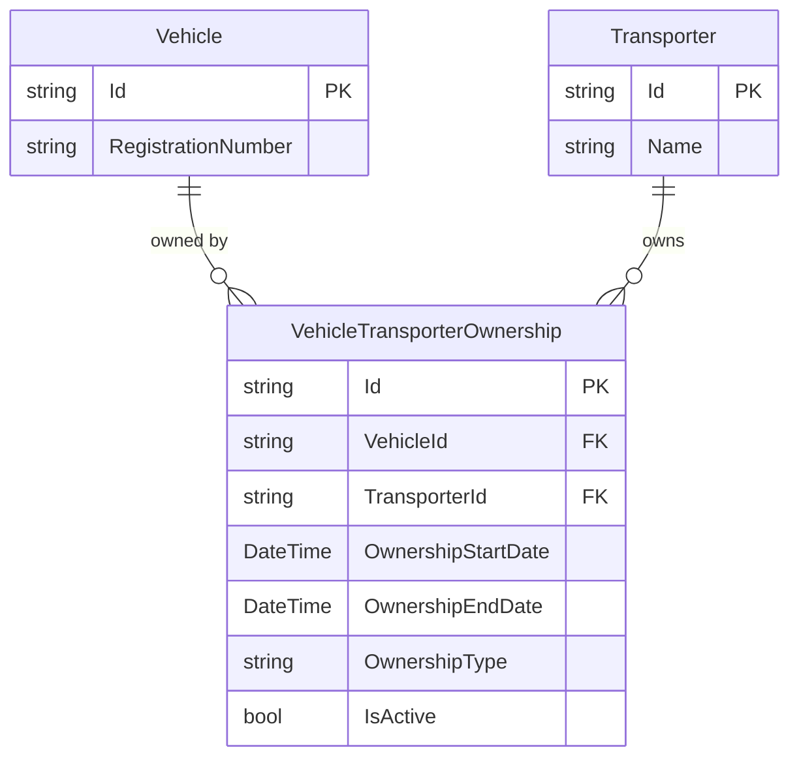

#### 3. Driver-Vehicle Assignment
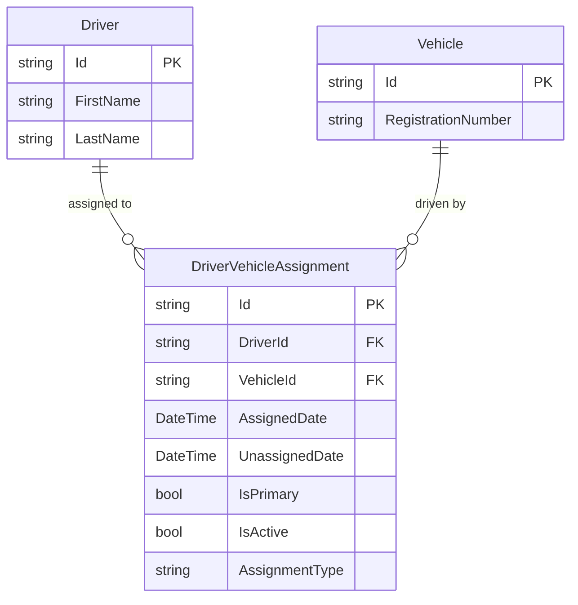

#### 4. Driver-Transporter Employment
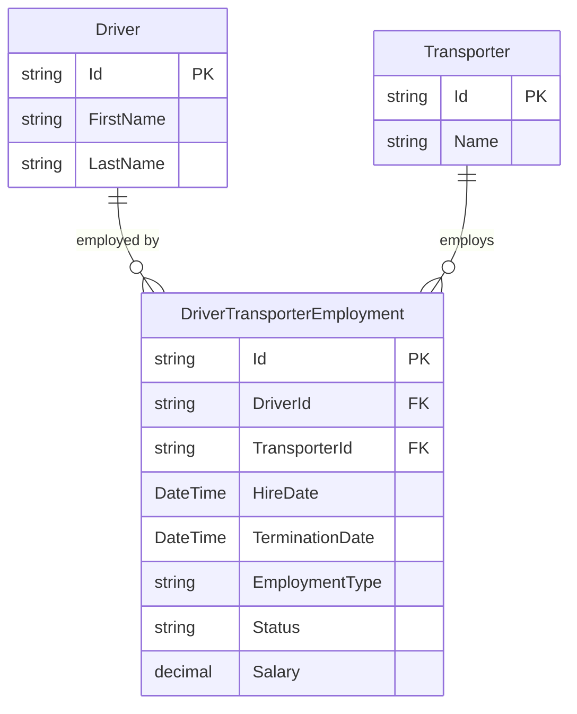

#### 5. Product-Supplier Catalog
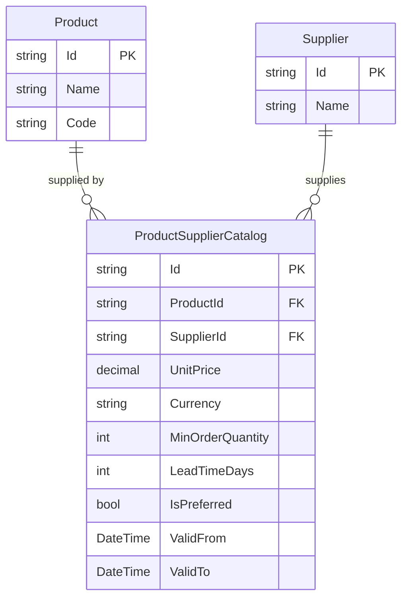

#### 6. Route-Weighbridge Association
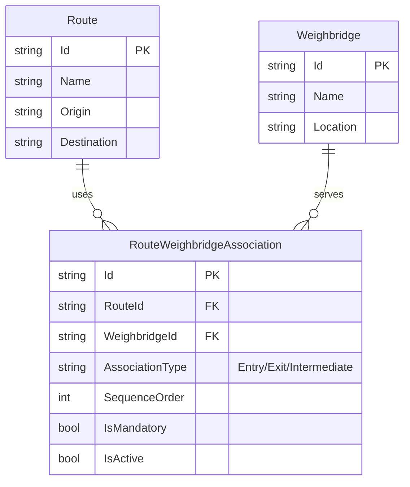

#### 7. Customer-Supplier Dual Role
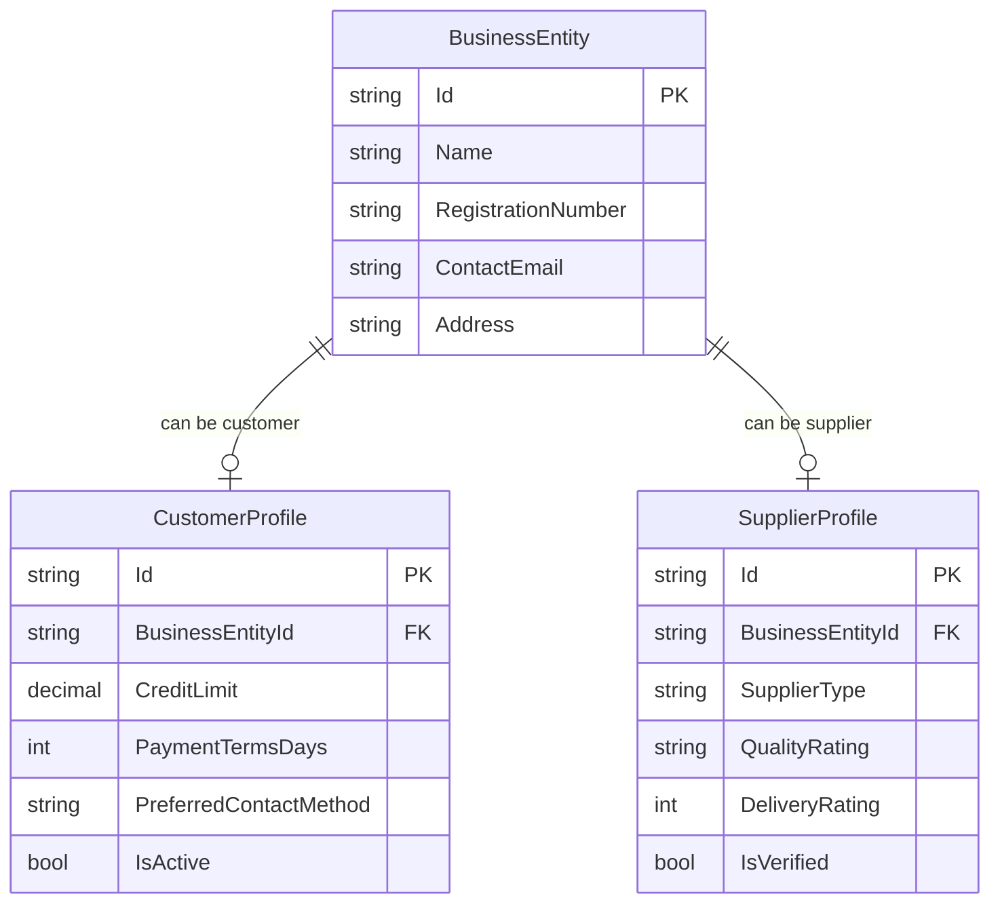

## Target Consolidated Architecture

### Consolidated Master Data Service ER Diagram

```mermaid
erDiagram
    %% Foundation Entities
    Organization {
        string Id PK
        string Name
        string Type
        string Status
        DateTime CreatedAt
        DateTime UpdatedAt
    }
    
    User {
        string Id PK
        string Username
        string Email
        string OrganizationId FK
        DateTime CreatedAt
        DateTime UpdatedAt
    }
    
    %% Business Entities
    BusinessEntity {
        string Id PK
        string Name
        string RegistrationNumber
        string TaxNumber
        string ContactEmail
        string ContactPhone
        string Address
        string OrganizationId FK
        DateTime CreatedAt
        DateTime UpdatedAt
    }
    
    CustomerProfile {
        string Id PK
        string BusinessEntityId FK
        decimal CreditLimit
        int PaymentTermsDays
        string Currency
        string Status
        DateTime CreatedAt
        DateTime UpdatedAt
    }
    
    SupplierProfile {
        string Id PK
        string BusinessEntityId FK
        string SupplierType
        string QualityRating
        bool IsVerified
        DateTime VerificationDate
        DateTime CreatedAt
        DateTime UpdatedAt
    }
    
    TransporterProfile {
        string Id PK
        string BusinessEntityId FK
        string TransporterType
        int FleetSize
        string OperatingLicense
        DateTime LicenseExpiryDate
        DateTime CreatedAt
        DateTime UpdatedAt
    }
    
    %% Operational Entities
    Driver {
        string Id PK
        string FirstName
        string LastName
        string EmployeeId
        DateTime DateOfBirth
        string Status
        string OrganizationId FK
        DateTime CreatedAt
        DateTime UpdatedAt
    }
    
    Vehicle {
        string Id PK
        string RegistrationNumber
        string Make
        string Model
        string VIN
        decimal MaxWeight
        decimal TareWeight
        string Status
        string VehicleTypeId FK
        string OrganizationId FK
        DateTime CreatedAt
        DateTime UpdatedAt
    }
    
    VehicleType {
        string Id PK
        string Name
        string Category
        string Description
        DateTime CreatedAt
        DateTime UpdatedAt
    }
    
    Product {
        string Id PK
        string Name
        string Code
        string Description
        decimal Weight
        string CategoryId FK
        string Status
        string OrganizationId FK
        DateTime CreatedAt
        DateTime UpdatedAt
    }
    
    ProductCategory {
        string Id PK
        string Name
        string Code
        string ParentCategoryId FK
        DateTime CreatedAt
        DateTime UpdatedAt
    }
    
    Route {
        string Id PK
        string Name
        string Code
        string Origin
        string Destination
        double Distance
        string Status
        string OrganizationId FK
        DateTime CreatedAt
        DateTime UpdatedAt
    }
    
    Weighbridge {
        string Id PK
        string Name
        string Code
        string Location
        decimal MaxCapacity
        string Status
        string OrganizationId FK
        DateTime CreatedAt
        DateTime UpdatedAt
    }
    
    Sacco {
        string Id PK
        string Name
        string RegistrationNumber
        string ContactEmail
        string Address
        string Status
        DateTime CreatedAt
        DateTime UpdatedAt
    }
    
    %% Relationship Entities
    DriverSaccoMembership {
        string Id PK
        string DriverId FK
        string SaccoId FK
        DateTime MembershipDate
        DateTime ExpiryDate
        string MembershipNumber
        string Status
        decimal ShareContribution
        DateTime CreatedAt
        DateTime UpdatedAt
    }
    
    VehicleTransporterOwnership {
        string Id PK
        string VehicleId FK
        string TransporterProfileId FK
        DateTime OwnershipStartDate
        DateTime OwnershipEndDate
        string OwnershipType
        bool IsActive
        DateTime CreatedAt
        DateTime UpdatedAt
    }
    
    DriverVehicleAssignment {
        string Id PK
        string DriverId FK
        string VehicleId FK
        DateTime AssignedDate
        DateTime UnassignedDate
        bool IsPrimary
        bool IsActive
        string AssignmentType
        DateTime CreatedAt
        DateTime UpdatedAt
    }
    
    DriverTransporterEmployment {
        string Id PK
        string DriverId FK
        string TransporterProfileId FK
        DateTime HireDate
        DateTime TerminationDate
        string EmploymentType
        string Status
        decimal Salary
        DateTime CreatedAt
        DateTime UpdatedAt
    }
    
    ProductSupplierCatalog {
        string Id PK
        string ProductId FK
        string SupplierProfileId FK
        decimal UnitPrice
        string Currency
        int MinOrderQuantity
        int LeadTimeDays
        bool IsPreferred
        DateTime ValidFrom
        DateTime ValidTo
        DateTime CreatedAt
        DateTime UpdatedAt
    }
    
    RouteWeighbridgeAssociation {
        string Id PK
        string RouteId FK
        string WeighbridgeId FK
        string AssociationType
        int SequenceOrder
        bool IsMandatory
        bool IsActive
        DateTime CreatedAt
        DateTime UpdatedAt
    }
    
    %% Core Relationships
    Organization ||--o{ User : manages
    Organization ||--o{ BusinessEntity : contains
    Organization ||--o{ Driver : employs
    Organization ||--o{ Vehicle : owns
    Organization ||--o{ Product : catalogs
    Organization ||--o{ Route : defines
    Organization ||--o{ Weighbridge : operates
    
    BusinessEntity ||--o| CustomerProfile : "can have"
    BusinessEntity ||--o| SupplierProfile : "can have"
    BusinessEntity ||--o| TransporterProfile : "can have"
    
    Vehicle }o--|| VehicleType : "is of type"
    Product }o--|| ProductCategory : "belongs to"
    ProductCategory }o--o| ProductCategory : "parent/child"
    
    %% Cross-Module Relationships
    Driver ||--o{ DriverSaccoMembership : "member of"
    Sacco ||--o{ DriverSaccoMembership : "has members"
    
    Vehicle ||--o{ VehicleTransporterOwnership : "owned by"
    TransporterProfile ||--o{ VehicleTransporterOwnership : "owns"
    
    Driver ||--o{ DriverVehicleAssignment : "assigned to"
    Vehicle ||--o{ DriverVehicleAssignment : "driven by"
    
    Driver ||--o{ DriverTransporterEmployment : "employed by"
    TransporterProfile ||--o{ DriverTransporterEmployment : "employs"
    
    Product ||--o{ ProductSupplierCatalog : "supplied by"
    SupplierProfile ||--o{ ProductSupplierCatalog : "supplies"
    
    Route ||--o{ RouteWeighbridgeAssociation : "uses"
    Weighbridge ||--o{ RouteWeighbridgeAssociation : "serves"
```

### Consolidated Data Manager Service ER Diagram

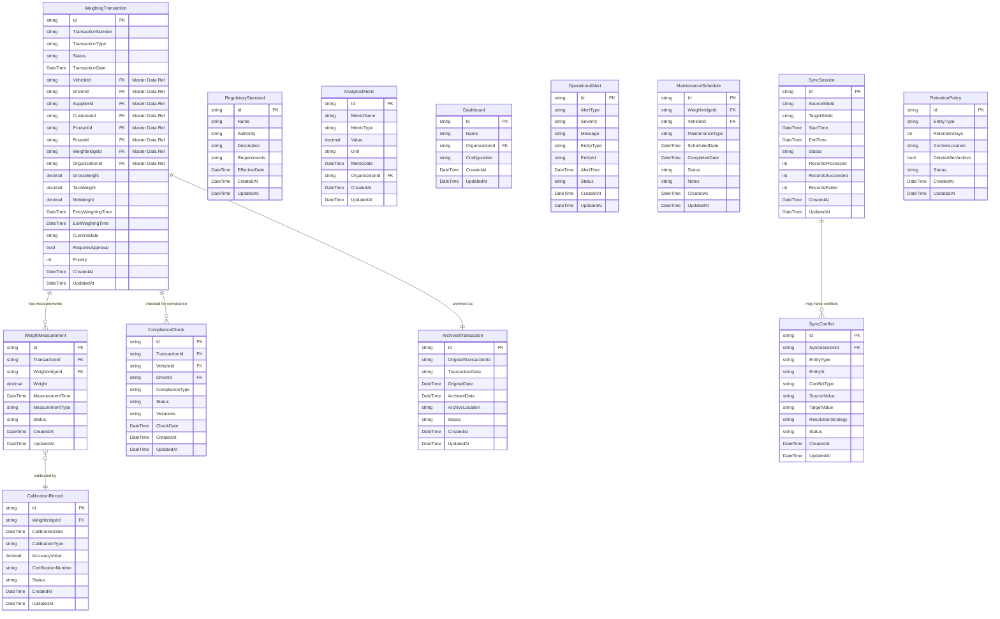

## Integration Points

### Master Data ↔ Data Manager Integration

The consolidated services will integrate through:

1. **Foreign Key References**: Data Manager entities reference Master Data entity IDs
2. **Event-Driven Synchronization**: Changes in Master Data trigger events consumed by Data Manager
3. **Shared DTOs**: Common data transfer objects for cross-service communication
4. **API Gateway Routing**: Unified API endpoint routing to appropriate service modules

### Authentication & Authorization Flow

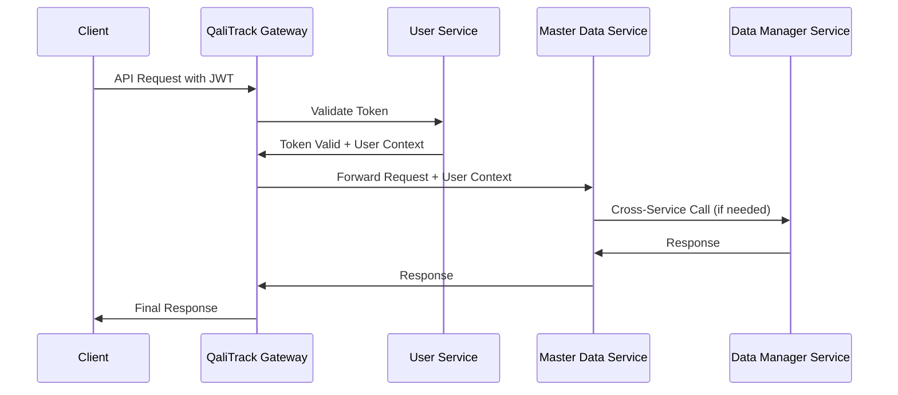

## Next Steps

1. ✅ **Analysis Complete**: Current and missing relationships identified
2. 🔄 **In Progress**: ER diagrams for consolidated architecture
3. ⏳ **Next**: Implement consolidated service structure with Django-style modules
4. ⏳ **Then**: Create missing relationship entities and junction tables
5. ⏳ **Finally**: Migrate existing entities into modular architecture

This analysis provides the foundation for consolidating 19 microservices into 2 well-structured, relationship-complete services with proper Django-style modular organization.