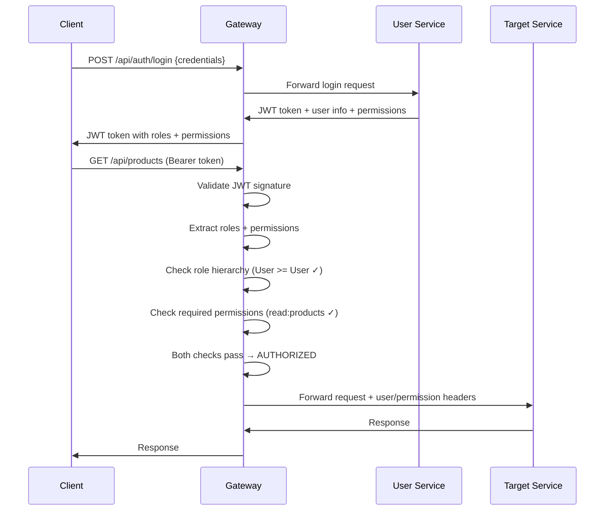

# QaliTrack API Gateway - Technical Architecture

Comprehensive technical documentation covering the implementation details, design patterns, and architectural decisions of the QaliTrack API Gateway.

## 📋 Table of Contents

- [Architecture Overview](#architecture-overview)
- [Core Components](#core-components)
- [Authentication & Authorization](#authentication--authorization)
- [Request Processing Pipeline](#request-processing-pipeline)
- [Service Discovery & Health Monitoring](#service-discovery--health-monitoring)
- [Configuration Management](#configuration-management)
- [Security Implementation](#security-implementation)
- [Performance Optimizations](#performance-optimizations)
- [Deployment Architecture](#deployment-architecture)

## Architecture Overview

### Technology Stack

| Component | Technology | Version | Purpose |
|-----------|------------|---------|---------|
| **Runtime** | .NET | 8.0 | High-performance cross-platform runtime |
| **Gateway Framework** | Ocelot | 22.0.1 | API Gateway with advanced routing |
| **Authentication** | JWT Bearer | 8.0.17 | Token-based authentication |
| **Logging** | Serilog | 8.0.0 | Structured logging and monitoring |
| **Health Checks** | ASP.NET Core | 9.0.0 | Service health monitoring |
| **Documentation** | Swagger/OpenAPI | 6.6.2 | API documentation and testing |
| **Configuration** | YamlDotNet | 13.7.1 | Dynamic configuration management |
| **Service Discovery** | Consul (Optional) | 22.0.1 | Advanced service discovery |

### Design Patterns

#### 1. Gateway Pattern
```
┌─────────────┐    ┌─────────────────┐    ┌─────────────────┐
│   Client    │────│   API Gateway   │────│  Microservices  │
│ Application │    │    (Port 7000)  │    │   (Ports 7001+) │
└─────────────┘    └─────────────────┘    └─────────────────┘
```

**Benefits**:
- Single entry point for all client requests
- Centralized authentication and authorization
- Request/response transformation
- Rate limiting and caching

#### 2. Middleware Pipeline Pattern
```
Request → Authentication → Authorization → Routing → Response
    ↓           ↓              ↓           ↓          ↑
  JWT       Role Check    Service      Ocelot   Downstream
Validation   Middleware   Discovery    Routing    Services
```

#### 3. Hybrid Authorization Model
```
┌─────────────────────────────────────────────────────────┐
│                 Gateway Layer                           │
│  ┌─────────────────────────────────────────────────┐    │
│  │        Coarse-Grained Authorization            │    │
│  │     (Service-level access control)             │    │
│  └─────────────────────────────────────────────────┘    │
└─────────────────────────────────────────────────────────┘
                          │
                          ▼
┌─────────────────────────────────────────────────────────┐
│                Service Layer                            │
│  ┌─────────────────────────────────────────────────┐    │
│  │        Fine-Grained Authorization              │    │
│  │     (Data-level access control)                │    │
│  └─────────────────────────────────────────────────┘    │
└─────────────────────────────────────────────────────────┘
```

## Core Components

### 1. Program.cs - Application Bootstrap

```csharp
// packages/qalitrack-gateway/src/Program.cs
public class Program
{
    public static void Main(string[] args)
    {
        var builder = WebApplication.CreateBuilder(args);
        
        // Service Registration
        ConfigureServices(builder.Services, builder.Configuration);
        
        // Application Pipeline
        var app = builder.Build();
        ConfigurePipeline(app);
        
        app.Run();
    }
}
```

**Key Responsibilities**:
- Dependency injection container setup
- Middleware pipeline configuration
- JWT authentication configuration
- Ocelot integration and routing setup
- Health check registration

### 2. RoleAuthorizationMiddleware - Security Enforcement

```csharp
// packages/qalitrack-gateway/src/Middleware/RoleAuthorizationMiddleware.cs
public class RoleAuthorizationMiddleware
{
    private readonly RequestDelegate _next;
    private readonly IMemoryCache _cache;
    private readonly Dictionary<string, int> _roleHierarchy;
    private readonly Dictionary<string, RouteRoleRequirement> _routeRoleRequirements;
}
```

**Architecture Features**:
- **Role Hierarchy Enforcement**: Numeric level-based authorization
- **Route Pattern Matching**: Dynamic path to role requirement mapping
- **Caching Strategy**: 5-minute TTL for authorization rules
- **User Context Forwarding**: Adds user headers for downstream services

**Role Hierarchy Implementation**:
```csharp
private readonly Dictionary<string, int> _roleHierarchy = new()
{
    ["User"] = 1,
    ["Operator"] = 2, 
    ["SiteManager"] = 3,
    ["Admin"] = 4,
    ["SuperAdmin"] = 5
};
```

### 3. GatewayController - Administrative APIs

```csharp
// packages/qalitrack-gateway/src/Controllers/GatewayController.cs
[ApiController]
[Route("api/[controller]")]
public class GatewayController : ControllerBase
{
    [HttpGet("info")]
    public IActionResult GetGatewayInfo() { }
    
    [HttpGet("services")] 
    public IActionResult GetServices() { }
}
```

**Endpoints**:
- `/api/gateway/info` - Gateway metadata and service catalog
- `/api/gateway/services` - Service discovery information

### 4. ConfigurationService - Dynamic Configuration

```csharp
// packages/qalitrack-gateway/src/Services/ConfigurationService.cs
public interface IConfigurationService
{
    Task<ServiceConfiguration> GetServiceConfigurationAsync(string clientCode);
    Task<List<string>> GetEnabledServicesAsync(string clientCode);
    Task ReloadConfigurationAsync();
}
```

**Configuration Sources**:
- YAML client configuration files (`configs/clients/{client}.yml`)
- Environment variables
- Ocelot JSON configuration
- Runtime configuration updates

## Authentication & Authorization

### Hybrid Authorization Model

The gateway implements a **hybrid authorization model** that enforces both role-based and permission-based access control for comprehensive security.

#### Authorization Flow Diagram



#### Access Control Logic

```
FOR EACH REQUEST:
  1. Validate JWT Token
  2. Extract user role and permissions from token
  3. Check endpoint requirements from configuration
  4. Evaluate: (User Role Level >= Required Role Level) AND 
              (User Permissions ∩ Required Permissions ≠ ∅)
  5. If BOTH conditions TRUE → AUTHORIZE
  6. Else → DENY (403 Forbidden)
```

### JWT Token Structure

```json
{
  "header": {
    "alg": "HS256",
    "typ": "JWT"
  },
  "payload": {
    "sub": "user-uuid",
    "name": "john.doe",
    "email": "john.doe@example.com",
    "role": "Operator",
    "roles": "Operator,User",
    "permissions": "read:products,write:products,read:customers,write:customers",
    "first_name": "John",
    "last_name": "Doe",
    "iss": "UserService",
    "aud": "UserService", 
    "exp": 1625745600,
    "iat": 1625742000
  }
}
```

**Token Claims**:
- `role` - Primary role (backward compatibility)
- `roles` - Comma-separated list of all roles (future multi-role support)  
- `permissions` - Comma-separated list of all permissions derived from roles

### Authorization Configuration Loading

```csharp
// Enhanced route requirements with hybrid authorization support
private Dictionary<string, RouteRoleRequirement> LoadRouteRoleRequirements(IConfiguration config)
{
    var ocelotConfig = configuration.GetSection("Routes");
    
    foreach (var route in ocelotConfig.GetChildren())
    {
        var pathPattern = route["UpstreamPathTemplate"];
        var metadata = route.GetSection("Metadata");
        
        // Load both role and permission requirements
        var requiredRoles = metadata.GetSection("RequiredRoles")
            .Get<List<string>>() ?? new List<string>();
        var requiredPermissions = metadata.GetSection("RequiredPermissions")
            .Get<List<string>>() ?? new List<string>();
        var serviceName = metadata["ServiceName"];
        
        var requirement = new RouteRoleRequirement
        {
            PathPattern = pathPattern,
            RequiredRoles = requiredRoles,
            RequiredPermissions = requiredPermissions, // NEW: Permission support
            ServiceName = serviceName,
            Description = metadata["Description"]
        };
        
        _routeRequirements[pathPattern] = requirement;
    }
}
```

### Role Authorization Middleware Enhancement

```csharp
public class RoleAuthorizationMiddleware
{
    public async Task InvokeAsync(HttpContext context)
    {
        // Skip public endpoints
        if (IsPublicEndpoint(context.Request.Path)) 
        {
            await _next(context);
            return;
        }

        // Extract user claims from JWT
        var userRole = context.User.FindFirst(ClaimTypes.Role)?.Value;
        var userPermissions = context.User.FindFirst("permissions")?.Value
            ?.Split(',', StringSplitOptions.RemoveEmptyEntries) ?? Array.Empty<string>();

        // Find route requirements
        var requirement = FindMatchingRouteRequirement(context.Request.Path);
        if (requirement == null)
        {
            await _next(context);
            return;
        }

        // HYBRID AUTHORIZATION CHECK
        var roleAuthorized = CheckRoleAccess(userRole, requirement.RequiredRoles);
        var permissionAuthorized = CheckPermissionAccess(userPermissions, requirement.RequiredPermissions);

        if (roleAuthorized && permissionAuthorized)
        {
            // Forward user context to downstream services
            AddUserContextHeaders(context, userRole, userPermissions);
            await _next(context);
        }
        else
        {
            // Return detailed authorization error
            await HandleAuthorizationFailure(context, requirement, userRole, userPermissions);
        }
    }

    private bool CheckRoleAccess(string userRole, List<string> requiredRoles)
    {
        if (!requiredRoles.Any()) return true;
        
        var userLevel = GetRoleLevel(userRole);
        var requiredLevel = requiredRoles.Min(role => GetRoleLevel(role));
        
        return userLevel >= requiredLevel;
    }

    private bool CheckPermissionAccess(string[] userPermissions, List<string> requiredPermissions)
    {
        if (!requiredPermissions.Any()) return true;
        
        return requiredPermissions.Any(required => userPermissions.Contains(required));
    }
}
```

### User Context Headers

The gateway adds enhanced user context to downstream requests:

```http
X-User-ID: user-uuid
X-User-Name: john.doe
X-User-Email: john.doe@example.com
X-User-Role: Operator
X-User-Roles: Operator,User
X-User-Permissions: read:products,write:products,read:customers,write:customers
X-Service-Name: ProductService
X-Gateway-Authorized: true
X-Authorization-Method: hybrid
```

**Header Details**:
- `X-User-Role` - Primary role (backward compatibility)
- `X-User-Roles` - All roles for multi-role support
- `X-User-Permissions` - All computed permissions for the user
- `X-Authorization-Method` - Indicates hybrid role+permission authorization used

## Request Processing Pipeline

### Middleware Pipeline Order

```csharp
app.UseCors("AllowAll");
app.UseHttpsRedirection();
app.UseSwagger();
app.UseSwaggerUI();
app.UseSerilogRequestLogging();
app.UseAuthentication();           // JWT validation
app.UseAuthorization();           // Basic ASP.NET Core auth
app.UseRoleAuthorization();       // Custom hybrid role+permission middleware
app.UseHealthChecks("/health");   // Health check endpoints
app.MapControllers();             // Gateway controllers
await app.UseOcelot();            // Ocelot routing (terminal)
```

### Request Flow Diagram

```
┌─────────────┐
│   Client    │
│   Request   │
└──────┬──────┘
       │
       ▼
┌─────────────┐
│    CORS     │
│  Middleware │
└──────┬──────┘
       │
       ▼
┌─────────────┐
│    HTTPS    │
│  Redirect   │
└──────┬──────┘
       │
       ▼
┌─────────────┐
│   Serilog   │
│   Logging   │
└──────┬──────┘
       │
       ▼
┌─────────────┐
│     JWT     │
│ Validation  │
└──────┬──────┘
       │
       ▼
┌─────────────┐
│   Hybrid    │
│ Role+Perm   │
│Authorization│
└──────┬──────┘
       │
       ▼
┌─────────────┐
│   Health    │
│   Checks    │
└──────┬──────┘
       │
       ▼
┌─────────────┐
│   Gateway   │
│ Controllers │
└──────┬──────┘
       │
       ▼
┌─────────────┐
│   Ocelot    │
│   Routing   │
└──────┬──────┘
       │
       ▼
┌─────────────┐
│ Downstream  │
│  Services   │
└─────────────┘
```

### Error Handling Strategy

```csharp
// Global exception handling
public class GlobalExceptionMiddleware
{
    public async Task InvokeAsync(HttpContext context)
    {
        try
        {
            await _next(context);
        }
        catch (UnauthorizedAccessException ex)
        {
            await HandleUnauthorizedAsync(context, ex);
        }
        catch (SecurityTokenException ex)
        {
            await HandleTokenExceptionAsync(context, ex);
        }
        catch (Exception ex)
        {
            await HandleGenericExceptionAsync(context, ex);
        }
    }
}
```

## Service Discovery & Health Monitoring

### Dynamic Health Check Registration

```csharp
// Health checks are dynamically registered based on client configuration
var clientCode = builder.Configuration["CLIENT_CODE"] ?? "testing";
var configPath = Path.Combine("configs", "clients", $"{clientCode}.yml");

if (File.Exists(configPath))
{
    var config = LoadYamlConfiguration(configPath);
    
    foreach (var service in config.Services)
    {
        if (service.Enabled && service.Name != "gateway")
        {
            var healthUrl = $"http://{service.Name}/health";
            healthChecksBuilder.AddUrlGroup(new Uri(healthUrl), service.Name);
        }
    }
}
```

### Health Check Response Format

```json
{
  "status": "Healthy|Degraded|Unhealthy",
  "totalDuration": "00:00:00.0234567",
  "entries": {
    "service-name": {
      "status": "Healthy|Degraded|Unhealthy",
      "duration": "00:00:00.0123456",
      "description": "Optional status description",
      "data": {
        "additional": "service-specific data"
      }
    }
  }
}
```

### Service Discovery Implementation

```csharp
// Service discovery returns real-time service status
public async Task<ServiceDiscoveryResponse> GetServicesAsync()
{
    var services = new List<ServiceInfo>();
    
    foreach (var serviceConfig in _enabledServices)
    {
        var healthStatus = await CheckServiceHealthAsync(serviceConfig);
        services.Add(new ServiceInfo
        {
            Name = serviceConfig.Name,
            Url = serviceConfig.Url,
            Status = healthStatus,
            Health = $"/services/{serviceConfig.Name}/health"
        });
    }
    
    return new ServiceDiscoveryResponse { Services = services };
}
```

## Configuration Management

### Ocelot Configuration Structure

```json
{
  "Routes": [
    {
      "DownstreamPathTemplate": "/api/products/{everything}",
      "DownstreamScheme": "http",
      "DownstreamHostAndPorts": [
        {
          "Host": "product-service",
          "Port": 7005
        }
      ],
      "UpstreamPathTemplate": "/api/products/{everything}",
      "UpstreamHttpMethod": ["GET", "POST", "PUT", "DELETE"],
      "Metadata": {
        "RequiredRoles": ["User"],
        "ServiceName": "ProductService",
        "Description": "Product management endpoints"
      }
    }
  ],
  "GlobalConfiguration": {
    "BaseUrl": "https://localhost:7000"
  }
}
```

### Client-Specific Configuration

```yaml
# configs/clients/testing.yml
client:
  code: "testing"
  name: "Testing Environment"
  
services:
  gateway:
    enabled: true
    port: 7000
  user-service:
    enabled: true
    port: 7001
  product-service:
    enabled: true
    port: 7005

environment:
  use_mock_services: true
  log_level: "Debug"
```

### Environment-Based Configuration Loading

```csharp
// Configuration precedence: Environment → Client Config → Defaults
public void ConfigureServices(IServiceCollection services, IConfiguration configuration)
{
    // 1. Base configuration
    var baseConfig = LoadBaseConfiguration();
    
    // 2. Client-specific overrides
    var clientCode = Environment.GetEnvironmentVariable("CLIENT_CODE");
    var clientConfig = LoadClientConfiguration(clientCode);
    
    // 3. Environment variable overrides
    var envConfig = LoadEnvironmentConfiguration();
    
    // Merge configurations with proper precedence
    var finalConfig = MergeConfigurations(baseConfig, clientConfig, envConfig);
}
```

## Security Implementation

### JWT Validation Pipeline

```csharp
// JWT Bearer authentication configuration
builder.Services.AddAuthentication(JwtBearerDefaults.AuthenticationScheme)
.AddJwtBearer(options =>
{
    options.TokenValidationParameters = new TokenValidationParameters
    {
        ValidateIssuerSigningKey = true,
        IssuerSigningKey = new SymmetricSecurityKey(secretKeyBytes),
        ValidateIssuer = true,
        ValidIssuer = issuer,
        ValidateAudience = true,
        ValidAudience = audience,
        ValidateLifetime = true,
        ClockSkew = TimeSpan.Zero
    };
});
```

### Security Headers Implementation

```csharp
// Security headers middleware
public void Configure(IApplicationBuilder app)
{
    app.Use(async (context, next) =>
    {
        // Security headers
        context.Response.Headers.Add("X-Content-Type-Options", "nosniff");
        context.Response.Headers.Add("X-Frame-Options", "DENY");
        context.Response.Headers.Add("X-XSS-Protection", "1; mode=block");
        context.Response.Headers.Add("Strict-Transport-Security", "max-age=31536000");
        
        await next();
    });
}
```

### Role-Based Access Control Algorithm

```csharp
private async Task<bool> CheckRoleAccess(List<string> userRoles, RouteRoleRequirement requirement)
{
    // Get user's highest role level
    var userLevel = userRoles
        .Where(role => _roleHierarchy.ContainsKey(role))
        .Max(role => _roleHierarchy[role]);
    
    // Check if user meets any required role level
    return requirement.RequiredRoles.Any(requiredRole =>
    {
        var requiredLevel = _roleHierarchy.GetValueOrDefault(requiredRole, int.MaxValue);
        return userLevel >= requiredLevel;
    });
}
```

## Performance Optimizations

### Caching Strategy

```csharp
// Route role requirements caching
private RouteRoleRequirement? GetRouteRoleRequirement(string path)
{
    var cacheKey = $"route_role_{path}";
    if (_cache.TryGetValue(cacheKey, out RouteRoleRequirement? cached))
    {
        return cached;
    }
    
    // Load and cache for 5 minutes
    var requirement = LoadRouteRoleRequirement(path);
    if (requirement != null)
    {
        _cache.Set(cacheKey, requirement, TimeSpan.FromMinutes(5));
    }
    
    return requirement;
}
```

### Connection Pooling

```csharp
// HTTP client configuration for downstream services
services.AddHttpClient("downstream-services", client =>
{
    client.Timeout = TimeSpan.FromSeconds(30);
})
.ConfigurePrimaryHttpMessageHandler(() => new HttpClientHandler
{
    MaxConnectionsPerServer = 50,
    PooledConnectionLifetime = TimeSpan.FromMinutes(15)
});
```

### Asynchronous Processing

```csharp
// Non-blocking health checks
public async Task<HealthCheckResult> CheckHealthAsync(HealthCheckContext context)
{
    var tasks = _services.Select(async service =>
    {
        try
        {
            using var client = _httpClientFactory.CreateClient();
            var response = await client.GetAsync($"{service.Url}/health");
            return response.IsSuccessStatusCode;
        }
        catch
        {
            return false;
        }
    });
    
    var results = await Task.WhenAll(tasks);
    var healthyCount = results.Count(r => r);
    
    return healthyCount == results.Length 
        ? HealthCheckResult.Healthy() 
        : HealthCheckResult.Degraded();
}
```

## Deployment Architecture

### Container Architecture

```dockerfile
# packages/qalitrack-gateway/Dockerfile
FROM mcr.microsoft.com/dotnet/aspnet:8.0 AS base
WORKDIR /app
EXPOSE 7000

FROM mcr.microsoft.com/dotnet/sdk:8.0 AS build
WORKDIR /src
COPY ["QaliTrack.Gateway.csproj", "."]
RUN dotnet restore
COPY . .
RUN dotnet build -c Release -o /app/build

FROM build AS publish
RUN dotnet publish -c Release -o /app/publish

FROM base AS final
WORKDIR /app
COPY --from=publish /app/publish .
ENTRYPOINT ["dotnet", "QaliTrack.Gateway.dll"]
```

### Docker Compose Integration

```yaml
# Gateway service in docker-compose
version: '3.8'
services:
  gateway:
    build: 
      context: ./packages/qalitrack-gateway
    ports:
      - "7000:7000"
    environment:
      - CLIENT_CODE=${CLIENT_CODE:-testing}
      - USE_MOCK_SERVICES=${USE_MOCK_SERVICES:-true}
      - Jwt__SecretKey=${JWT_SECRET_KEY}
    volumes:
      - ./configs:/app/configs:ro
    depends_on:
      - user-service
      - product-service
    networks:
      - qalitrack-network
```

### Kubernetes Deployment

```yaml
# Gateway Kubernetes deployment
apiVersion: apps/v1
kind: Deployment
metadata:
  name: qalitrack-gateway
spec:
  replicas: 3
  selector:
    matchLabels:
      app: qalitrack-gateway
  template:
    metadata:
      labels:
        app: qalitrack-gateway
    spec:
      containers:
      - name: gateway
        image: qalitrack/gateway:latest
        ports:
        - containerPort: 7000
        env:
        - name: CLIENT_CODE
          value: "production"
        - name: Jwt__SecretKey
          valueFrom:
            secretKeyRef:
              name: jwt-secret
              key: secret-key
        resources:
          limits:
            memory: "256Mi"
            cpu: "250m"
          requests:
            memory: "128Mi"
            cpu: "100m"
        livenessProbe:
          httpGet:
            path: /health/live
            port: 7000
          initialDelaySeconds: 30
          periodSeconds: 10
        readinessProbe:
          httpGet:
            path: /health/ready
            port: 7000
          initialDelaySeconds: 5
          periodSeconds: 5
```

### Scaling Considerations

#### Horizontal Scaling
- **Stateless Design**: No session state stored in gateway
- **Load Balancing**: Multiple gateway instances behind load balancer
- **Health Checks**: Kubernetes liveness/readiness probes
- **Configuration**: Shared configuration via ConfigMaps/Secrets

#### Vertical Scaling
- **Memory**: 128MB baseline, 256MB under load
- **CPU**: 100m baseline, 250m under load
- **Connections**: Configure connection pool sizes
- **Caching**: Tune cache sizes and TTL values

---

*This technical architecture document provides comprehensive implementation details for understanding, maintaining, and extending the QaliTrack API Gateway.*