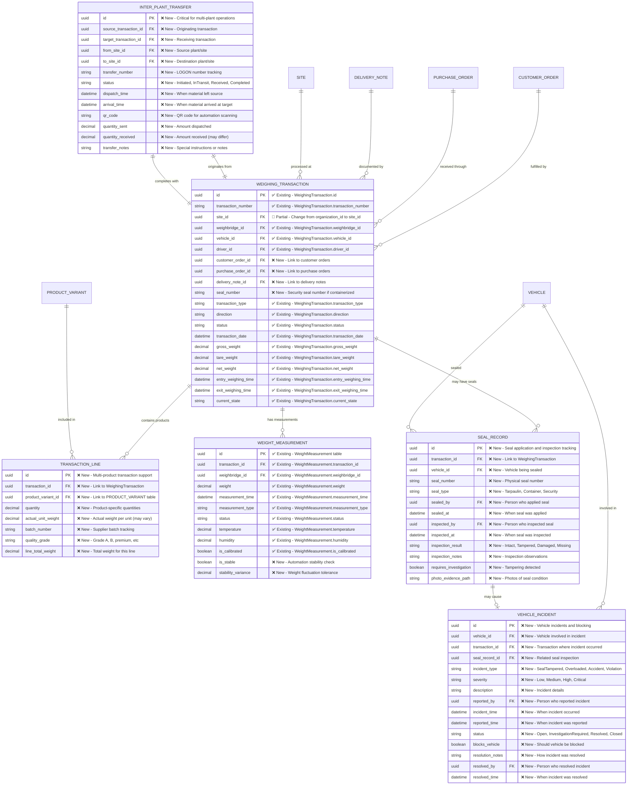
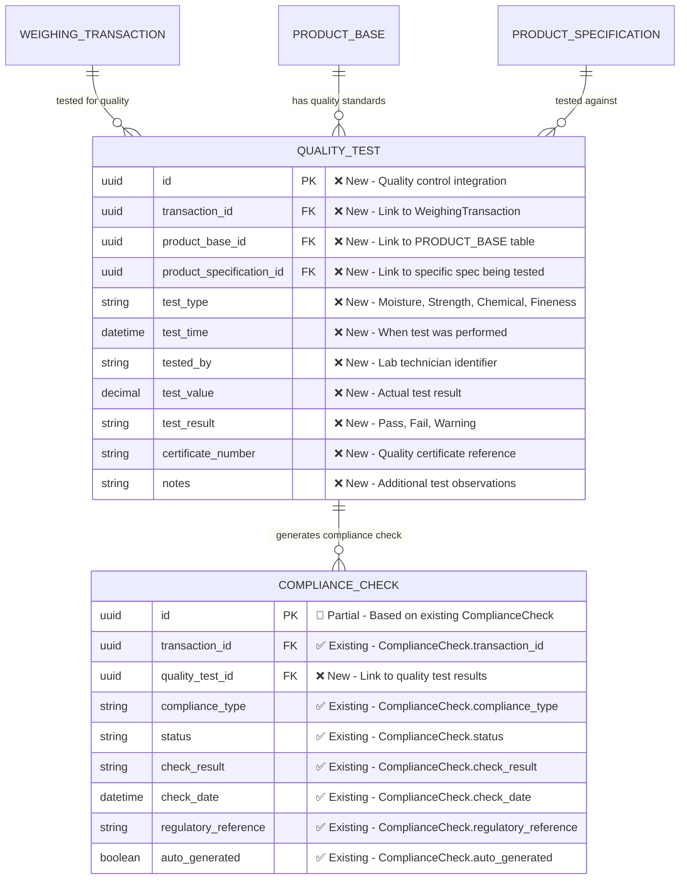
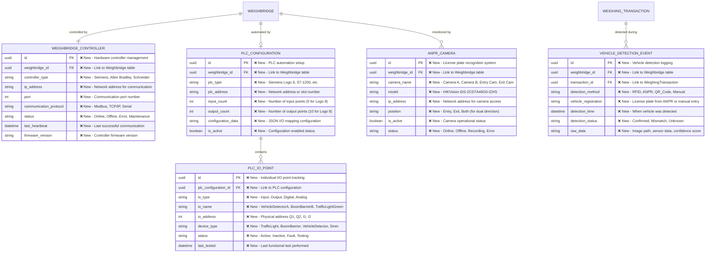
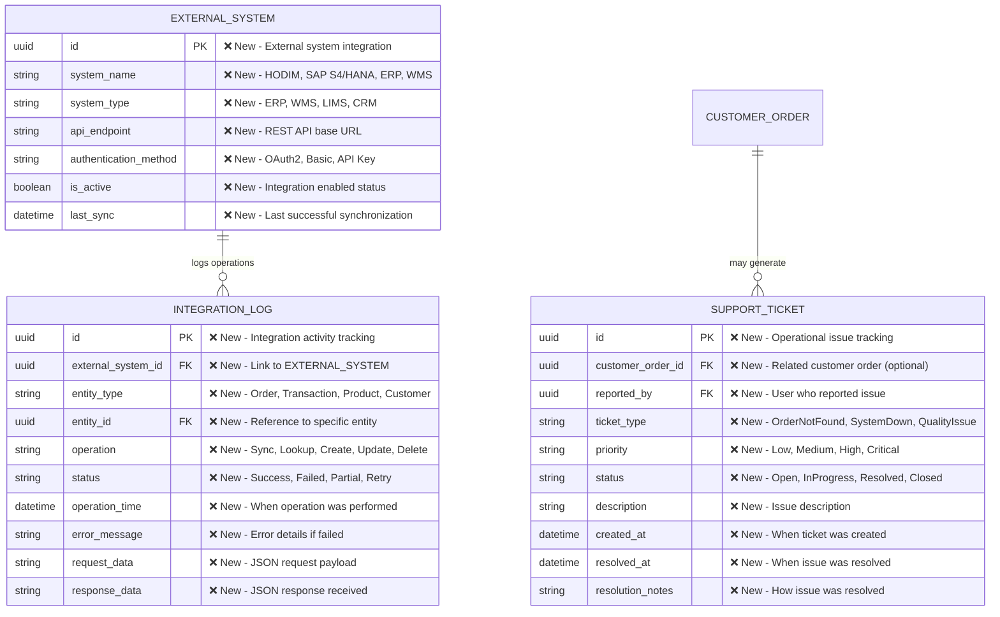
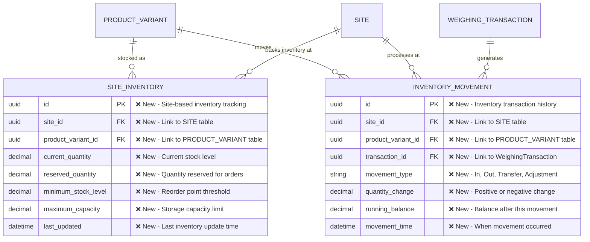

# QaliTrack Entity Relationship Diagrams

```mermaid
erDiagram
    LOCATION_TYPE {
        uuid id PK "❌ New - Reference table"
        string name "❌ New - Plant, Warehouse, Terminal, Branch"
        string code "❌ New - PLT, WHR, TRM, BRC"
        string description "❌ New - Location type description"
        boolean is_active "❌ New"
    }
    
    ZONE {
        uuid id PK "❌ New - Zone reference table"
        string name "❌ New - Coastal Region, Eastern Region"
        string code "❌ New - COAST, EAST, CENTRAL"
        string description "❌ New - Zone coverage and operations"
        boolean is_active "❌ New - Zone active status"
    }
    
    SITE {
        uuid id PK "🔶 Partial - Based on OrganizationLocation"
        uuid location_type_id FK "❌ New - Link to LOCATION_TYPE"
        uuid zone_id FK "❌ New - Link to ZONE table"
        string name "✅ Existing - OrganizationLocation.name"
        string address "✅ Existing - OrganizationLocation.address"
        string contact_person "✅ Existing - OrganizationLocation.contact_person"
        boolean is_active "✅ Existing - OrganizationLocation.is_active"
    }
    
    PRODUCT_CATEGORY {
        uuid id PK "❌ New - Product category hierarchy"
        string name "❌ New - Cement, Clinker, Raw Materials"
        string code "❌ New - CEM, CLK, RAW"
        string description "❌ New - Category description"
        uuid parent_category_id FK "❌ New - Self-referencing for hierarchy"
        boolean is_active "❌ New - Category active status"
    }
    
    PRODUCT_BASE {
        uuid id PK "🔶 Partial - Core product without packaging"
        string name "✅ Existing - Product.name (base name)"
        string code "✅ Existing - Product.code (base code)"
        uuid category_id FK "❌ New - Link to PRODUCT_CATEGORY"
        string grade "❌ New - 42.5N, 52.5R, Grade A, Premium"
        string chemical_formula "❌ New - CaCO3, SiO2, etc"
        decimal standard_density "❌ New - Standard bulk density"
        string description "❌ New - Base product description"
        boolean is_active "✅ Existing - Product.is_active"
    }
    
    PACKAGING_TYPE {
        uuid id PK "❌ New - Packaging method reference"
        string name "❌ New - Bags, Bulk, Container, Silo, Truck"
        string code "❌ New - BAG, BLK, CNT, SIL, TRK"
        string unit_of_measure "❌ New - bags, tons, m³, containers"
        boolean requires_container "❌ New - True for container packaging"
        string handling_equipment "❌ New - Forklift, Conveyor, Pump, Crane"
        boolean is_active "❌ New - Packaging type active status"
    }
    
    
    PRODUCT_VARIANT {
        uuid id PK "❌ New - Specific product + packaging combination"
        uuid product_base_id FK "❌ New - Link to base product"
        uuid packaging_type_id FK "❌ New - How it's packaged"
        string variant_name "❌ New - OPC 42.5N Cement 50kg Bags"
        string variant_code "❌ New - CEM-OPC42-50-BAG"
        decimal unit_weight "❌ New - Weight per unit (50kg per bag)"
        decimal price_per_unit "❌ New - Base price per unit"
        boolean is_active "❌ New - Variant active status"
    }
    
    PRODUCT_USAGE_PERMISSION {
        uuid id PK "❌ New - What can be done with product"
        uuid product_variant_id FK "❌ New - Link to product variant"
        string usage_type "❌ New - Sale, Purchase, InterPlant, Transfer"
        uuid site_id FK "❌ New - Site-specific permissions"
        boolean is_permitted "❌ New - Permission granted"
        datetime effective_from "❌ New - Permission start date"
        datetime effective_to "❌ New - Permission end date"
    }
    
    SITE_CAPABILITY {
        uuid id PK "❌ New - What each site can handle"
        uuid site_id FK "❌ New - Link to SITE table"
        string capability_type "❌ New - Production, Storage, Loading, Rail, Grinding"
        uuid product_category_id FK "❌ New - Link to PRODUCT_CATEGORY"
        decimal max_capacity_tons "❌ New - Maximum handling capacity"
        string operational_hours "❌ New - When this capability is available"
        boolean requires_special_equipment "❌ New - Special handling needed"
        string equipment_required "❌ New - Crane, Conveyor, Silo, Rail"
        boolean is_active "❌ New - Capability currently available"
    }
    
    SITE_PRODUCT_CONSTRAINT {
        uuid id PK "❌ New - Site-specific product constraints"
        uuid from_site_id FK "❌ New - Source site"
        uuid to_site_id FK "❌ New - Destination site"
        uuid product_category_id FK "❌ New - Product category constraint"
        string constraint_type "❌ New - Prohibited, Restricted, Allowed, Preferred"
        string reason "❌ New - Why constraint exists"
        decimal min_quantity "❌ New - Minimum order quantity"
        decimal max_quantity "❌ New - Maximum order quantity"
        boolean requires_approval "❌ New - Manual approval needed"
        datetime effective_from "❌ New - Constraint start date"
        datetime effective_to "❌ New - Constraint end date"
        boolean is_active "❌ New - Constraint currently active"
    }
    
    PRODUCT_SPECIFICATION {
        uuid id PK "❌ New - Structured product specifications"
        uuid product_base_id FK "❌ New - Link to base product"
        string spec_category "❌ New - Physical, Chemical, Performance"
        string spec_name "❌ New - Compressive Strength, Fineness, Setting Time"
        string spec_unit "❌ New - MPa, m²/kg, minutes"
        decimal min_value "❌ New - Minimum acceptable value"
        decimal max_value "❌ New - Maximum acceptable value"
        decimal typical_value "❌ New - Typical/target value"
        string test_method "❌ New - ASTM C109, IS 4031, EN 196"
        boolean is_mandatory "❌ New - Required for quality control"
    }
    
    BUSINESS_ENTITY {
        uuid id PK "✅ Existing - BusinessEntity table"
        string name "✅ Existing - BusinessEntity.name"
        string code "✅ Existing - BusinessEntity.code"
        string entity_type "✅ Existing - BusinessEntity.entity_type"
        string contact_email "✅ Existing - BusinessEntity.contact_email"
        string contact_phone "✅ Existing - BusinessEntity.contact_phone"
        string address "✅ Existing - BusinessEntity.address"
        boolean is_active "✅ Existing - BusinessEntity.is_active"
    }
    
    CUSTOMER_PROFILE {
        uuid id PK "✅ Existing - CustomerProfile table"
        uuid business_entity_id FK "✅ Existing - CustomerProfile.business_entity_id"
        decimal credit_limit "✅ Existing - CustomerProfile.credit_limit"
        string payment_terms "✅ Existing - CustomerProfile.payment_terms"
        string preferred_contact_method "✅ Existing - CustomerProfile.preferred_contact_method"
    }
    
    SUPPLIER_PROFILE {
        uuid id PK "✅ Existing - SupplierProfile table"
        uuid business_entity_id FK "✅ Existing - SupplierProfile.business_entity_id"
        string supplier_type "✅ Existing - SupplierProfile.supplier_type"
        string quality_rating "✅ Existing - SupplierProfile.quality_rating"
        int lead_time_days "✅ Existing - SupplierProfile.lead_time_days"
    }
    
    VEHICLE {
        uuid id PK "✅ Existing - Vehicle table"
        string number_plate "✅ Existing - Vehicle.registration_number"
        string vehicle_type "❌ New - Truck, Pick-up, Train_Wagon, Rail_Car"
        string make "✅ Existing - Vehicle.make"
        string model "✅ Existing - Vehicle.model"
        string fuel_type "✅ Existing - Vehicle.fuel_type"
        decimal max_weight "✅ Existing - Vehicle.max_weight"
        decimal max_legal_load "❌ New - Legal maximum load capacity"
        decimal max_safe_load "❌ New - Safe operational load limit"
        decimal tare_weight "✅ Existing - Vehicle.tare_weight"
        boolean has_container "❌ New - Vehicle can carry containerized loads"
        string container_type "❌ New - Tarpaulin, Sealed_Box, Rail_Container"
        string status "✅ Existing - Vehicle.status"
        boolean is_blocked "❌ New - Vehicle blocked due to incidents"
        string blocked_reason "❌ New - Why vehicle is blocked"
    }
    
    DRIVER {
        uuid id PK "✅ Existing - Driver table"
        string first_name "✅ Existing - Driver.first_name"
        string last_name "✅ Existing - Driver.last_name"
        string phone_number "✅ Existing - Driver.phone_number"
        string email "✅ Existing - Driver.email"
        string employee_id "✅ Existing - Driver.employee_id"
        string license_number "❌ New - Driver's license number"
        string license_class "❌ New - License class (A, B, C, CDL)"
        datetime license_expiry "❌ New - License expiration date"
        string status "✅ Existing - Driver.status"
    }
    
    DRIVER_VEHICLE_ASSIGNMENT {
        uuid id PK "✅ Existing - DriverVehicleAssignment table"
        uuid driver_id FK "✅ Existing - DriverVehicleAssignment.driver_id"
        uuid vehicle_id FK "✅ Existing - DriverVehicleAssignment.vehicle_id"
        datetime assigned_date "✅ Existing - DriverVehicleAssignment.assigned_date"
        boolean is_primary "✅ Existing - DriverVehicleAssignment.is_primary"
        boolean is_active "✅ Existing - DriverVehicleAssignment.is_active"
    }
    
    WEIGHBRIDGE {
        uuid id PK "✅ Existing - Weighbridge table"
        uuid site_id FK "🔶 Partial - Change from organization_id to site_id"
        string name "✅ Existing - Weighbridge.name"
        string code "✅ Existing - Weighbridge.code"
        decimal max_capacity "✅ Existing - Weighbridge.max_capacity"
        string direction_capability "❌ New - OneWay, TwoWay from TOR analysis"
        string weighbridge_role "❌ New - Entry, Exit, Both from TOR analysis"
        string manufacturer "✅ Existing - Weighbridge.manufacturer"
        string model "✅ Existing - Weighbridge.model"
        boolean is_active "✅ Existing - Weighbridge.is_active"
    }
    

    LOCATION_TYPE ||--o{ SITE : "categorizes"
    ZONE ||--o{ SITE : "groups"
    PRODUCT_CATEGORY ||--o{ PRODUCT_CATEGORY : "parent category"
    PRODUCT_CATEGORY ||--o{ PRODUCT_BASE : "categorizes"
    PRODUCT_BASE ||--o{ PRODUCT_VARIANT : "has variants"
    PRODUCT_BASE ||--o{ PRODUCT_SPECIFICATION : "has specifications"
    PACKAGING_TYPE ||--o{ PRODUCT_VARIANT : "used in"
    PRODUCT_VARIANT ||--o{ PRODUCT_USAGE_PERMISSION : "has permissions"
    SITE ||--o{ PRODUCT_USAGE_PERMISSION : "grants permissions at"
    SITE ||--o{ SITE_CAPABILITY : "has capabilities"
    PRODUCT_CATEGORY ||--o{ SITE_CAPABILITY : "supported by"
    SITE ||--o{ SITE_PRODUCT_CONSTRAINT : "source constraints"
    SITE ||--o{ SITE_PRODUCT_CONSTRAINT : "destination constraints"
    PRODUCT_CATEGORY ||--o{ SITE_PRODUCT_CONSTRAINT : "constrained by"
    BUSINESS_ENTITY ||--o| CUSTOMER_PROFILE : "extends"
    BUSINESS_ENTITY ||--o| SUPPLIER_PROFILE : "extends"
    DRIVER ||--o{ DRIVER_VEHICLE_ASSIGNMENT : "assigned to"
    VEHICLE ||--o{ DRIVER_VEHICLE_ASSIGNMENT : "assigned from"
    SITE ||--o{ WEIGHBRIDGE : "contains"
```

```mermaid
erDiagram
    CUSTOMER_ORDER {
        uuid id PK "❌ Missing - CRITICAL for outbound process"
        string order_number "❌ Missing - Unique identifier for CSC confirmation"
        uuid customer_id FK "❌ Missing - Link to BusinessEntity"
        uuid from_site_id FK "❌ Missing - Source plant/site for shipping"
        uuid to_site_id FK "❌ Missing - Customer delivery destination"
        datetime order_date "❌ Missing - When order was placed"
        datetime required_date "❌ Missing - Customer required delivery date"
        string status "❌ Missing - Pending, Confirmed, InProgress, Completed"
        decimal total_amount "❌ Missing - Order value"
        string payment_terms "❌ Missing - NET30, COD, etc"
        string special_instructions "❌ Missing - Loading instructions"
        boolean is_visible_at_gate "❌ Missing - For CSC order confirmation workflow"
        string created_by "❌ Missing - User who created order"
    }
    
    CUSTOMER_ORDER_LINE {
        uuid id PK "❌ Missing - CRITICAL for multi-product orders"
        uuid customer_order_id FK "❌ Missing - Parent order reference"
        uuid product_variant_id FK "❌ Missing - Link to PRODUCT_VARIANT table"
        decimal quantity_ordered "❌ Missing - Ordered amount"
        decimal quantity_delivered "❌ Missing - Track fulfillment progress"
        decimal unit_price "❌ Missing - Price per unit"
        string line_status "❌ Missing - Pending, Loaded, Delivered"
        string special_instructions "❌ Missing - Line-specific delivery notes"
    }
    
    PURCHASE_ORDER {
        uuid id PK "❌ Missing - CRITICAL for inbound process"
        string po_number "❌ Missing - References ERP/HODIM system"
        uuid supplier_id FK "❌ Missing - Link to BusinessEntity"
        uuid to_site_id FK "❌ Missing - Destination plant for delivery"
        datetime order_date "❌ Missing - PO creation date"
        datetime expected_delivery_date "❌ Missing - Expected arrival"
        string status "❌ Missing - Open, InTransit, Received, Closed"
        decimal total_amount "❌ Missing - Total PO value"
        string terms_conditions "❌ Missing - Contract terms"
        string hodim_reference "❌ Missing - External system reference"
    }
    
    PURCHASE_ORDER_LINE {
        uuid id PK "❌ Missing - CRITICAL for inbound materials"
        uuid purchase_order_id FK "❌ Missing - Parent PO reference"
        uuid product_variant_id FK "❌ Missing - Link to PRODUCT_VARIANT table"
        decimal quantity_ordered "❌ Missing - Ordered quantity"
        decimal quantity_received "❌ Missing - Track receipt progress"
        decimal unit_price "❌ Missing - Unit cost"
        string quality_specifications "❌ Missing - Required quality standards"
    }
    
    SCHEDULE_AGREEMENT {
        uuid id PK "❌ Missing - CRITICAL for HODIM integration"
        string agreement_number "❌ Missing - HODIM reference number"
        uuid supplier_id FK "❌ Missing - Link to BusinessEntity"
        uuid product_variant_id FK "❌ Missing - Link to PRODUCT_VARIANT table"
        datetime valid_from "❌ Missing - Agreement start date"
        datetime valid_to "❌ Missing - Agreement end date"
        decimal price_per_unit "❌ Missing - Contracted price"
        string delivery_terms "❌ Missing - FOB, CIF, etc"
        boolean is_active "❌ Missing - Agreement status"
    }

    DELIVERY_NOTE {
        uuid id PK "❌ Missing - CRITICAL physical document tracking"
        string delivery_note_number "❌ Missing - Physical document reference"
        uuid purchase_order_id FK "❌ Missing - Optional link for inbound"
        uuid customer_order_id FK "❌ Missing - Optional link for outbound"
        uuid supplier_id FK "❌ Missing - For inbound deliveries"
        uuid customer_id FK "❌ Missing - For outbound deliveries"
        uuid vehicle_id FK "❌ Missing - Delivery vehicle"
        uuid driver_id FK "❌ Missing - Delivery driver"
        datetime issue_date "❌ Missing - When DN was issued"
        string delivery_type "❌ Missing - Inbound, Outbound"
        string status "❌ Missing - Created, InTransit, Delivered"
        string qr_code "❌ Missing - LOGON number for automation"
        string notes "❌ Missing - Special delivery instructions"
    }
    
    DELIVERY_NOTE_LINE {
        uuid id PK "❌ Missing - Delivery item details"
        uuid delivery_note_id FK "❌ Missing - Parent DN reference"
        uuid product_variant_id FK "❌ Missing - Link to PRODUCT_VARIANT table"
        decimal quantity "❌ Missing - Delivered quantity"
        string batch_number "❌ Missing - Supplier batch tracking"
        string quality_certificate "❌ Missing - Quality compliance docs"
    }

    CUSTOMER_ORDER ||--o{ CUSTOMER_ORDER_LINE : "contains"
    PURCHASE_ORDER ||--o{ PURCHASE_ORDER_LINE : "contains"
    DELIVERY_NOTE ||--o{ DELIVERY_NOTE_LINE : "contains"
    BUSINESS_ENTITY ||--o{ CUSTOMER_ORDER : "places order"
    BUSINESS_ENTITY ||--o{ PURCHASE_ORDER : "supplies to"
    PRODUCT_VARIANT ||--o{ CUSTOMER_ORDER_LINE : "ordered"
    PRODUCT_VARIANT ||--o{ PURCHASE_ORDER_LINE : "ordered"
    PRODUCT_VARIANT ||--o{ DELIVERY_NOTE_LINE : "delivered"
    SITE ||--o{ CUSTOMER_ORDER : "ships from"
    SITE ||--o{ PURCHASE_ORDER : "receives at"
```

```mermaid
erDiagram
    WEIGHING_TRANSACTION {
        uuid id PK "✅ Existing - WeighingTransaction.id"
        string transaction_number "✅ Existing - WeighingTransaction.transaction_number"
        uuid site_id FK "🔶 Partial - Change from organization_id to site_id"
        uuid weighbridge_id FK "✅ Existing - WeighingTransaction.weighbridge_id"
        uuid vehicle_id FK "✅ Existing - WeighingTransaction.vehicle_id"
        uuid driver_id FK "✅ Existing - WeighingTransaction.driver_id"
        uuid customer_order_id FK "❌ New - Link to customer orders"
        uuid purchase_order_id FK "❌ New - Link to purchase orders"
        uuid delivery_note_id FK "❌ New - Link to delivery notes"
        string seal_number "❌ New - Security seal number if containerized"
        string transaction_type "✅ Existing - WeighingTransaction.transaction_type"
        string direction "✅ Existing - WeighingTransaction.direction"
        string status "✅ Existing - WeighingTransaction.status"
        datetime transaction_date "✅ Existing - WeighingTransaction.transaction_date"
        decimal gross_weight "✅ Existing - WeighingTransaction.gross_weight"
        decimal tare_weight "✅ Existing - WeighingTransaction.tare_weight"
        decimal net_weight "✅ Existing - WeighingTransaction.net_weight"
        datetime entry_weighing_time "✅ Existing - WeighingTransaction.entry_weighing_time"
        datetime exit_weighing_time "✅ Existing - WeighingTransaction.exit_weighing_time"
        string current_state "✅ Existing - WeighingTransaction.current_state"
    }
    
    TRANSACTION_LINE {
        uuid id PK "❌ New - Multi-product transaction support"
        uuid transaction_id FK "❌ New - Link to WeighingTransaction"
        uuid product_variant_id FK "❌ New - Link to PRODUCT_VARIANT table"
        decimal quantity "❌ New - Product-specific quantities"
        decimal actual_unit_weight "❌ New - Actual weight per unit (may vary)"
        string batch_number "❌ New - Supplier batch tracking"
        string quality_grade "❌ New - Grade A, B, premium, etc"
        decimal line_total_weight "❌ New - Total weight for this line"
    }
    
    WEIGHT_MEASUREMENT {
        uuid id PK "✅ Existing - WeightMeasurement table"
        uuid transaction_id FK "✅ Existing - WeightMeasurement.transaction_id"
        uuid weighbridge_id FK "✅ Existing - WeightMeasurement.weighbridge_id"
        decimal weight "✅ Existing - WeightMeasurement.weight"
        datetime measurement_time "✅ Existing - WeightMeasurement.measurement_time"
        string measurement_type "✅ Existing - WeightMeasurement.measurement_type"
        string status "✅ Existing - WeightMeasurement.status"
        decimal temperature "✅ Existing - WeightMeasurement.temperature"
        decimal humidity "✅ Existing - WeightMeasurement.humidity"
        boolean is_calibrated "✅ Existing - WeightMeasurement.is_calibrated"
        boolean is_stable "❌ New - Automation stability check"
        decimal stability_variance "❌ New - Weight fluctuation tolerance"
    }
    
    INTER_PLANT_TRANSFER {
        uuid id PK "❌ New - Critical for multi-plant operations"
        uuid source_transaction_id FK "❌ New - Originating transaction"
        uuid target_transaction_id FK "❌ New - Receiving transaction"
        uuid from_site_id FK "❌ New - Source plant/site"
        uuid to_site_id FK "❌ New - Destination plant/site"
        string transfer_number "❌ New - LOGON number tracking"
        string status "❌ New - Initiated, InTransit, Received, Completed"
        datetime dispatch_time "❌ New - When material left source"
        datetime arrival_time "❌ New - When material arrived at target"
        string qr_code "❌ New - QR code for automation scanning"
        decimal quantity_sent "❌ New - Amount dispatched"
        decimal quantity_received "❌ New - Amount received (may differ)"
        string transfer_notes "❌ New - Special instructions or notes"
    }
    
    SEAL_RECORD {
        uuid id PK "❌ New - Seal application and inspection tracking"
        uuid transaction_id FK "❌ New - Link to WeighingTransaction"
        uuid vehicle_id FK "❌ New - Vehicle being sealed"
        string seal_number "❌ New - Physical seal number"
        string seal_type "❌ New - Tarpaulin, Container, Security"
        uuid sealed_by FK "❌ New - Person who applied seal"
        datetime sealed_at "❌ New - When seal was applied"
        uuid inspected_by FK "❌ New - Person who inspected seal"
        datetime inspected_at "❌ New - When seal was inspected"
        string inspection_result "❌ New - Intact, Tampered, Damaged, Missing"
        string inspection_notes "❌ New - Inspection observations"
        boolean requires_investigation "❌ New - Tampering detected"
        string photo_evidence_path "❌ New - Photos of seal condition"
    }
    
    VEHICLE_INCIDENT {
        uuid id PK "❌ New - Vehicle incidents and blocking"
        uuid vehicle_id FK "❌ New - Vehicle involved in incident"
        uuid transaction_id FK "❌ New - Transaction where incident occurred"
        uuid seal_record_id FK "❌ New - Related seal inspection"
        string incident_type "❌ New - SealTampered, Overloaded, Accident, Violation"
        string severity "❌ New - Low, Medium, High, Critical"
        string description "❌ New - Incident details"
        uuid reported_by FK "❌ New - Person who reported incident"
        datetime incident_time "❌ New - When incident occurred"
        datetime reported_time "❌ New - When incident was reported"
        string status "❌ New - Open, InvestigationRequired, Resolved, Closed"
        boolean blocks_vehicle "❌ New - Should vehicle be blocked"
        string resolution_notes "❌ New - How incident was resolved"
        uuid resolved_by FK "❌ New - Person who resolved incident"
        datetime resolved_time "❌ New - When incident was resolved"
    }

    WEIGHING_TRANSACTION ||--o{ WEIGHT_MEASUREMENT : "has measurements"
    WEIGHING_TRANSACTION ||--o{ TRANSACTION_LINE : "contains products"
    WEIGHING_TRANSACTION ||--o{ SEAL_RECORD : "may have seals"
    VEHICLE ||--o{ SEAL_RECORD : "sealed"
    VEHICLE ||--o{ VEHICLE_INCIDENT : "involved in"
    SEAL_RECORD ||--o| VEHICLE_INCIDENT : "may cause"
    CUSTOMER_ORDER ||--o{ WEIGHING_TRANSACTION : "fulfilled by"
    PURCHASE_ORDER ||--o{ WEIGHING_TRANSACTION : "received through"
    DELIVERY_NOTE ||--o{ WEIGHING_TRANSACTION : "documented by"
    PRODUCT_VARIANT ||--o{ TRANSACTION_LINE : "included in"
    SITE ||--o{ WEIGHING_TRANSACTION : "processed at"
    INTER_PLANT_TRANSFER ||--|| WEIGHING_TRANSACTION : "originates from"
    INTER_PLANT_TRANSFER ||--|| WEIGHING_TRANSACTION : "completes with"
```

```mermaid
erDiagram
    QUALITY_TEST {
        uuid id PK "❌ New - Quality control integration"
        uuid transaction_id FK "❌ New - Link to WeighingTransaction"
        uuid product_base_id FK "❌ New - Link to PRODUCT_BASE table"
        uuid product_specification_id FK "❌ New - Link to specific spec being tested"
        string test_type "❌ New - Moisture, Strength, Chemical, Fineness"
        datetime test_time "❌ New - When test was performed"
        string tested_by "❌ New - Lab technician identifier"
        decimal test_value "❌ New - Actual test result"
        string test_result "❌ New - Pass, Fail, Warning"
        string certificate_number "❌ New - Quality certificate reference"
        string notes "❌ New - Additional test observations"
    }
    
    COMPLIANCE_CHECK {
        uuid id PK "🔶 Partial - Based on existing ComplianceCheck"
        uuid transaction_id FK "✅ Existing - ComplianceCheck.transaction_id"
        uuid quality_test_id FK "❌ New - Link to quality test results"
        string compliance_type "✅ Existing - ComplianceCheck.compliance_type"
        string status "✅ Existing - ComplianceCheck.status"
        string check_result "✅ Existing - ComplianceCheck.check_result"
        datetime check_date "✅ Existing - ComplianceCheck.check_date"
        string regulatory_reference "✅ Existing - ComplianceCheck.regulatory_reference"
        boolean auto_generated "✅ Existing - ComplianceCheck.auto_generated"
    }

    WEIGHING_TRANSACTION ||--o{ QUALITY_TEST : "tested for quality"
    QUALITY_TEST ||--o{ COMPLIANCE_CHECK : "generates compliance check"
    PRODUCT_BASE ||--o{ QUALITY_TEST : "has quality standards"
    PRODUCT_SPECIFICATION ||--o{ QUALITY_TEST : "tested against"
```

```mermaid
erDiagram
    WEIGHBRIDGE_CONTROLLER {
        uuid id PK "❌ New - Hardware controller management"
        uuid weighbridge_id FK "❌ New - Link to Weighbridge table"
        string controller_type "❌ New - Siemens, Allen Bradley, Schneider"
        string ip_address "❌ New - Network address for communication"
        int port "❌ New - Communication port number"
        string communication_protocol "❌ New - Modbus, TCP/IP, Serial"
        string status "❌ New - Online, Offline, Error, Maintenance"
        datetime last_heartbeat "❌ New - Last successful communication"
        string firmware_version "❌ New - Controller firmware version"
    }
    
    PLC_CONFIGURATION {
        uuid id PK "❌ New - PLC automation setup"
        uuid weighbridge_id FK "❌ New - Link to Weighbridge table"
        string plc_type "❌ New - Siemens Logo 8, S7-1200, etc"
        string plc_address "❌ New - Network address or slot number"
        int input_count "❌ New - Number of input points (5 for Logo 8)"
        int output_count "❌ New - Number of output points (10 for Logo 8)"
        string configuration_data "❌ New - JSON I/O mapping configuration"
        boolean is_active "❌ New - Configuration enabled status"
    }
    
    PLC_IO_POINT {
        uuid id PK "❌ New - Individual I/O point tracking"
        uuid plc_configuration_id FK "❌ New - Link to PLC configuration"
        string io_type "❌ New - Input, Output, Digital, Analog"
        string io_name "❌ New - VehicleDetectorA, BoomBarrierB, TrafficLightGreen"
        int io_address "❌ New - Physical address Q1, Q2, I1, I2"
        string device_type "❌ New - TrafficLight, BoomBarrier, VehicleDetector, Siren"
        string status "❌ New - Active, Inactive, Fault, Testing"
        datetime last_tested "❌ New - Last functional test performed"
    }
    
    ANPR_CAMERA {
        uuid id PK "❌ New - License plate recognition system"
        uuid weighbridge_id FK "❌ New - Link to Weighbridge table"
        string camera_name "❌ New - Camera A, Camera B, Entry Cam, Exit Cam"
        string model "❌ New - HIKVision iDS-2CD7A46G0-IZHS"
        string ip_address "❌ New - Network address for camera access"
        string position "❌ New - Entry, Exit, Both (for dual direction)"
        boolean is_active "❌ New - Camera operational status"
        string status "❌ New - Online, Offline, Recording, Error"
    }
    
    VEHICLE_DETECTION_EVENT {
        uuid id PK "❌ New - Vehicle detection logging"
        uuid weighbridge_id FK "❌ New - Link to Weighbridge table"
        uuid transaction_id FK "❌ New - Link to WeighingTransaction"
        string detection_method "❌ New - RFID, ANPR, QR_Code, Manual"
        string vehicle_registration "❌ New - License plate from ANPR or manual entry"
        datetime detection_time "❌ New - When vehicle was detected"
        string detection_status "❌ New - Confirmed, Mismatch, Unknown"
        string raw_data "❌ New - Image path, sensor data, confidence score"
    }

    WEIGHBRIDGE ||--|| WEIGHBRIDGE_CONTROLLER : "controlled by"
    WEIGHBRIDGE ||--o| PLC_CONFIGURATION : "automated by"
    WEIGHBRIDGE ||--o{ ANPR_CAMERA : "monitored by"
    PLC_CONFIGURATION ||--o{ PLC_IO_POINT : "contains"
    WEIGHING_TRANSACTION ||--o{ VEHICLE_DETECTION_EVENT : "detected during"
```

```mermaid
erDiagram
    EXTERNAL_SYSTEM {
        uuid id PK "❌ New - External system integration"
        string system_name "❌ New - HODIM, SAP S4/HANA, ERP, WMS"
        string system_type "❌ New - ERP, WMS, LIMS, CRM"
        string api_endpoint "❌ New - REST API base URL"
        string authentication_method "❌ New - OAuth2, Basic, API Key"
        boolean is_active "❌ New - Integration enabled status"
        datetime last_sync "❌ New - Last successful synchronization"
    }
    
    INTEGRATION_LOG {
        uuid id PK "❌ New - Integration activity tracking"
        uuid external_system_id FK "❌ New - Link to EXTERNAL_SYSTEM"
        string entity_type "❌ New - Order, Transaction, Product, Customer"
        uuid entity_id FK "❌ New - Reference to specific entity"
        string operation "❌ New - Sync, Lookup, Create, Update, Delete"
        string status "❌ New - Success, Failed, Partial, Retry"
        datetime operation_time "❌ New - When operation was performed"
        string error_message "❌ New - Error details if failed"
        string request_data "❌ New - JSON request payload"
        string response_data "❌ New - JSON response received"
    }

    SUPPORT_TICKET {
        uuid id PK "❌ New - Operational issue tracking"
        uuid customer_order_id FK "❌ New - Related customer order (optional)"
        uuid reported_by FK "❌ New - User who reported issue"
        string ticket_type "❌ New - OrderNotFound, SystemDown, QualityIssue"
        string priority "❌ New - Low, Medium, High, Critical"
        string status "❌ New - Open, InProgress, Resolved, Closed"
        string description "❌ New - Issue description"
        datetime created_at "❌ New - When ticket was created"
        datetime resolved_at "❌ New - When issue was resolved"
        string resolution_notes "❌ New - How issue was resolved"
    }

    CUSTOMER_ORDER ||--o{ SUPPORT_TICKET : "may generate"
    EXTERNAL_SYSTEM ||--o{ INTEGRATION_LOG : "logs operations"
```

```mermaid
erDiagram
    SITE_INVENTORY {
        uuid id PK "❌ New - Site-based inventory tracking"
        uuid site_id FK "❌ New - Link to SITE table"
        uuid product_variant_id FK "❌ New - Link to PRODUCT_VARIANT table"
        decimal current_quantity "❌ New - Current stock level"
        decimal reserved_quantity "❌ New - Quantity reserved for orders"
        decimal minimum_stock_level "❌ New - Reorder point threshold"
        decimal maximum_capacity "❌ New - Storage capacity limit"
        datetime last_updated "❌ New - Last inventory update time"
    }
    
    INVENTORY_MOVEMENT {
        uuid id PK "❌ New - Inventory transaction history"
        uuid site_id FK "❌ New - Link to SITE table"
        uuid product_variant_id FK "❌ New - Link to PRODUCT_VARIANT table"
        uuid transaction_id FK "❌ New - Link to WeighingTransaction"
        string movement_type "❌ New - In, Out, Transfer, Adjustment"
        decimal quantity_change "❌ New - Positive or negative change"
        decimal running_balance "❌ New - Balance after this movement"
        datetime movement_time "❌ New - When movement occurred"
    }

    SITE ||--o{ SITE_INVENTORY : "tracks inventory at"
    PRODUCT_VARIANT ||--o{ SITE_INVENTORY : "stocked as"
    WEIGHING_TRANSACTION ||--o{ INVENTORY_MOVEMENT : "generates"
    SITE ||--o{ INVENTORY_MOVEMENT : "processes at"
    PRODUCT_VARIANT ||--o{ INVENTORY_MOVEMENT : "moves"
```