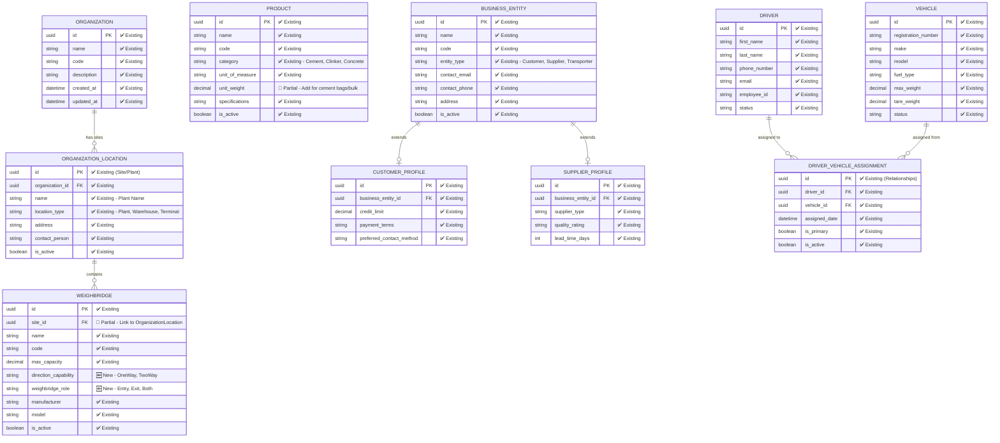
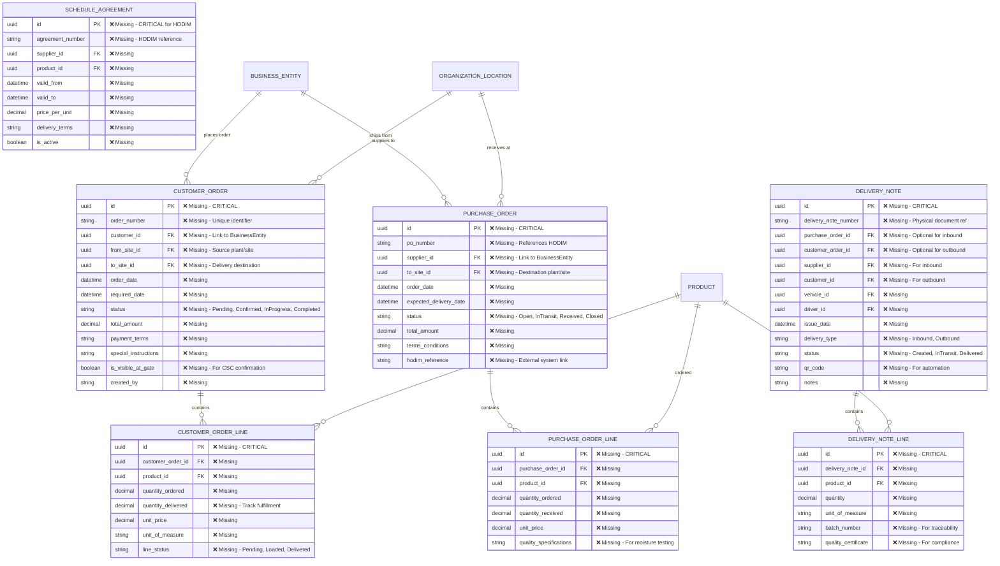
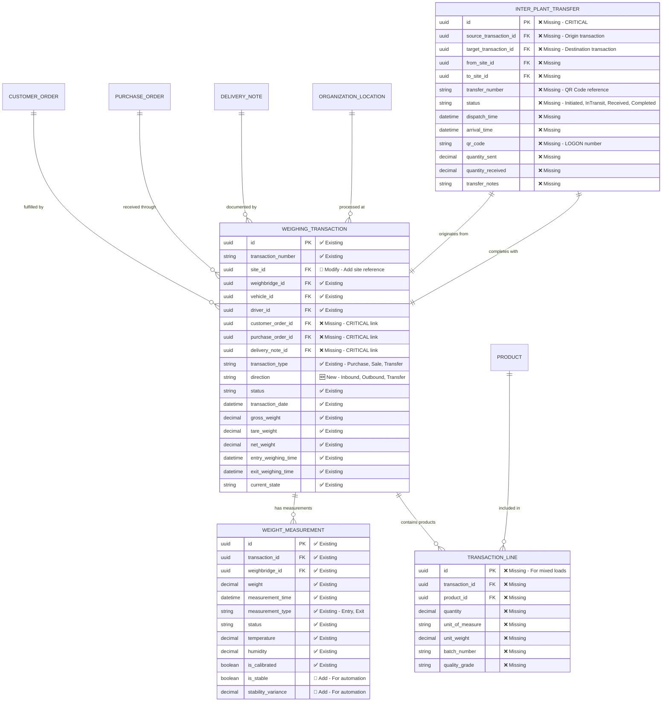
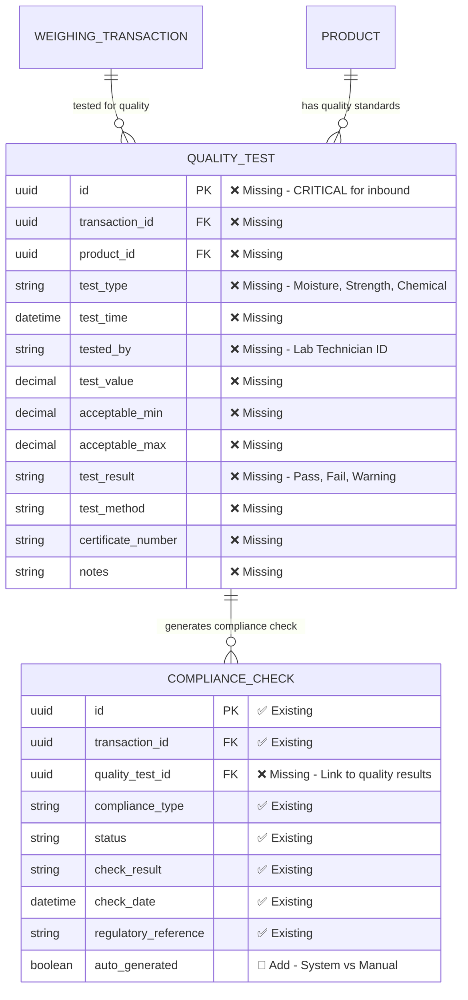
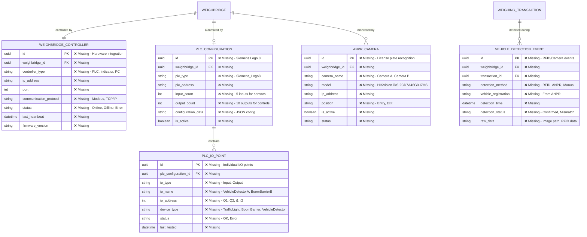
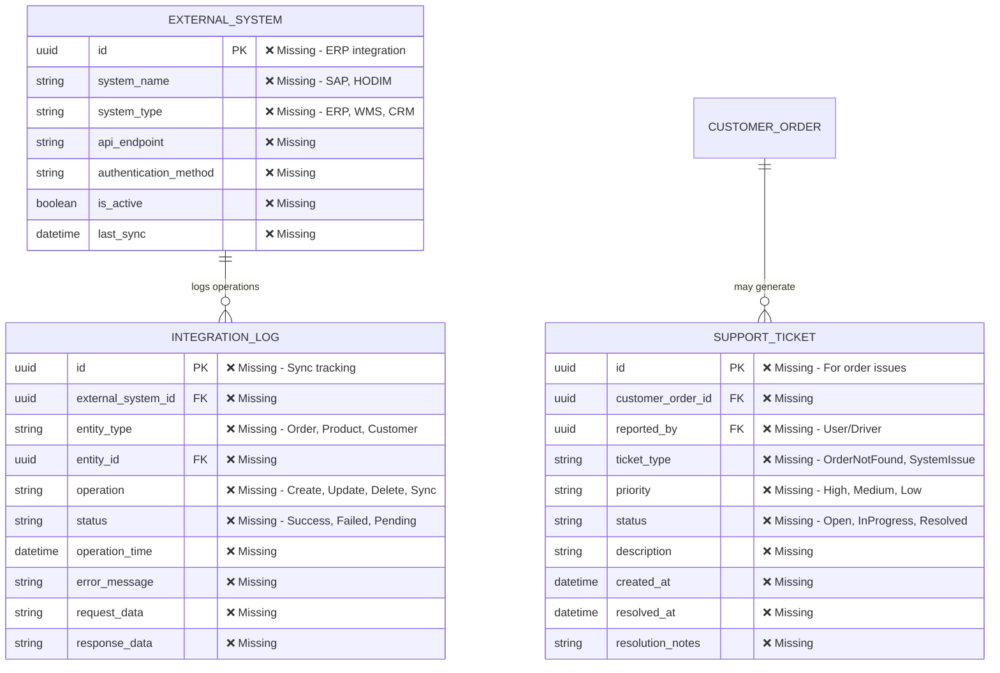

# QaliTrack Entity Relationship Diagram

## System Overview
This document shows the complete entity model for QaliTrack weighbridge management system, adapted for single organization with multiple sites/plants. 

## Legend
- ✅ **Existing** - Currently implemented in QaliTrack MasterData/DataManager
- 🔶 **Partial** - Exists but needs modification  
- ❌ **Missing** - Needs to be developed
- 🆕 **New** - New entity for Bamburi requirements

---

## Core Master Data Entities

---

## Order Management System (🆕 NEW - Critical Missing Component)

---

## Transaction Processing System

---

## Quality Control and Compliance (🔶 ENHANCE EXISTING)

---

## Automation and Hardware Integration (❌ MISSING - CRITICAL)

---

## System Integration Points

---

## Summary: Implementation Priority

### 🔴 CRITICAL (Phase 1 - Must Have)
1. **Order Management System** - Customer orders, Purchase orders, Delivery notes
2. **Transaction-Order Linking** - Link transactions to orders/deliveries  
3. **Site-Based Processing** - Remove multi-tenancy, add site references
4. **Product Tracking** - Transaction lines for multi-product support

### 🟡 HIGH (Phase 2 - Important)
5. **Quality Control Integration** - Moisture testing, lab workflows
6. **Inter-Plant Transfer Enhancement** - QR codes, stock-in-transit tracking
7. **Hardware Integration Framework** - PLC, ANPR, RFID support
8. **HODIM Integration** - Schedule agreements, delivery note matching

### 🟢 MEDIUM (Phase 3 - Enhancement)  
9. **Full Automation** - Complete PLC/sensor integration
10. **ERP Integration** - SAP S4/HANA connectivity
11. **Support System** - Ticket management, customer service integration
12. **Advanced Analytics** - TTAT tracking, performance optimization