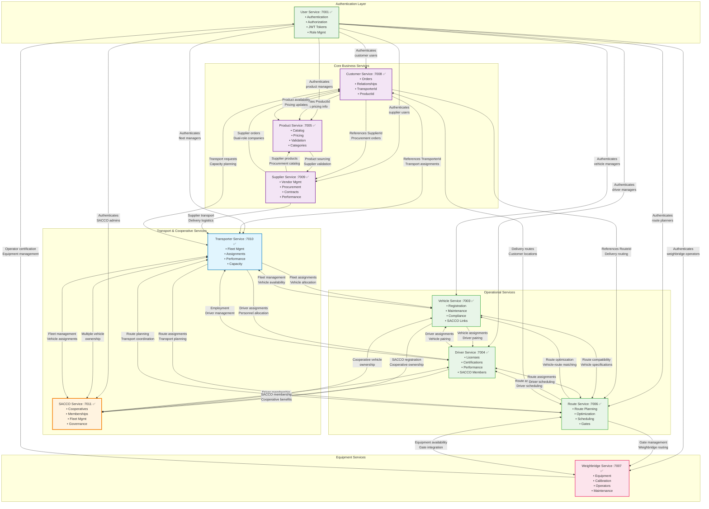
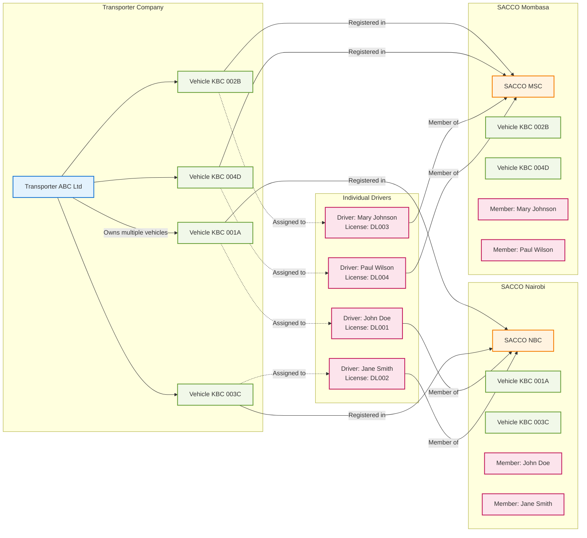
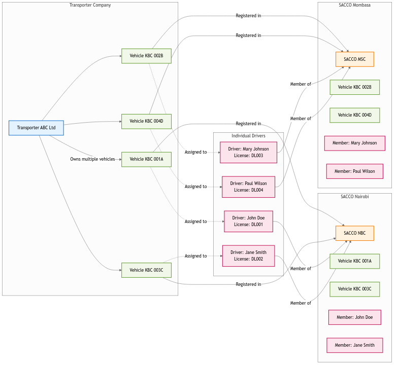
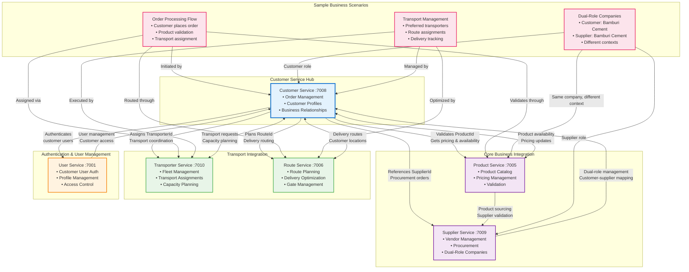

# QaliTrack Complete Services Visual Guide

## 🎯 **System Overview**

This comprehensive guide combines all QaliTrack microservices visuals, showing service integrations and main capabilities in a single reference document.

---

## 🔄 **Service Integration Map**

### **Complete Master Data Services Integration**



### **SACCO Integration Details**




### **Customer Integration Details**


### **SACCO Integration Relationships**
```
┌─────────────────────────────────────────────────────────────────────────┐
│                        SACCO INTEGRATION PATTERNS                       │
├─────────────────────────────────────────────────────────────────────────┤
│                                                                         │
│  1. Multiple Vehicle Ownership (Transporter ↔ SACCO):                  │
│     ┌─────────────────┐    ┌─────────────────┐    ┌─────────────────┐   │
│     │ Transporter A   │    │ SACCO Nairobi   │    │ SACCO Mombasa   │   │
│     │ • Vehicle KBC   │◄──►│ • Vehicle KBC   │    │ • Vehicle KBD   │   │
│     │ • Vehicle KBD   │    │ • Vehicle KBE   │◄──►│ • Vehicle KBF   │   │
│     │ • Vehicle KBE   │    │ • Vehicle KBG   │    │ • Vehicle KBH   │   │
│     │ • Vehicle KBF   │    └─────────────────┘    └─────────────────┘   │
│     └─────────────────┘                                                 │
│                                                                         │
│  2. Driver SACCO Membership (Driver → SACCO):                          │
│     ┌─────────────────┐    ┌─────────────────┐    ┌─────────────────┐   │
│     │ Driver John     │    │ SACCO Nairobi   │    │ SACCO Mombasa   │   │
│     │ • Member#: 001  │───►│ • Member: John  │    │ • Member: Mary  │   │
│     │ • SACCO: NBC    │    │ • Member: Jane  │◄───│ • Member: Paul  │   │
│     └─────────────────┘    │ • Member: Bob   │    │ • Member: Lisa  │   │
│                            └─────────────────┘    └─────────────────┘   │
│     ┌─────────────────┐           ▲                                      │
│     │ Driver Mary     │           │                                      │
│     │ • Member#: 002  │───────────┘                                      │
│     │ • SACCO: MSC    │                                                  │
│     └─────────────────┘                                                  │
│                                                                         │
│  3. Business Benefits:                                                  │
│     • Cooperative vehicle ownership reduces individual investment       │
│     • Shared maintenance costs and insurance                            │
│     • Driver membership provides financial services                     │
│     • SACCO governance ensures democratic management                    │
│     • Multiple SACCO participation allows regional operations           │
│                                                                         │
└─────────────────────────────────────────────────────────────────────────┘
```

### **Business Process Flow**
```
┌─────────────────────────────────────────────────────────────────────────┐
│                        BUSINESS PROCESS FLOW                            │
├─────────────────────────────────────────────────────────────────────────┤
│                                                                         │
│  Customer Places Order                                                  │
│  ┌─────────────────┐    ┌─────────────────┐    ┌─────────────────┐      │
│  │ Customer Service│───►│ Product Service │───►│ Supplier Service│      │
│  │ • Order Creation│    │ • Validation    │    │ • Procurement   │      │
│  │ • Requirements  │    │ • Pricing       │    │ • Contracts     │      │
│  └─────────────────┘    └─────────────────┘    └─────────────────┘      │
│           │                                                             │
│           ▼                                                             │
│  Transportation Assignment                                              │
│  ┌─────────────────┐    ┌─────────────────┐    ┌─────────────────┐      │
│  │ Transporter     │───►│ Vehicle Service │───►│ Driver Service  │      │
│  │ Service         │    │ • Assignment    │    │ • Assignment    │      │
│  │ • Assignment    │    │ • Availability  │    │ • Availability  │      │
│  └─────────────────┘    └─────────────────┘    └─────────────────┘      │
│           │                                                             │
│           ▼                                                             │
│  Route Planning & Execution                                             │
│  ┌─────────────────┐    ┌─────────────────┐    ┌─────────────────┐      │
│  │ Route Service   │───►│ Weighbridge     │───►│ Future Weight   │      │
│  │ • Optimization  │    │ Service         │    │ Data Service    │      │
│  │ • Scheduling    │    │ • Equipment     │    │ • Measurement   │      │
│  └─────────────────┘    └─────────────────┘    └─────────────────┘      │
│                                                                         │
└─────────────────────────────────────────────────────────────────────────┘
```

---

## 🔗 **Service Interaction Patterns**

### **Master Data Service Communication Flow**
```
┌─────────────────────────────────────────────────────────────────────────┐
│                  SERVICE INTERACTION FLOW PATTERNS                      │
├─────────────────────────────────────────────────────────────────────────┤
│                                                                         │
│  Order Processing Flow:                                                 │
│  ┌─────────────────┐    ┌─────────────────┐    ┌─────────────────┐      │
│  │ Customer Service│───►│ Product Service │───►│ Supplier Service│      │
│  │ • Customer.Id   │    │ • Product.Id    │    │ • Supplier.Id   │      │
│  │ • Order.ProductId│   │ • Validation    │    │ • Procurement   │      │
│  │ • Order.CustomerId│  │ • Pricing       │    │ • Availability  │      │
│  └─────────────────┘    └─────────────────┘    └─────────────────┘      │
│           │                        │                        │           │
│           ▼                        ▼                        ▼           │
│  ┌─────────────────┐    ┌─────────────────┐    ┌─────────────────┐      │
│  │ Transporter     │    │ Route Service   │    │ Vehicle Service │      │
│  │ Service         │    │ • Route.Id      │    │ • Vehicle.Id    │      │
│  │ • Transporter.Id│    │ • Optimization  │    │ • Availability  │      │
│  │ • Assignment    │    │ • Scheduling    │    │ • Assignment    │      │
│  └─────────────────┘    └─────────────────┘    └─────────────────┘      │
│           │                        │                        │           │
│           ▼                        ▼                        ▼           │
│  ┌─────────────────┐    ┌─────────────────┐    ┌─────────────────┐      │
│  │ Driver Service  │    │ Weighbridge     │    │ Future Weight   │      │
│  │ • Driver.Id     │    │ Service         │    │ Data Service    │      │
│  │ • Assignment    │    │ • Equipment.Id  │    │ • Measurement   │      │
│  │ • Availability  │    │ • Calibration   │    │ • Transactions  │      │
│  └─────────────────┘    └─────────────────┘    └─────────────────┘      │
│                                                                         │
└─────────────────────────────────────────────────────────────────────────┘
```

### **ID-Based Reference Pattern**
```
┌─────────────────────────────────────────────────────────────────────────┐
│                     ID-BASED REFERENCE PATTERN                          │
├─────────────────────────────────────────────────────────────────────────┤
│                                                                         │
│  Customer Service Entity References:                                    │
│  ┌─────────────────────────────────────────────────────────────────┐    │
│  │ Customer {                                                      │    │
│  │   Id: "customer-001",                                           │    │
│  │   Name: "Bamburi Cement Ltd",                                   │    │
│  │   TransporterId: "transporter-001",    // → Transporter Service│    │
│  │   PreferredTransporterId: "transporter-002"                    │    │
│  │ }                                                               │    │
│  │                                                                 │    │
│  │ Order {                                                         │    │
│  │   Id: "order-001",                                              │    │
│  │   CustomerId: "customer-001",          // → Customer Service   │    │
│  │   SupplierId: "supplier-001",          // → Supplier Service   │    │
│  │   ProductId: "product-001",            // → Product Service    │    │
│  │   TransporterId: "transporter-001",    // → Transporter Service│    │
│  │   RouteId: "route-001"                 // → Route Service      │    │
│  │ }                                                               │    │
│  └─────────────────────────────────────────────────────────────────┘    │
│                                                                         │
│  Validation Pattern:                                                    │
│  1. Customer Service validates ProductId via Product Service API        │
│  2. Product Service returns product details and pricing                 │
│  3. Customer Service validates TransporterId via Transporter Service    │
│  4. Transporter Service returns capacity and availability               │
│  5. No data duplication - only IDs stored                              │
│                                                                         │
└─────────────────────────────────────────────────────────────────────────┘
```

### **Multi-Service Transaction Pattern**
```
┌─────────────────────────────────────────────────────────────────────────┐
│                   MULTI-SERVICE TRANSACTION FLOW                        │
├─────────────────────────────────────────────────────────────────────────┤
│                                                                         │
│  Weighing Transaction Workflow:                                         │
│                                                                         │
│  1. User Authentication                                                 │
│     User Service ← API Gateway ← Client                                 │
│     • JWT validation                                                    │
│     • Role authorization                                                │
│                                                                         │
│  2. Order Validation                                                    │
│     Customer Service → Product Service → Supplier Service               │
│     • Product availability check                                       │
│     • Pricing validation                                               │
│     • Supplier confirmation                                            │
│                                                                         │
│  3. Transportation Assignment                                           │
│     Transporter Service → Vehicle Service → Driver Service              │
│     • Vehicle availability                                             │
│     • Driver assignment                                                │
│     • Route optimization                                               │
│                                                                         │
│  4. Route Planning                                                      │
│     Route Service → Weighbridge Service                                 │
│     • Optimal route calculation                                        │
│     • Weighbridge availability                                         │
│     • Gate scheduling                                                  │
│                                                                         │
│  5. Weighing Execution                                                  │
│     Future Weight Data Service → Future Transaction Service             │
│     • Live weight measurement                                          │
│     • Data validation                                                  │
│     • Transaction recording                                            │
│                                                                         │
└─────────────────────────────────────────────────────────────────────────┘
```

## 📋 **Individual Service Visuals & Models**

### 1. **User Service** (:7001) ✅ **COMPLETED**
```
┌─────────────────────────────────────────────────────────────────────────┐
│                           USER SERVICE                                  │
├─────────────────────────────────────────────────────────────────────────┤
│  Core Functions:                                                        │
│  • Authentication & Authorization                                       │
│  • JWT Token Management                                                 │
│  • Role-Based Access Control                                            │
│  • User Profile Management                                              │
│                                                                         │
│  Key Entity Models:                                                     │
│  ┌─────────────────────────────────────────────────────────────────┐    │
│  │ User {                                                          │    │
│  │   Id: string,                                                   │    │
│  │   Username: string,                                             │    │
│  │   Email: string,                                                │    │
│  │   PasswordHash: string,                                         │    │
│  │   FirstName: string,                                            │    │
│  │   LastName: string,                                             │    │
│  │   PhoneNumber: string,                                          │    │
│  │   IsActive: boolean,                                            │    │
│  │   LastLoginAt: DateTime,                                        │    │
│  │   CreatedAt: DateTime,                                          │    │
│  │   Roles: Collection<UserRole>                                   │    │
│  │ }                                                               │    │
│  │                                                                 │    │
│  │ Role {                                                          │    │
│  │   Id: string,                                                   │    │
│  │   Name: string,                                                 │    │
│  │   Description: string,                                          │    │
│  │   Level: int,                                                   │    │
│  │   Permissions: Collection<RolePermission>                       │    │
│  │ }                                                               │    │
│  │                                                                 │    │
│  │ Permission {                                                    │    │
│  │   Id: string,                                                   │    │
│  │   Name: string,                                                 │    │
│  │   Resource: string,                                             │    │
│  │   Action: string,                                               │    │
│  │   IsActive: boolean                                             │    │
│  │ }                                                               │    │
│  └─────────────────────────────────────────────────────────────────┘    │
│                                                                         │
│  Integration Points:                                                    │
│  • All services use User Service for authentication                    │
│  • Customer Service for customer user management                       │
│  • SACCO Service for cooperative admin authentication                  │
│  • Transporter Service for fleet manager authentication                │
│  • Weighbridge Service for operator authentication                     │
│  • API Gateway for token validation                                    │
│                                                                         │
│  Status: ✅ COMPLETED                                                   │
└─────────────────────────────────────────────────────────────────────────┘
```

### 2. **SACCO Service** (:7011) ✅ **COMPLETED**
```
┌─────────────────────────────────────────────────────────────────────────┐
│                           SACCO SERVICE                                 │
├─────────────────────────────────────────────────────────────────────────┤
│  Core Functions:                                                        │
│  • SACCO (Savings & Credit Cooperative) Management                      │
│  • Cooperative Membership Management                                    │
│  • Vehicle Ownership & Fleet Management                                 │
│  • Democratic Governance & Leadership                                   │
│                                                                         │
│  Key Entity Models:                                                     │
│  ┌─────────────────────────────────────────────────────────────────┐    │
│  │ SACCO {                                                         │    │
│  │   Id: string,                                                   │    │
│  │   Name: string,                                                 │    │
│  │   RegistrationNumber: string,                                   │    │
│  │   Location: string,                                             │    │
│  │   ContactEmail: string,                                         │    │
│  │   ContactPhone: string,                                         │    │
│  │   EstablishedDate: DateTime,                                    │    │
│  │   TotalMembers: int,                                            │    │
│  │   TotalVehicles: int,                                           │    │
│  │   Status: SACCOStatus,                                          │    │
│  │   IsActive: boolean,                                            │    │
│  │   Members: Collection<SACCOMember>,                            │    │
│  │   Vehicles: Collection<SACCOVehicle>,                          │    │
│  │   Governance: Collection<SACCOGovernance>                      │    │
│  │ }                                                               │    │
│  │                                                                 │    │
│  │ SACCOMember {                                                   │    │
│  │   Id: string,                                                   │    │
│  │   SACCOId: string,                                              │    │
│  │   MemberNumber: string,                                         │    │
│  │   PersonType: PersonType,                                       │    │
│  │   PersonId: string,             // → Driver or Transporter     │    │
│  │   JoinDate: DateTime,                                           │    │
│  │   ShareContribution: decimal,                                   │    │
│  │   MembershipType: MembershipType,                               │    │
│  │   Status: MemberStatus,                                         │    │
│  │   IsActive: boolean                                             │    │
│  │ }                                                               │    │
│  │                                                                 │    │
│  │ SACCOVehicle {                                                  │    │
│  │   Id: string,                                                   │    │
│  │   SACCOId: string,                                              │    │
│  │   VehicleId: string,            // → Vehicle Service           │    │
│  │   TransporterId: string,        // → Transporter Service       │    │
│  │   OwnershipType: VehicleOwnershipType,                         │    │
│  │   OwnershipPercentage: decimal,                                 │    │
│  │   AcquisitionDate: DateTime,                                    │    │
│  │   ContributionAmount: decimal,                                  │    │
│  │   Status: VehicleStatus,                                        │    │
│  │   IsActive: boolean                                             │    │
│  │ }                                                               │    │
│  │                                                                 │    │
│  │ SACCOGovernance {                                               │    │
│  │   Id: string,                                                   │    │
│  │   SACCOId: string,                                              │    │
│  │   Position: GovernancePosition,                                 │    │
│  │   MemberId: string,                                             │    │
│  │   ElectedDate: DateTime,                                        │    │
│  │   TermEndDate: DateTime,                                        │    │
│  │   Status: GovernanceStatus,                                     │    │
│  │   IsActive: boolean,                                            │    │
│  │   Responsibilities: string                                      │    │
│  │ }                                                               │    │
│  └─────────────────────────────────────────────────────────────────┘    │
│                                                                         │
│  Integration Points:                                                    │
│  • Vehicle Service for cooperative fleet management                    │
│  • Driver Service for member registration                              │
│  • Transporter Service for multiple vehicle ownership                  │
│  • User Service for SACCO administrator authentication                 │
│                                                                         │
│  Status: ✅ COMPLETED VISUAL - Ready for Implementation                 │
│  Priority: MEDIUM (Cooperative integration)                             │
└─────────────────────────────────────────────────────────────────────────┘
```

### 3. **Customer Service** (:7008) ✅ **COMPLETED**
```
┌─────────────────────────────────────────────────────────────────────────┐
│                         CUSTOMER SERVICE                                │
├─────────────────────────────────────────────────────────────────────────┤
│  Core Functions:                                                        │
│  • Customer Relationship Management                                     │
│  • Order Management & Processing                                        │
│  • Customer Data & Profile Management                                   │
│  • Business Relationship Tracking                                       │
│                                                                         │
│  Key Entity Models:                                                     │
│  ┌─────────────────────────────────────────────────────────────────┐    │
│  │ Customer {                                                      │    │
│  │   Id: string,                                                   │    │
│  │   Name: string,                                                 │    │
│  │   TaxNumber: string,                                            │    │
│  │   RegistrationNumber: string,                                   │    │
│  │   ContactEmail: string,                                         │    │
│  │   ContactPhone: string,                                         │    │
│  │   BillingAddress: string,                                       │    │
│  │   CustomerType: CustomerType,                                   │    │
│  │   CreditLimit: decimal,                                         │    │
│  │   Status: CustomerStatus,                                       │    │
│  │   TransporterId: string,        // → Transporter Service       │    │
│  │   PreferredTransporterId: string,                               │    │
│  │   IsSupplier: boolean,                                          │    │
│  │   IsBuyer: boolean,                                             │    │
│  │   PaymentTermsDays: int,                                        │    │
│  │   Currency: string,                                             │    │
│  │   Contacts: Collection<CustomerContact>,                        │    │
│  │   Orders: Collection<Order>                                     │    │
│  │ }                                                               │    │
│  │                                                                 │    │
│  │ Order {                                                         │    │
│  │   Id: string,                                                   │    │
│  │   OrderNumber: string,                                          │    │
│  │   CustomerId: string,           // → Customer Service          │    │
│  │   SupplierId: string,           // → Supplier Service          │    │
│  │   ProductId: string,            // → Product Service           │    │
│  │   ProductName: string,                                          │    │
│  │   Quantity: decimal,                                            │    │
│  │   UnitPrice: decimal,                                           │    │
│  │   TotalAmount: decimal,                                         │    │
│  │   TransporterId: string,        // → Transporter Service       │    │
│  │   RouteId: string,              // → Route Service             │    │
│  │   OrderDate: DateTime,                                          │    │
│  │   Status: OrderStatus,                                          │    │
│  │   OrderType: OrderType                                          │    │
│  │ }                                                               │    │
│  │                                                                 │    │
│  │ CustomerContact {                                               │    │
│  │   Id: string,                                                   │    │
│  │   CustomerId: string,                                           │    │
│  │   Name: string,                                                 │    │
│  │   Email: string,                                                │    │
│  │   Phone: string,                                                │    │
│  │   Position: string,                                             │    │
│  │   IsPrimary: boolean                                            │    │
│  │ }                                                               │    │
│  └─────────────────────────────────────────────────────────────────┘    │
│                                                                         │
│  Integration Points:                                                    │
│  • Product Service via ProductId references                            │
│  • Transporter Service via TransporterId references                    │
│  • Route Service for delivery routing                                  │
│  • Supplier Service for dual-role companies                            │
│                                                                         │
│  Status: ✅ COMPLETED                                                   │
└─────────────────────────────────────────────────────────────────────────┘
```

### 4. **Product Service** (:7005) ✅ **COMPLETED**
```
┌─────────────────────────────────────────────────────────────────────────┐
│                          PRODUCT SERVICE                                │
├─────────────────────────────────────────────────────────────────────────┤
│  Core Functions:                                                        │
│  • Product Catalog Management                                           │
│  • Product Specifications & Quality Standards                           │
│  • Regional Pricing Management                                          │
│  • Product Category & Classification                                    │
│                                                                         │
│  Key Entity Models:                                                     │
│  ┌─────────────────────────────────────────────────────────────────┐    │
│  │ Product {                                                       │    │
│  │   Id: string,                                                   │    │
│  │   Name: string,                                                 │    │
│  │   Description: string,                                          │    │
│  │   SKU: string,                                                  │    │
│  │   CategoryId: string,           // → Category Service          │    │
│  │   Brand: string,                                                │    │
│  │   ProductType: ProductType,                                     │    │
│  │   QualityGrade: QualityGrade,                                   │    │
│  │   UnitOfMeasure: string,                                        │    │
│  │   Status: ProductStatus,                                        │    │
│  │   IsActive: boolean,                                            │    │
│  │   CreatedAt: DateTime,                                          │    │
│  │   Specifications: Collection<ProductSpecification>,            │    │
│  │   Prices: Collection<ProductPrice>                             │    │
│  │ }                                                               │    │
│  │                                                                 │    │
│  │ Category {                                                      │    │
│  │   Id: string,                                                   │    │
│  │   Name: string,                                                 │    │
│  │   Description: string,                                          │    │
│  │   ParentCategoryId: string,                                     │    │
│  │   Level: int,                                                   │    │
│  │   IsActive: boolean,                                            │    │
│  │   Products: Collection<Product>                                 │    │
│  │ }                                                               │    │
│  │                                                                 │    │
│  │ ProductPrice {                                                  │    │
│  │   Id: string,                                                   │    │
│  │   ProductId: string,                                            │    │
│  │   Price: decimal,                                               │    │
│  │   Currency: string,                                             │    │
│  │   EffectiveDate: DateTime,                                      │    │
│  │   ExpiryDate: DateTime,                                         │    │
│  │   Region: string,                                               │    │
│  │   IsActive: boolean                                             │    │
│  │ }                                                               │    │
│  │                                                                 │    │
│  │ ProductSpecification {                                          │    │
│  │   Id: string,                                                   │    │
│  │   ProductId: string,                                            │    │
│  │   SpecificationName: string,                                    │    │
│  │   SpecificationValue: string,                                   │    │
│  │   Unit: string,                                                 │    │
│  │   IsRequired: boolean,                                          │    │
│  │   SortOrder: int                                                │    │
│  │ }                                                               │    │
│  └─────────────────────────────────────────────────────────────────┘    │
│                                                                         │
│  Integration Points:                                                    │
│  • Customer Service for order validation                               │
│  • Supplier Service for product sourcing                               │
│  • Future Inventory Service for stock management                       │
│                                                                         │
│  Status: ✅ COMPLETED VISUAL - Ready for Implementation                 │
│  Priority: HIGH (Next for implementation)                               │
└─────────────────────────────────────────────────────────────────────────┘
```

### 5. **Supplier Service** (:7009) ✅ **COMPLETED**
```
┌─────────────────────────────────────────────────────────────────────────┐
│                         SUPPLIER SERVICE                                │
├─────────────────────────────────────────────────────────────────────────┤
│  Core Functions:                                                        │
│  • Supplier Relationship Management                                     │
│  • Procurement & Contract Management                                    │
│  • Supplier Performance Monitoring                                      │
│  • Vendor Capability Assessment                                         │
│                                                                         │
│  Key Entity Models:                                                     │
│  ┌─────────────────────────────────────────────────────────────────┐    │
│  │ Supplier {                                                      │    │
│  │   Id: string,                                                   │    │
│  │   Name: string,                                                 │    │
│  │   TaxNumber: string,                                            │    │
│  │   RegistrationNumber: string,                                   │    │
│  │   ContactEmail: string,                                         │    │
│  │   ContactPhone: string,                                         │    │
│  │   Address: string,                                              │    │
│  │   SupplierType: SupplierType,                                   │    │
│  │   PaymentTerms: string,                                         │    │
│  │   Currency: string,                                             │    │
│  │   CreditRating: CreditRating,                                   │    │
│  │   Status: SupplierStatus,                                       │    │
│  │   IsActive: boolean,                                            │    │
│  │   Contracts: Collection<SupplierContract>,                     │    │
│  │   Performance: Collection<SupplierPerformance>                 │    │
│  │ }                                                               │    │
│  │                                                                 │    │
│  │ SupplierContract {                                              │    │
│  │   Id: string,                                                   │    │
│  │   SupplierId: string,                                           │    │
│  │   ContractNumber: string,                                       │    │
│  │   StartDate: DateTime,                                          │    │
│  │   EndDate: DateTime,                                            │    │
│  │   ContractValue: decimal,                                       │    │
│  │   Currency: string,                                             │    │
│  │   PaymentTerms: string,                                         │    │
│  │   Status: ContractStatus,                                       │    │
│  │   Terms: string,                                                │    │
│  │   RenewalDate: DateTime                                         │    │
│  │ }                                                               │    │
│  │                                                                 │    │
│  │ SupplierPerformance {                                           │    │
│  │   Id: string,                                                   │    │
│  │   SupplierId: string,                                           │    │
│  │   EvaluationPeriod: string,                                     │    │
│  │   QualityRating: decimal,                                       │    │
│  │   DeliveryRating: decimal,                                      │    │
│  │   ServiceRating: decimal,                                       │    │
│  │   OverallRating: decimal,                                       │    │
│  │   EvaluationDate: DateTime,                                     │    │
│  │   EvaluatedBy: string,                                          │    │
│  │   Comments: string                                              │    │
│  │ }                                                               │    │
│  │                                                                 │    │
│  │ ProcurementOrder {                                              │    │
│  │   Id: string,                                                   │    │
│  │   OrderNumber: string,                                          │    │
│  │   SupplierId: string,                                           │    │
│  │   ProductId: string,            // → Product Service           │    │
│  │   Quantity: decimal,                                            │    │
│  │   UnitPrice: decimal,                                           │    │
│  │   TotalAmount: decimal,                                         │    │
│  │   OrderDate: DateTime,                                          │    │
│  │   ExpectedDeliveryDate: DateTime,                               │    │
│  │   Status: ProcurementStatus,                                    │    │
│  │   RequestedBy: string,                                          │    │
│  │   ApprovedBy: string                                            │    │
│  │ }                                                               │    │
│  └─────────────────────────────────────────────────────────────────┘    │
│                                                                         │
│  Integration Points:                                                    │
│  • Customer Service for dual-role companies                            │
│  • Product Service for product sourcing                                │
│  • Future Cost Management for procurement analytics                    │
│                                                                         │
│  Status: ✅ COMPLETED VISUAL - Ready for Implementation                 │
│  Priority: LOW (Seventh in implementation order)                        │
└─────────────────────────────────────────────────────────────────────────┘
```

### 6. **Transporter Service** (:7010) ✅ **COMPLETED**
```
┌─────────────────────────────────────────────────────────────────────────┐
│                       TRANSPORTER SERVICE                               │
├─────────────────────────────────────────────────────────────────────────┤
│  Core Functions:                                                        │
│  • Transportation Company Management                                     │
│  • Fleet Management & Capacity Planning                                 │
│  • Contract & Performance Management                                    │
│  • Service Area Coverage                                                │
│                                                                         │
│  Key Entity Models:                                                     │
│  ┌─────────────────────────────────────────────────────────────────┐    │
│  │ Transporter {                                                   │    │
│  │   Id: string,                                                   │    │
│  │   Name: string,                                                 │    │
│  │   LicenseNumber: string,                                        │    │
│  │   ContactEmail: string,                                         │    │
│  │   ContactPhone: string,                                         │    │
│  │   Address: string,                                              │    │
│  │   TransporterType: TransporterType,                             │    │
│  │   FleetSize: int,                                               │    │
│  │   CapacityTons: decimal,                                        │    │
│  │   OperatingLicense: string,                                     │    │
│  │   InsuranceCertificate: string,                                 │    │
│  │   Status: TransporterStatus,                                    │    │
│  │   IsActive: boolean,                                            │    │
│  │   ServiceAreas: Collection<ServiceArea>,                       │    │
│  │   Contracts: Collection<TransporterContract>                   │    │
│  │ }                                                               │    │
│  │                                                                 │    │
│  │ ServiceArea {                                                   │    │
│  │   Id: string,                                                   │    │
│  │   TransporterId: string,                                        │    │
│  │   Region: string,                                               │    │
│  │   Country: string,                                              │    │
│  │   Coverage: ServiceCoverage,                                    │    │
│  │   MaxDistance: decimal,                                         │    │
│  │   AdditionalCharges: decimal,                                   │    │
│  │   IsActive: boolean                                             │    │
│  │ }                                                               │    │
│  │                                                                 │    │
│  │ TransporterContract {                                           │    │
│  │   Id: string,                                                   │    │
│  │   TransporterId: string,                                        │    │
│  │   ContractNumber: string,                                       │    │
│  │   StartDate: DateTime,                                          │    │
│  │   EndDate: DateTime,                                            │    │
│  │   RatePerKm: decimal,                                           │    │
│  │   RatePerTon: decimal,                                          │    │
│  │   Currency: string,                                             │    │
│  │   PaymentTerms: string,                                         │    │
│  │   Status: ContractStatus,                                       │    │
│  │   RenewalDate: DateTime                                         │    │
│  │ }                                                               │    │
│  │                                                                 │    │
│  │ PerformanceMetrics {                                            │    │
│  │   Id: string,                                                   │    │
│  │   TransporterId: string,                                        │    │
│  │   MetricPeriod: string,                                         │    │
│  │   OnTimeDeliveryRate: decimal,                                  │    │
│  │   SafetyRating: decimal,                                        │    │
│  │   CustomerSatisfactionRating: decimal,                          │    │
│  │   CostEfficiencyRating: decimal,                                │    │
│  │   VehicleUtilizationRate: decimal,                              │    │
│  │   EvaluationDate: DateTime,                                     │    │
│  │   EvaluatedBy: string                                           │    │
│  │ }                                                               │    │
│  └─────────────────────────────────────────────────────────────────┘    │
│                                                                         │
│  Integration Points:                                                    │
│  • Customer Service for transport assignments                          │
│  • Vehicle Service for fleet management                                │
│  • Driver Service for personnel management                             │
│  • Route Service for routing optimization                              │
│                                                                         │
│  Status: ✅ COMPLETED VISUAL - Ready for Implementation                 │
│  Priority: HIGH (Second in implementation order)                        │
└─────────────────────────────────────────────────────────────────────────┘
```

### 7. **Route Service** (:7006) ✅ **COMPLETED**
```
┌─────────────────────────────────────────────────────────────────────────┐
│                           ROUTE SERVICE                                 │
├─────────────────────────────────────────────────────────────────────────┤
│  Core Functions:                                                        │
│  • Route Planning & Optimization                                        │
│  • Gate Management & Access Control                                     │
│  • Transportation Scheduling                                            │
│  • Waypoint & Progress Tracking                                         │
│                                                                         │
│  Key Entity Models:                                                     │
│  ┌─────────────────────────────────────────────────────────────────┐    │
│  │ Route {                                                         │    │
│  │   Id: string,                                                   │    │
│  │   Name: string,                                                 │    │
│  │   Description: string,                                          │    │
│  │   OriginLocation: string,                                       │    │
│  │   DestinationLocation: string,                                  │    │
│  │   TotalDistance: decimal,                                       │    │
│  │   EstimatedTravelTime: TimeSpan,                                │    │
│  │   DifficultyLevel: DifficultyLevel,                             │    │
│  │   RoadCondition: RoadCondition,                                 │    │
│  │   Status: RouteStatus,                                          │    │
│  │   IsActive: boolean,                                            │    │
│  │   MaxVehicleWeight: decimal,                                    │    │
│  │   MaxVehicleHeight: decimal,                                    │    │
│  │   Waypoints: Collection<Waypoint>,                             │    │
│  │   Gates: Collection<Gate>                                       │    │
│  │ }                                                               │    │
│  │                                                                 │    │
│  │ Gate {                                                          │    │
│  │   Id: string,                                                   │    │
│  │   Name: string,                                                 │    │
│  │   Location: string,                                             │    │
│  │   GateType: GateType,                                           │    │
│  │   Capacity: int,                                                │    │
│  │   OperatingHours: string,                                       │    │
│  │   AccessRestrictions: string,                                   │    │
│  │   ContactInfo: string,                                          │    │
│  │   Status: GateStatus,                                           │    │
│  │   IsActive: boolean,                                            │    │
│  │   WeighbridgeId: string         // → Weighbridge Service       │    │
│  │ }                                                               │    │
│  │                                                                 │    │
│  │ Waypoint {                                                      │    │
│  │   Id: string,                                                   │    │
│  │   RouteId: string,                                              │    │
│  │   Name: string,                                                 │    │
│  │   Location: string,                                             │    │
│  │   WaypointType: WaypointType,                                   │    │
│  │   Sequence: int,                                                │    │
│  │   EstimatedArrivalTime: TimeSpan,                               │    │
│  │   Services: string,                                             │    │
│  │   Requirements: string,                                         │    │
│  │   IsOptional: boolean,                                          │    │
│  │   IsActive: boolean                                             │    │
│  │ }                                                               │    │
│  │                                                                 │    │
│  │ RouteSchedule {                                                 │    │
│  │   Id: string,                                                   │    │
│  │   RouteId: string,                                              │    │
│  │   VehicleId: string,            // → Vehicle Service           │    │
│  │   DriverId: string,             // → Driver Service            │    │
│  │   OrderId: string,              // → Customer Service          │    │
│  │   ScheduledDeparture: DateTime,                                 │    │
│  │   ScheduledArrival: DateTime,                                   │    │
│  │   ActualDeparture: DateTime,                                    │    │
│  │   ActualArrival: DateTime,                                      │    │
│  │   Status: ScheduleStatus,                                       │    │
│  │   Notes: string                                                 │    │
│  │ }                                                               │    │
│  └─────────────────────────────────────────────────────────────────┘    │
│                                                                         │
│  Integration Points:                                                    │
│  • Customer Service for order routing                                  │
│  • Transporter Service for route assignments                           │
│  • Vehicle Service for vehicle-route matching                          │
│  • Driver Service for driver assignments                               │
│                                                                         │
│  Status: ✅ COMPLETED VISUAL - Ready for Implementation                 │
│  Priority: MEDIUM (Third in implementation order)                       │
└─────────────────────────────────────────────────────────────────────────┘
```

### 8. **Vehicle Service** (:7003) ✅ **COMPLETED**
```
┌─────────────────────────────────────────────────────────────────────────┐
│                          VEHICLE SERVICE                                │
├─────────────────────────────────────────────────────────────────────────┤
│  Core Functions:                                                        │
│  • Vehicle Registration & Fleet Management                              │
│  • Maintenance Scheduling & Tracking                                    │
│  • Compliance & Insurance Management                                    │
│  • SACCO Integration & Relationships                                    │
│                                                                         │
│  Key Entity Models:                                                     │
│  ┌─────────────────────────────────────────────────────────────────┐    │
│  │ Vehicle {                                                       │    │
│  │   Id: string,                                                   │    │
│  │   RegistrationNumber: string,                                   │    │
│  │   Make: string,                                                 │    │
│  │   Model: string,                                                │    │
│  │   Year: int,                                                    │    │
│  │   VehicleType: VehicleType,                                     │    │
│  │   CapacityTons: decimal,                                        │    │
│  │   FuelType: FuelType,                                           │    │
│  │   ChassisNumber: string,                                        │    │
│  │   EngineNumber: string,                                         │    │
│  │   OwnershipType: OwnershipType,                                 │    │
│  │   TransporterId: string,        // → Transporter Service       │    │
│  │   SACCOId: string,              // → SACCO Service             │    │
│  │   Status: VehicleStatus,                                        │    │
│  │   IsActive: boolean,                                            │    │
│  │   PurchaseDate: DateTime,                                       │    │
│  │   Maintenance: Collection<VehicleMaintenance>,                 │    │
│  │   Compliance: Collection<VehicleCompliance>                    │    │
│  │ }                                                               │    │
│  │                                                                 │    │
│  │ VehicleMaintenance {                                            │    │
│  │   Id: string,                                                   │    │
│  │   VehicleId: string,                                            │    │
│  │   MaintenanceType: MaintenanceType,                             │    │
│  │   Description: string,                                          │    │
│  │   ScheduledDate: DateTime,                                      │    │
│  │   CompletedDate: DateTime,                                      │    │
│  │   Cost: decimal,                                                │    │
│  │   Currency: string,                                             │    │
│  │   ServiceProvider: string,                                      │    │
│  │   Mileage: decimal,                                             │    │
│  │   Status: MaintenanceStatus,                                    │    │
│  │   NextServiceDate: DateTime,                                    │    │
│  │   Notes: string                                                 │    │
│  │ }                                                               │    │
│  │                                                                 │    │
│  │ VehicleCompliance {                                             │    │
│  │   Id: string,                                                   │    │
│  │   VehicleId: string,                                            │    │
│  │   ComplianceType: ComplianceType,                               │    │
│  │   CertificateNumber: string,                                    │    │
│  │   IssuedDate: DateTime,                                         │    │
│  │   ExpiryDate: DateTime,                                         │    │
│  │   IssuingAuthority: string,                                     │    │
│  │   Status: ComplianceStatus,                                     │    │
│  │   RenewalDate: DateTime,                                        │    │
│  │   IsActive: boolean                                             │    │
│  │ }                                                               │    │
│  │                                                                 │    │
│  │ VehicleAssignment {                                             │    │
│  │   Id: string,                                                   │    │
│  │   VehicleId: string,                                            │    │
│  │   DriverId: string,             // → Driver Service            │    │
│  │   RouteId: string,              // → Route Service             │    │
│  │   AssignedDate: DateTime,                                       │    │
│  │   StartDate: DateTime,                                          │    │
│  │   EndDate: DateTime,                                            │    │
│  │   Status: AssignmentStatus,                                     │    │
│  │   AssignedBy: string,                                           │    │
│  │   Notes: string                                                 │    │
│  │ }                                                               │    │
│  └─────────────────────────────────────────────────────────────────┘    │
│                                                                         │
│  Integration Points:                                                    │
│  • Transporter Service for fleet ownership                             │
│  • Driver Service for vehicle assignments                              │
│  • Route Service for vehicle-route matching                            │
│  • SACCO Service for cooperative fleet management                      │
│                                                                         │
│  Status: ✅ COMPLETED VISUAL - Ready for Implementation                 │
│  Priority: MEDIUM (Fourth in implementation order)                      │
└─────────────────────────────────────────────────────────────────────────┘
```

### 9. **Driver Service** (:7004) ✅ **COMPLETED**
```
┌─────────────────────────────────────────────────────────────────────────┐
│                           DRIVER SERVICE                                │
├─────────────────────────────────────────────────────────────────────────┤
│  Core Functions:                                                        │
│  • Driver Registration & Personnel Management                           │
│  • License & Certification Management                                   │
│  • Performance Monitoring & Evaluation                                  │
│  • Compliance & Violation Tracking                                      │
│                                                                         │
│  Key Entity Models:                                                     │
│  ┌─────────────────────────────────────────────────────────────────┐    │
│  │ Driver {                                                        │    │
│  │   Id: string,                                                   │    │
│  │   FirstName: string,                                            │    │
│  │   LastName: string,                                             │    │
│  │   NationalId: string,                                           │    │
│  │   DateOfBirth: DateTime,                                        │    │
│  │   ContactEmail: string,                                         │    │
│  │   ContactPhone: string,                                         │    │
│  │   Address: string,                                              │    │
│  │   LicenseNumber: string,                                        │    │
│  │   LicenseClass: string,                                         │    │
│  │   ExperienceYears: int,                                         │    │
│  │   TransporterId: string,        // → Transporter Service       │    │
│  │   SACCOId: string,              // → SACCO Service             │    │
│  │   HireDate: DateTime,                                           │    │
│  │   Status: DriverStatus,                                         │    │
│  │   IsActive: boolean,                                            │    │
│  │   Compliance: Collection<DriverCompliance>,                    │    │
│  │   Performance: Collection<DriverPerformance>                   │    │
│  │ }                                                               │    │
│  │                                                                 │    │
│  │ DriverCompliance {                                              │    │
│  │   Id: string,                                                   │    │
│  │   DriverId: string,                                             │    │
│  │   ComplianceType: ComplianceType,                               │    │
│  │   CertificateNumber: string,                                    │    │
│  │   IssuedDate: DateTime,                                         │    │
│  │   ExpiryDate: DateTime,                                         │    │
│  │   IssuingAuthority: string,                                     │    │
│  │   Status: ComplianceStatus,                                     │    │
│  │   RenewalDate: DateTime,                                        │    │
│  │   IsActive: boolean,                                            │    │
│  │   Documents: string                                             │    │
│  │ }                                                               │    │
│  │                                                                 │    │
│  │ DriverPerformance {                                             │    │
│  │   Id: string,                                                   │    │
│  │   DriverId: string,                                             │    │
│  │   EvaluationPeriod: string,                                     │    │
│  │   SafetyRating: decimal,                                        │    │
│  │   PunctualityRating: decimal,                                   │    │
│  │   CustomerServiceRating: decimal,                               │    │
│  │   VehicleMaintenanceRating: decimal,                            │    │
│  │   OverallRating: decimal,                                       │    │
│  │   TotalTrips: int,                                              │    │
│  │   AccidentCount: int,                                           │    │
│  │   ViolationCount: int,                                          │    │
│  │   EvaluationDate: DateTime,                                     │    │
│  │   EvaluatedBy: string,                                          │    │
│  │   Comments: string                                              │    │
│  │ }                                                               │    │
│  │                                                                 │    │
│  │ DriverAssignment {                                              │    │
│  │   Id: string,                                                   │    │
│  │   DriverId: string,                                             │    │
│  │   VehicleId: string,            // → Vehicle Service           │    │
│  │   RouteId: string,              // → Route Service             │    │
│  │   AssignedDate: DateTime,                                       │    │
│  │   StartDate: DateTime,                                          │    │
│  │   EndDate: DateTime,                                            │    │
│  │   Status: AssignmentStatus,                                     │    │
│  │   AssignedBy: string,                                           │    │
│  │   Notes: string                                                 │    │
│  │ }                                                               │    │
│  └─────────────────────────────────────────────────────────────────┘    │
│                                                                         │
│  Integration Points:                                                    │
│  • Transporter Service for employment relationships                    │
│  • Vehicle Service for vehicle assignments                             │
│  • Route Service for route assignments                                 │
│  • SACCO Service for cooperative membership                            │
│  • Performance tracking across all services                            │
│                                                                         │
│  Status: ✅ COMPLETED VISUAL - Ready for Implementation                 │
│  Priority: MEDIUM (Fifth in implementation order)                       │
└─────────────────────────────────────────────────────────────────────────┘
```

### 10. **Weighbridge Service** (:7007) ✅ **COMPLETED**
```
┌─────────────────────────────────────────────────────────────────────────┐
│                       WEIGHBRIDGE SERVICE                               │
├─────────────────────────────────────────────────────────────────────────┤
│  Core Functions:                                                        │
│  • Weighbridge Equipment Management                                     │
│  • Calibration & Maintenance Scheduling                                 │
│  • Operator Certification & Assignment                                  │
│  • Equipment Compliance & Performance                                   │
│                                                                         │
│  Key Entity Models:                                                     │
│  ┌─────────────────────────────────────────────────────────────────┐    │
│  │ Weighbridge {                                                   │    │
│  │   Id: string,                                                   │    │
│  │   Name: string,                                                 │    │
│  │   Location: string,                                             │    │
│  │   SerialNumber: string,                                         │    │
│  │   Manufacturer: string,                                         │    │
│  │   Model: string,                                                │    │
│  │   MaxCapacity: decimal,                                         │    │
│  │   MinCapacity: decimal,                                         │    │
│  │   Accuracy: decimal,                                            │    │
│  │   CalibrationDate: DateTime,                                    │    │
│  │   NextCalibrationDate: DateTime,                                │    │
│  │   Status: WeighbridgeStatus,                                    │    │
│  │   IsActive: boolean,                                            │    │
│  │   InstallationDate: DateTime,                                   │    │
│  │   WarrantyExpiryDate: DateTime,                                 │    │
│  │   Operators: Collection<WeighbridgeOperator>,                  │    │
│  │   MaintenanceRecords: Collection<WeighbridgeMaintenance>       │    │
│  │ }                                                               │    │
│  │                                                                 │    │
│  │ WeighbridgeOperator {                                           │    │
│  │   Id: string,                                                   │    │
│  │   FirstName: string,                                            │    │
│  │   LastName: string,                                             │    │
│  │   CertificationNumber: string,                                  │    │
│  │   ContactEmail: string,                                         │    │
│  │   ContactPhone: string,                                         │    │
│  │   ExperienceYears: int,                                         │    │
│  │   CertificationDate: DateTime,                                  │    │
│  │   CertificationExpiryDate: DateTime,                            │    │
│  │   Status: OperatorStatus,                                       │    │
│  │   IsActive: boolean,                                            │    │
│  │   WeighbridgeId: string,                                        │    │
│  │   ShiftPattern: string                                          │    │
│  │ }                                                               │    │
│  │                                                                 │    │
│  │ WeighbridgeMaintenance {                                        │    │
│  │   Id: string,                                                   │    │
│  │   WeighbridgeId: string,                                        │    │
│  │   MaintenanceType: MaintenanceType,                             │    │
│  │   Description: string,                                          │    │
│  │   ScheduledDate: DateTime,                                      │    │
│  │   CompletedDate: DateTime,                                      │    │
│  │   Cost: decimal,                                                │    │
│  │   Currency: string,                                             │    │
│  │   ServiceProvider: string,                                      │    │
│  │   Status: MaintenanceStatus,                                    │    │
│  │   NextServiceDate: DateTime,                                    │    │
│  │   Notes: string                                                 │    │
│  │ }                                                               │    │
│  │                                                                 │    │
│  │ WeighbridgeCalibration {                                        │    │
│  │   Id: string,                                                   │    │
│  │   WeighbridgeId: string,                                        │    │
│  │   CalibrationDate: DateTime,                                    │    │
│  │   NextCalibrationDate: DateTime,                                │    │
│  │   CalibratedBy: string,                                         │    │
│  │   CertificateNumber: string,                                    │    │
│  │   AccuracyReading: decimal,                                     │    │
│  │   Status: CalibrationStatus,                                    │    │
│  │   IsActive: boolean,                                            │    │
│  │   TestWeights: string,                                          │    │
│  │   Remarks: string                                               │    │
│  │ }                                                               │    │
│  └─────────────────────────────────────────────────────────────────┘    │
│                                                                         │
│  Integration Points:                                                    │
│  • Future Weight Data Service for measurement operations               │
│  • Route Service for gate integration                                  │
│  • Equipment validation and availability checking                      │
│                                                                         │
│  Status: ✅ COMPLETED VISUAL - Ready for Implementation                 │
│  Priority: LOW (Sixth in implementation order)                          │
└─────────────────────────────────────────────────────────────────────────┘
```

---

## 🔄 **Implementation Status & Priority**

### **✅ COMPLETED SERVICES** (3/11)
1. **User Service** :7001 - Authentication & Authorization ✅
2. **Customer Service** :7008 - CRM & Order Management ✅
3. **SACCO Service** :7011 - Cooperative Management ✅

### **📋 VISUAL COMPLETED - READY FOR IMPLEMENTATION** (7/11)
4. **Product Service** :7005 - 🥇 **NEXT PRIORITY** (Month 1)
5. **Transporter Service** :7010 - 🥈 **HIGH PRIORITY** (Month 2)
6. **Route Service** :7006 - 🥉 **MEDIUM PRIORITY** (Month 3)
7. **Vehicle Service** :7003 - **MEDIUM PRIORITY** (Month 4)
8. **Driver Service** :7004 - **MEDIUM PRIORITY** (Month 5)
9. **Weighbridge Service** :7007 - **LOW PRIORITY** (Month 7)
10. **Supplier Service** :7009 - **LOW PRIORITY** (Month 8)

### **❌ REMOVED FROM SCOPE** (1/11)
11. **Organization Service** :7002 - **REMOVED** (Replaced by SACCO Service)

---

## 🎯 **Key Integration Patterns**

### **ID-Based Service References**
```
┌─────────────────────────────────────────────────────────────────────────┐
│                      CLEAN SERVICE INTEGRATION                          │
├─────────────────────────────────────────────────────────────────────────┤
│  Customer Service                │  Integration Pattern                  │
│  ┌─────────────────────────────┐  │  ┌─────────────────────────────────┐ │
│  │ Customer {                  │  │  │ • Store only IDs, not data      │ │
│  │   TransporterId: "trans-1"  │  │  │ • Validate references via APIs  │ │
│  │   ProductId: "prod-1"       │  │  │ • No data duplication           │ │
│  │   RouteId: "route-1"        │  │  │ • Clean service boundaries      │ │
│  │ }                           │  │  │ • Consistent data integrity     │ │
│  └─────────────────────────────┘  │  └─────────────────────────────────┘ │
│                                   │                                     │
│  Validation Flow:                 │  Benefits:                          │
│  • Customer Service validates    │  • Loose coupling                   │
│    ProductId via Product Service │  • Independent scaling              │
│  • Product Service returns       │  • Service autonomy                 │
│    product details and pricing   │  • Easier maintenance               │
│  • No product data duplicated    │  • Better data consistency          │
└─────────────────────────────────────────────────────────────────────────┘
```

### **Customer-Supplier Dual Role Pattern**
```
┌─────────────────────────────────────────────────────────────────────────┐
│                     DUAL-ROLE COMPANY PATTERN                           │
├─────────────────────────────────────────────────────────────────────────┤
│  Same Company, Different Business Contexts:                             │
│                                                                         │
│  Bamburi Cement as CUSTOMER       │  Bamburi Cement as SUPPLIER        │
│  ┌─────────────────────────────┐  │  ┌─────────────────────────────────┐ │
│  │ Customer Service Record:    │  │  │ Supplier Service Record:        │ │
│  │ • ID: customer-bamburi-001  │  │  │ • ID: supplier-bamburi-001      │ │
│  │ • Role: Buyer               │  │  │ • Role: Vendor                  │ │
│  │ • Orders from suppliers     │  │  │ • Supplies to customers         │ │
│  │ • Procurement activities    │  │  │ • Sales activities              │ │
│  │ • Preferred suppliers       │  │  │ • Customer contracts            │ │
│  └─────────────────────────────┘  │  └─────────────────────────────────┘ │
│                                   │                                     │
│  Business Benefits:                                                     │
│  • Clear separation of concerns   • Proper business context           │
│  • No data duplication           • Independent service evolution       │
│  • Clean service boundaries      • Different contract terms           │
└─────────────────────────────────────────────────────────────────────────┘
```

---

## 🚀 **Next Steps**

### **Immediate Actions** (Next 2 Weeks)
1. **Start Product Service Implementation** - Highest priority
2. **Prepare Transporter Service** - Architecture design
3. **Integration Testing** - Customer-Product validation
4. **Documentation Updates** - Keep visuals current

### **Medium Term** (Next 3 Months)
1. **Complete Priority Services** - Product, Transporter, Route
2. **Integration Testing** - Full service integration
3. **Performance Optimization** - Service communication
4. **Deployment Preparation** - Production readiness

### **Long Term** (Next 6 Months)
1. **Complete All Services** - Full 11-service implementation
2. **DataManager Integration** - Operational services
3. **Production Deployment** - Client implementations
4. **Advanced Features** - Analytics, reporting, automation

---

*This comprehensive visual guide provides a complete reference for all QaliTrack Master Data services, their integration patterns, and implementation roadmap. Use this as a single-source reference for understanding the entire system architecture and service relationships.*